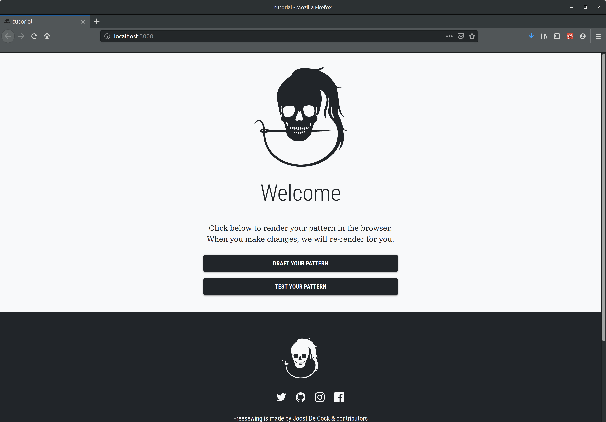

Ouvrez un terminal et entrez la commande suivante :

```bash
npm init freesewing-pattern@beta
```

<Note>

Le suffixe `@beta` est requis tant que FreeSewing 2.0 est en beta.

</Note>

Cela va charger quelques dépendances, puis vous demander les questions suivantes :

- **Language (Langage)**: Utilisez les flèches directionnelles pour sélectionner le langage de votre choix
- **Pattern name (Nom du patron)**: Entrez `tutorial` (pour tutoriel) 
- **description**: Entrez `The FreeSewing tutorial` (le tutoriel Freesewing)
- **Pattern type (Type de patron)**: Utilisez les flèches directionnelles pour sélectionner `Pattern` (pour patron)
- **Department (Département)**: Utilisez les flèches directionnelles pour sélectionner `Accessories` (pour Accessoires)
- **Author (Auteur)**: Entrez votre nom d'utilisateur GitHub
- **GitHub repository (Dépôt Github)**: Cela sera pré-rempli pour vous, alors cliquez juste sur Entrée
- **Package manager (Gestionnaire de package)**: Utilisez la flèche pour choisir. En cas de doute, prenez `NPM`

Après avoir répondu à toutes ces questions, le modèle par défaut sera copié, après quoi toutes les dépendances seront installées.

<Note>

Cela prendra quelques minutes car nous chargeons des logiciels pour votre environnement de développement.

</Note>

Lorsque c'est prêt, vous devrez exécuter deux commandes en parallèle. Dans le terminal courant, entrez le répertoire qui vient d'être créé pour notre patron `tutorial` et démarrez rollup en mode veille :

```bash
cd tutorial
npm run start
```

Ou si vous choisissez d'utiliser Yarn en tant que gestionnaire de package :

```bash
cd tutorial
yarn start
```

Maintenant, ouvrez un second terminal, et naviguez jusqu'au sous-dossier `example` et exécutez la même commande là :

```bash
cd tutorial/example
npm run start
```
    
Ou si vous choisissez d'utiliser Yarn en tant que gestionnaire de package :

```bash
cd tutorial/example
yarn start
```

Si tout se passe bien, votre navigateur s'ouvrira et vous montrera la page suivante :



<Note>

###### Vous utilisez Windows ?

Nous avons testé ceci sur Linux et MacOS, mais pas sur Windows étant donné que je (Joost) ne possède pas une machine Windows sur laquelle je pourrais le tester.

Si vous rencontrez un problème, vous pouvez joindre [notre chat](https://gitter.im/freesewing/freesewing) et nous trouverons une solution ensemble.

</Note>
