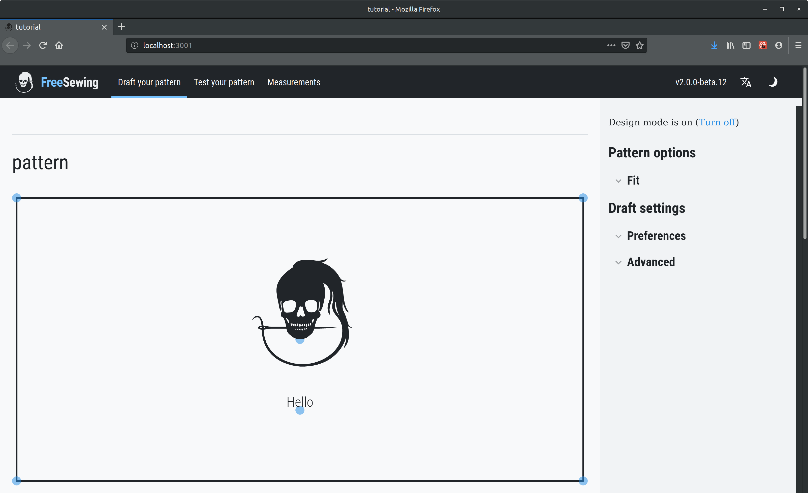

Comme les vêtements eux-mêmes, les patrons sont composés de *parties*.

La plupart des patrons auront plusieurs parties. Une manche, une partie arrière, le col, etc. Notre patron est des plus simples, et ne comporte qu'une seule partie : le bavoir.

Le patron qui vient d'être créé pour nous a aussi une unique partie pour vous faire démarrer. Il est appelé **box** et il dessine une boîte. Si vous cliquez sur le bouton **Ébaucher votre patron** dans votre navigateur, vous allez la voir :



Puisque nous n'avons besoin que d'une seule partie, nous renommerons cette partie *box*, et l'appellerons *bib* (pour bavoir).

## Renommez la partie box en bib

Tout d'abord, mettez à jour le fichier de configuration dans `config/index.js`. Mettez à jour le tableau **parts** avec `bib`, plutôt que `box`:

```js
parts: ["bib"],
```

Lorsque c'est fait, remplacez le nom du fichier `src/box.js` par `src/bib.js`.

Puis, dans le fichier `src/index.js`, changez l'import de façon correspondante :

```js
// Changez cette ligne
//import draftBox from "./box";

// en
import draftBib from "./bib";
```

Enfin, toujours dans le fichier `src/index.js`, mettez à jour la méthode d'ébauche :

```js
// Change cette ligne
//Pattern.prototype.draftBox = draftBox;

// en
Pattern.prototype.draftBib = draftBib;
```

<tip>

###### Utilisez toujours draftNomdelapartie

FreeSewing s'attend pour chaque partie à trouver une méthode nommée Draft*Nomdelapartie*.

Si vous avez une partie nommée `sleeve` (manche), vous devez avoir une méthode appelée `draftSleeve()` qui dessine cette partie.

Dans notre cas, nous avons une partie nommée `bib` alors nous allons utiliser `draftBib()` en tant que méthode d'ébauche de cette partie.

</Tip>

Félicitations, votre modèle a maintenant une partie `bib`, au lieu d'une partie `box`. Elle a toujours la même tête cependant :

<example pattern="tutorial" part="step1" caption="Our bib part, which is the renamed box part" />

Cette partie `bib` est là où nous allons effectuer un travail plus sérieux. Mais tout d'abord, nous avons encore un peu de configuration à faire.