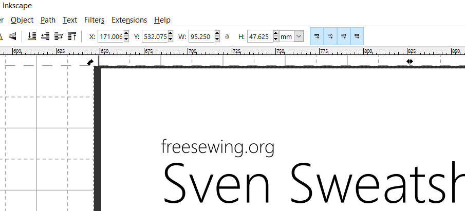
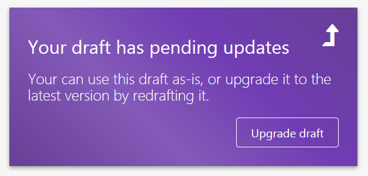

On the last day of 2017, in our [monthly roundup of all the freesewing news](/blog/roundup-2017-12/) , we wrote about the looming issue with incorrectly scaled drafts, aka [Core issue #204 - The Inkscape default units quandary](https://github.com/freesewing/core/issues/204).

I won't go over [all that](/blog/roundup-2017-12/) again, but it boils down to the fact that the [Inkscape](http://inkscape.org/) maintainers have changed Inkscape's internal DPI (dots per inch) from 90 to 96. A change that goes in effect from version 0.92 onwards.

Left unchecked, this change would cause all freesewing patterns to be incorrectly scaled. That's because we assume 90DPI in our SVG output, and scale accordingly.

When the switch to 96DPI goes into effect, all patterns would be off by 6.66%. Which is really the kind of difference that is too small to notice when eyeballing a pattern, yet large enough to completely mess up your garment.

The issue is also more troublesome than it would seem at the surface. First of all because we can't just switch to 96DPI as there are now two versions out there that use a different default DPI under the hood. We need a solution that works for both.

Furthermore, while any fix we implement would apply to new drafts, all existing drafts generated before the fix would still be impacted.

In other words, if you drafted a pattern last week, or a month ago, that pattern would not scale correctly in a recent version of Inkscape. And since we use Inkscape in our SVG-to-PDF tool-chain, it would also be incorrectly scaled if you came here and downloaded a PDF.

Clearly, something needed to be done. And fast.

## The fix for new drafts

From today's release of core v1.3.0 onwards, our SVG files no longer depend on any DPI setting.

Rather than use the internal units and apply an SVG transform to scale the entire pattern, we've bolted down the units to mm and updated the SVG viewBox to apply the scaling.

Obviously, this is how we should have done it from the start. Everyday is a school day.

If you're worried about the use of mm in your draft (because you're used to imperial units), rest assured that those mm will stay under the hood. You won't be able to tell the difference.

## The fix for pre-existing drafts

To avoid problems with pre-existing drafts, we needed to come up with a solution for those too.

We essentially have two options:

 - Re-draft all those drafts
 - Patch them in-place without changing the draft itself

Re-drafting fixes the issue as every new draft will be handled by the latest core version that does include the fix.

However, core also ships with regular updates, tweaks, and fixes in the patterns themselves. So by re-drafting a draft generated on a previous version of core, there's no guarantee the draft won't change.

In principle that change would always be an improvement. But one person's bug is another person's feature, and we do prefer not to [move your cheese](https://en.wikipedia.org/wiki/Who_Moved_My_Cheese%3F).

So, instead we decided to patch all drafts we have on file in-place with the new scaling code, without touching any other aspect of the draft.

As you're reading this, this has already been done, and all freesewing drafts should now scale correctly. Everywhere.

## Also: version awareness

We've also made changes to our backend systems to store the version of freesewing core that generated your draft.

If since you generated your draft we've rolled out new features or fixes, you'll be notified that an update is available:

Whether you update your draft or not is up to you. If you don't want to loose the info in your *old* draft, rather than update it in-place, you can fork it.

