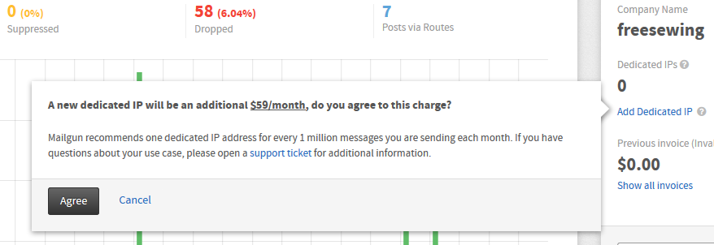

People with an email address from Microsoft --- think Hotmail, MSN, live.com, outlook.com and their numerous variants --- 
are significantly less likely to sign up for this website.

That's because more than 4 times out of 10, they never receive their account activation email.

## What's going on?

Let's first look at what's happening. Here's a relevant snippet from the logs:

````
Failed: postmaster@mg.freesewing.org -> ********@hotmail.co.uk 'Confirm your freesewing account' 
Server response: 550 5.7.1 Unfortunately, messages from [104.130.122.15] weren't sent. 
Please contact your Internet service provider since part of their network is on our block list. 
````

What this means is that part of the MailGun network is on their block list.
As a result, they (more on who they are later) are not delivering any messages that go out.

[MailGun](https://www.mailgun.com/) is a popular email service for developers.
It's used by this site to send out emails, like the account activation emails.

Other people use this service too, and perhaps some of them, at some point, 
delivered some spam messages through mailgun. Or it may just have been some guy with 
a last name that tends to trigger spam filters.


Point is, this IP address or one of its neighbours got *a bad rep*. It happens.
But to flat-out refuse to accept any messages from this host (or an entire network of hosts)
is the equivalent of shutting down a highway lane (or entire highway)
because one car in that lane played its music obnoxiously loud that one time.

Which brings me to our next question:

## Who would do something like that?

Good question. Here are some numbers:

 

The graph above represents emails that were sent out since the launch of this site.
The small subsection of the graph that is red are emails that are dropped.

This website sends out different kinds of email:

 - The account confirmation email
 - The *I forgot my password* emails
 - Comment reply notifications

The graph represents all email, but I'm focussing on the account confirmation emails only.
They are the most important after all.

> Apart from the 1 outlier, every message that was blocked, was blocked by Microsoft

Here's a list of all domains that blocked legitimate activation emails to their users:

 - btinternet.com
 - hotmail.com
 - hotmail.co.uk
 - live.ca
 - live.com
 - live.com.au
 - live.nl
 - msn.com
 - outlook.com

Apart from that very first entry in the list (on which only 1 message was blocked) all of these are Microsoft domains.

Let me restate that: Apart from the 1 outlier, every message that was blocked, was blocked by Microsoft.

## What's the impact?

So what sort of impact does that have on people?

Well, at the time I'm writing this, there are 817 registered users, and about 80% (661) have also activated their account.


From those people who were able to activate their account, less than 1% (6) have an email address managed by Microsoft.
In the group of people who did not, or were not able to, activate their account, more than half have such an address.

More than 40% of account confirmation emails are simply blocked by Microsoft and, based on the number of activations,
it seems likely that even when they aren't block at the SMTP relay, they get filtered somewhere further down the line.

As things stand, it seems almost impossible for the average hotmail/outlook/live/MSN/... user to sign up for this site.

## What can we do about it?

I chose mailgun for a number of reasons. Not having to handle SMTP outselves simplifies the code.
Not depending on a local SMTP deamon makes the code more portable, and MailGun has a bunch of cool features
that allow you to do things like replying to comments via email. 

Microsoft's crude methods of spam filtering don't invalidate any of those reasons.

Using MailGun means using their SMTP relays, and being at the mercy of the reputation of that relay.
The only way around that is to configure a dedicated relay in MailGun so that freesewing.org traffic is shielded from
others, and we become masters of our own reputation.



For that priviledge, MailGun charges 59 dollar per month, which amounts to 708 dollar yearly. 
I invite you to take a look at [the donations history](/about/pledge#donations-history), 
and you'll understand that's not going to happen either.

I could challenge the block list, and try to get the relay unblocked.
But that's pretty much tilting at windmills when the host is not under my control.
Not to mention that MailGun doesn't just have that one host.

It seems that I'm running low on options and quiet frankly, I'm also running out of patience.

## What I'm going to do about it

Microsoft is a behemoth, and I'm just a guy. I can't fight them on this.
Unless I Titanfall their ass.


Do you think Gmail is ever abused to send out spam? You know it is.
Do you think they would ever block all email coming from Gmail? You know they won't.

So last night, I rolled out some changes to work around the issue.
If you have a *problemtic* email address, in addition to the regular email, this site will send out 
a second email through Gmail. 

I'd like to see them block that.

> ##### Signup trouble? Help is available
> If you are (still) having problems signing up, don't hesitate to [get in touch](/contact).
