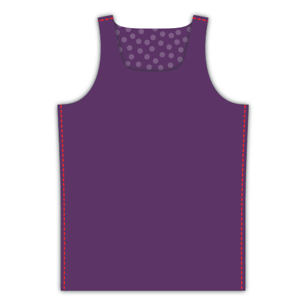

## Étape 1 : Faire les coutures d'assemblage

Mettez le devant et le dos l'un sur l'autre _endroit contre endroit_. Cousez les coutures latérales et les coutures d'épaules.

## Étape 2 : Faire l'ourlet

Pliez l'ourlet vers le haut, et cousez-le. Si vous avez une recouvreuse, utilisez-la. Sinon, utilisez une _aiguille double_ ou un _point zig-zag_ pour garder la couture extensible.

<Note>

##### Pliez une seule fois, pour éviter d'avoir trop d'épaisseur
Le tricot ne s'effiloche pas, vous pouvez donc simplement le plier une fois et le coudre, puis couper le tissu au plus près de la couture.

</Note>

## Étape 3 : Coudre le biais de jersey à l'avant

<Note>

##### À propos du bord côte

Si vous êtes novice en [tricot binding](/fr/docs/sewing/knit-binding), vous pouvez lire [cette page sur le sujet](/fr/docs/sewing/knit-binding).

###### Répéter les étapes 3 et 4 pour les emmanchures et l'ouverture du cou

Le procédure soulignée ci-dessous s'applique à la fois aux emmanchures et à l'encolure. En d'autres termes, vous devrez le faire trois fois.

###### Commencez par l'ouverture la plus simple

Je vous conseille de commencer par n'importe quelle ouverture ayant la courbure la plus uniforme. Par défaut, ce sont les trous de bras, mais si vous avez changé les options de patron (pensez au dos nageur) alors cela pourrait ne pas être le cas.

Dans les deux cas, moins vous avez d'arrondi "serré", plus il sera facile de le faire. Alors commencez avec cela pour vous échauffer avant de faire les arrondis plus délicats.

</Note>

Nous finirons par le trou du bras et du cou avec un [biais de jersey](/en/docs/sewing/knit-binding) (Remarque : pas une bande de jersey. Il y a une différence, et elle est expliquée [ici](/en/docs/sewing/knit-binding)).

<Note>

C'est la seule partie de la fabrication de ce A-shirt qui nécessite un peu de pratique. Ne vous inquiétez pas, il vous suffit d'en faire quelques uns et vous serez un pro en un rien de temps.

</Note>

### Choisissez votre emplacement

La première chose à faire est de décider où nous allons démarrer/arrêter notre biais. Voici ce que je suggère :

  - Pour les emmanchures : à la couture latérale. Cela cachera notre couture sous le bras
  - Pour l'encolure : à l'arrière, au milieu. Vous pourriez vouloir le faire en épinglant

### Placer (démarrer) votre biais

Put your A-shirt down with the good side up, and place your binding strip on top of it with the good side down (as in, good sides together).

Aling the long edge of your strip with the edge of your fabric so the strip lies on top of the fabric (not in the opening). Place the corner on your starting point.

Now shift your binding strip 1cm beyond your starting point. This little extra will guarantee we can join the two ends later.

> The easy way to keep this 1.5cm distance is by using a seam gauge. Or do what I do, place a piece of making tape on your sewing machine and mark a line on it 1.5cm from your needle. Then all you need to do is keep the edge of your fabric aligned with that line.

### Make sure you know where to sew

We are going to sew 1.5cm from the edge. So be careful because this is not the standard seam allowance.

Also, we are not starting at our start point, but we skip the first 3cm. We'll need this wiggle room later to join the ends of our binding.

### Sew binding in place

Sew your binding in place while gently stretching the binding, but not the fabric. Make sure not to sew the last 3cm but leave them, just as you did at the start.

You might need to practice a bit to get the hang of it.

> Make sure to stretch your binding more when you're taking a sharper bend. Read my notes on [knit binding](/en/docs/sewing/knit-binding) for more info.

### Mark binding ends

With about 6cm left to go before we complete our circle, it's time to sew the ends of the binding together.

Take one of the edges, and stretch it along the 3cm seperating it from the start point as you would while sewing.

Mark the where the binding reached the start point. Do the same for the other end.

### Sew binding ends together

Fold you A-shirt in whatever way makes it more easy for your to place both binding ends with good sides together, aligning the marks. Sew them together on the mark.

> 6 cm is not much, but should be enough to get both edges comfortably under your sewing machine to sew them togther.

### Finish last 6cm of binding

Now that your binding ends are joined together, it's time to finish the last 6cm of binding. Sew it down, staying 1.5cm from the edge as you did before.

## Step 4: Fold knit binding to the back and sew down

### Fold your binding over the fabric edge to the back

Fold your binding fabric around the fabric of your A-shirt to the back. This is how we'll sew it down.

> While the fabric is folded double at the front (hiding the fabric edge in the process) there's no need for that at the back. We will merely trim back the edge later, given that knit doesn't ravel. If we were to fold back the fabric at the back too, it would only add bulk.

### Sew your binding down

From the right side of your fabric, sew along the inner edge of your binding (furthest from the edge), making sure to catch the binding at the back in the process.

<Note>

If you have a coverlock machine, that would be perfect for this seam

</Note>

You'll have to, once again, stretch your binding a bit while doing this. But this time, there's an extra caveat to look out for.

<Note>

##### Beware of the uneven feed
As your feed your binding through your sewing machine, the feed dogs will pull the bottom layer (back of your binding) forward. 

In a perfect world, all layers will follow smoothly. 
But more often than not, the top layer (front of your binding) tends to lag behind a bit. 
This causes your binding to not neatly fold around the edge of the fabric, but make ugly wrinkles.

So watch out for this, and if you see it happening, stretch the under layer a bit extra to compensate.

</Note>

## Step 5: Trim back knit binding on the inside

On the inside of you A-shirt, trim back the knit binding against your seam to finish up.

<Note>

Be careful not to cut a hole in your A-shirt. Seriously, this happened to me on more than one occasion.

</Note>

