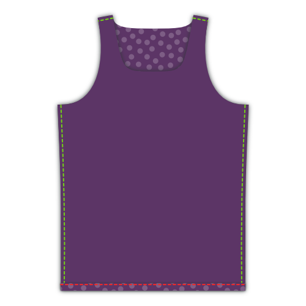
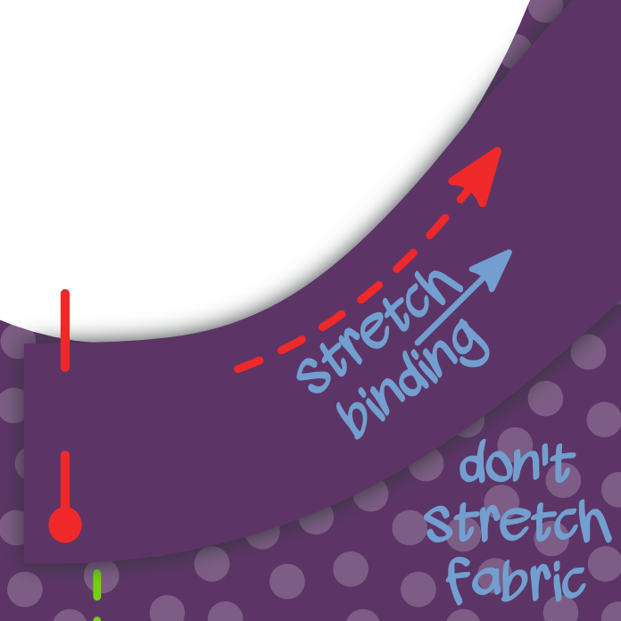
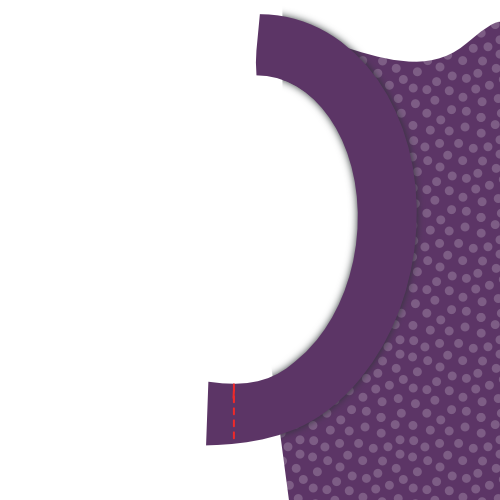

## Stap 1: Sluit de naden

Leg het voorpand op het rugpand met de juiste kanten tegen elkaar. Overlock de zijnaden, en de korte naden aan de schouderbandjes.

## Stap 2: Werk de zoom af

Vouw de zoom naar boven en stik door langs de goede kant. Als je een coverlock hebt is dit het moment om hem te gebruiken. Indien niet, gebruik een tweelingnaald of een zigzagsteek zodat de zoom elastisch blijft.

<note>

##### Vouw maar een keer om een teveel aan stof te vermijden

Gebreide stoffen rafelen niet, dus je kan dit gewoon één keer omplooien en vaststikken, en daarna de rand netjes bijknippen.

</Note>

## Stap 3: Stik de halsbies aan de voorkant

<note>

##### Over jersey biezen

Als [biesjes in jersey](/en/docs/sewing/knit-binding) nieuw zijn, is het misschien interessant om [deze pagina hierover](/en/docs/sewing/knit-binding) te lezen.

###### Herhaal stappen 3 en 4 voor beide armsgaten en de halsopening

De handelswijze hieronder kan zowel voor de armsgaten als voor de halsopening gebruikt worden. Met andere woorden, je zal dit drie keer moeten doen.

###### Start met het makkelijkste gat

Ik zou aanraden te starten met de opening die de meest gelijke curve heeft. Meestal zijn dit de armsgaten, maar als je de patroonopties aangepast hebt (denk aan een racerback) is dat misschien niet het geval.

Hoe dan ook, hoe minder scherp de curves zijn, hoe makkelijker. Start dus met een makkelijker opwarmertje voor je aan de lastigere stukken begint.

</Note>

We gaan de armsgaten en nekopening afwerken met een [jersey bies](/en/docs/sewing/knit-binding) (Pas op: geen jersey band. Er is een verschil, en dat wordt [hier](/en/docs/sewing/knit-binding) uitgelegd).

<note>

Dit is het enige onderdeel van dit hemdje waar wat oefening voor vereist is. Geen zorgen, als je er een paar maakt ben je een pro voor je het weet.

</Note>

### Kies je startpunt

Het eerste dat we moeten doen is beslissen waar de bies gaat starten en stoppen. Dit zou ik suggereren:

- Voor de armsgaten: aan de zijnaad. Zo zit de naad verstopt onder je arm
- Voor de halsopening: middenachter aan je nek. Het is aangeraden dit met een speldje aan te duiden

### Positioneer (het begin van) je bies

Leg je hemdje neer met de goede kant naar boven, en leg je bies met de goede kant naar beneden op de stof (dus, goede kanten op elkaar).

Aling the long edge of your strip with the edge of your fabric so the strip lies on top of the fabric (not in the opening). Place the corner on your starting point.

Now shift your binding strip 1cm beyond your starting point. This little extra will guarantee we can join the two ends later.

> The easy way to keep this 1.5cm distance is by using a seam gauge. Or do what I do, place a piece of making tape on your sewing machine and mark a line on it 1.5cm from your needle. Then all you need to do is keep the edge of your fabric aligned with that line.

### Make sure you know where to sew

We are going to sew 1.5cm from the edge. So be careful because this is not the standard seam allowance.

Also, we are not starting at our start point, but we skip the first 3cm. We'll need this wiggle room later to join the ends of our binding.

### Sew binding in place

Sew your binding in place while gently stretching the binding, but not the fabric. Make sure not to sew the last 3cm but leave them, just as you did at the start.

You might need to practice a bit to get the hang of it.

> Make sure to stretch your binding more when you're taking a sharper bend. Read my notes on [knit binding](/en/docs/sewing/knit-binding) for more info.

### Mark binding ends

With about 6cm left to go before we complete our circle, it's time to sew the ends of the binding together.

Take one of the edges, and stretch it along the 3cm seperating it from the start point as you would while sewing.

Mark the where the binding reached the start point. Do the same for the other end.

### Sew binding ends together

Fold you A-shirt in whatever way makes it more easy for your to place both binding ends with good sides together, aligning the marks. Sew them together on the mark.

> 6 cm is not much, but should be enough to get both edges comfortably under your sewing machine to sew them togther.

### Finish last 6cm of binding

Now that your binding ends are joined together, it's time to finish the last 6cm of binding. Sew it down, staying 1.5cm from the edge as you did before.

## Step 4: Fold knit binding to the back and sew down

### Fold your binding over the fabric edge to the back

Fold your binding fabric around the fabric of your A-shirt to the back. This is how we'll sew it down.

> While the fabric is folded double at the front (hiding the fabric edge in the process) there's no need for that at the back. We will merely trim back the edge later, given that knit doesn't ravel. If we were to fold back the fabric at the back too, it would only add bulk.

### Sew your binding down

From the right side of your fabric, sew along the inner edge of your binding (furthest from the edge), making sure to catch the binding at the back in the process.

<note>

If you have a coverlock machine, that would be perfect for this seam

</Note>

You'll have to, once again, stretch your binding a bit while doing this. But this time, there's an extra caveat to look out for.

<note>

##### Beware of the uneven feed

As your feed your binding through your sewing machine, the feed dogs will pull the bottom layer (back of your binding) forward.

In a perfect world, all layers will follow smoothly. But more often than not, the top layer (front of your binding) tends to lag behind a bit. This causes your binding to not neatly fold around the edge of the fabric, but make ugly wrinkles.

So watch out for this, and if you see it happening, stretch the under layer a bit extra to compensate.

</Note>

## Step 5: Trim back knit binding on the inside

On the inside of you A-shirt, trim back the knit binding against your seam to finish up.

<note>

Be careful not to cut a hole in your A-shirt. Seriously, this happened to me on more than one occasion.

</Note>

