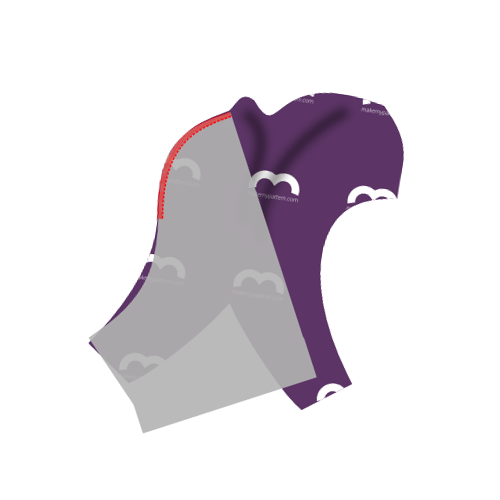
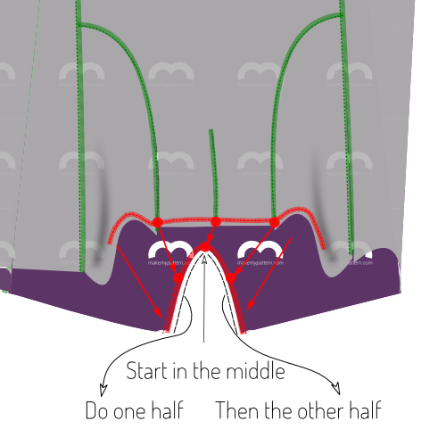

<YouTube id='PL1gv5yv3DoZME1xe5fBEHd0rKPW_xNpF3' playlist />

### Étape 1 : assembler le dos et le premier côté

Alignez le côté du dos (pièce 1) avec le côté (pièce 3) endroit contre endroit. Comme le côté (pièce 3) est symétrique, vous ne pouvez pas vous tromper.

Assemblez-les ensemble à la surjeteuse, en tenant compte d'une marge de couture de 1 cm. Placez donc l'aiguille extérieure de votre surjeteuse à 1cm du bord de votre tissu.

> Pour ceux dont la mesure métrique n'est pas la tasse de thé, 1 cm corresponds à 3/8 pouce.

> Certaines surjeteuses ont une manette permettant de choisir entre coutures plates et coutures roulottées. Si vous prévoyez de surpiquer plus tard (voir Étape 6), assurez-vous de choisir des coutures plates.

### Étape 2 : assembler le dos et le second côté

Alignez l'autre côté du dos (pièce 1) avec le second côté (pièce 3) endroit contre endroit. Comme le côté (pièce 3) est symétrique, vous ne pouvez pas vous tromper.

Assemblez-les ensemble à la surjeteuse, comme précédemment.

> Le dos et les côtés sont maintenant assemblés. Mettez-les de côté un instant.

### Étape 3 : Assebler le premier insert et les devants

  

Assemblez l'insert (pièce 4) avec les devants (pièce 2) à la surjeteuse sur leurs bords courbes.

> Rappelez-vous que vous avez deux devants. Vous devez les mettre l'un sur l'autre et les traiter comme une seule pièce à double épaisseur.

Face à une couture aussi délicate, vous pourriez être tenté d'épingler ou de bâtir, mais ne le faites pas. Cela rendrait la couture plus difficile.

Au lieu de cela, commencez en haut de la couture courbe, en alignant les pièces comme illustré, et en les assemblant à la surjeteuse lentement sur quelques cm.

Au fur et à mesure que vous avancez, maintenez les deux bords du tissu l'un sur l'autre.

Lorsque vous maintenez les bords du tissu alignés, vous risquez d'étirer un côté plus que l'autre. Le repère sur le bord courbe peut vous aider à éviter cela.

Après le repère, les choses seront plus faciles. Ce serait également le moment de comparer la longueur restante des coutures courbes. Si l'une est un peu plus longue que l'autre, étirez un peu la plus court jusqu'à ce qu'elles correspondent.

Si la différence est trop grande, laissez-la tout simplement. L'excédent sera coupé quand nous ferons la conture d'entrejamble.

<Note>

Il s'agit probablement de la couture la plus difficile de ce modèle. Prenez votre temps, et tout se passera bien.

</Note>

<Tip>

###### Ou enfermez ces coutures en sandwich entre les devants

Bien que ce soit un peu plus de travail, vous pouvez enfermer cette couture en bâtissant d'abord les inserts sur un des deux devants, puis en cousant les deux devants ensemble avec les inserts en sandwich à l'intérieur. 

Cousez les pinces du devant séparément et retourner le tout à l'ntérieur, et vous avez une belle zone d'emballage sans couture sur le devant. 

</Tip>

### Étape 4 : Assembler le second insert et les devants

Après avoir assemblé le premier insert et les devants, continuez avec le second.

Avec les devant et les entrées assemblés ensemble, vous avez 3 parties :

 - Les inserts + devants
 - Les côtés + dos
 - L'élastique

### Étape 5 : Fermer les pinces devant

Fold the fronts double along the center fronts line, so that the tusks at the bottom line up.

Serge the sides of the tusks to close the fronts dart. For best results, start at the top of the seam (where the fabric is folded) and work your way to the bottom.

<Tip>

###### Mettez cette couture loin de ma ...

Vous pouvez également coudre les pinces de chaque pièce individuellement afin que les deux coutures soient prises à l'intérieur.
Ne pas avoir de couture visible dans cette zone sera plus confortable.

</Tip>

### Étape 6 : Optionnel: Surpiquez

<Note>

Cette étape est facultative. Surpiquer ajoute un effet de style qui souligne les différentes pièces du patron. 
Ce peut être joli avec un tissu uni, mais pas nécessairement avec un imprimé, ou avec des pièces de différentes couleur.

</Note>

Si vous voulez surpiquer les coutures faites à la surjeteuse, faites le maintenant.

Si vous surpiquez, faites-le pour chaque couture, en vous assurant d'utiliser un point de couture extensible. Vous pouvez utiliser un point zig-zag ou une double aiguille si vous n'avez pas de point overlock ou de règlage spécial point extensible.

<Tip>

Pour surpiquer la couture qui ferme les pinces devant, commencez par le bas, en remontant jusqu'en haut, là où viendra la ceinture. 
La couture s’arrête à mi-chemin (où se termine la pince), mais votre surpiqûre doit continuer.

</Tip>

### Étape 7 : Assembler le premier côté et les devants

Alignez le bord latéral du premier côté avec le bord de l'ensemble devants+ insert (endroit contre endroit, comme d'habitude) et cousez les ensemble à la surjeteuse.

### Étape 8 : Assembler le second côté et les devants

Faites la même chose pour le second côté.

### Étape 9 : Optionnel: Surpiquer

Si vous avez surpiqué précédemment, faites maintenant la même chose pour les coutures réalisées aux étapes 7 et 8.

### Étape 10 : Terminer la fourche

Nous allons maintenant coudre ensemble à la surjeteuse l'arche du dos et celle du devant, constituée des devants et des inserts.

Aidez vous des repères dos. Il y a un repère pour le milieu, les deux autres repères devant  correspondre à la jointure des devants avec les inserts.

<Tip>

Il est plus facile de commencer au milieu et de faire un côté après l'autre. Recommencez à partir du milieu pour faire le deuxième côté.

Prenez votre temps, et soyez **très attentif** à l'endroit où votre surjeteuse coupe.

</Tip>

### Étape 11: Faire l'ourlet de la première jambe

Il est temps de faire les ourlets. Procédez comme vous le feriez pour n'importe quel autre tissu extensible. Utilisez un point extensible. Vous pouvez utiliser un point zig-zag ou une double aiguille si vous n'avez pas de point overlock ou de règlage spécial point extensible.

<Note>

A mon avis l'ourlet est beaucoup plus facile à faire si vous épinglez d'abord. 
Donc pliez donc votre ourlet et épinglez le en place. 
Ou mieux: épinglez les ourlets des deux jambes et ne cousez que lorsque l'aspect vous satisfait.

</Note>

### Étape 12: Faire l'ourlet de la seconde jambe

Vous avez compris.

### Étape 13 : Faire une boucle avec votre élastique

Coudre les deux extrémités de votre élastique ensemble endroit contre endroit.

<Note>

###### Combien d'élastique me faut-il ?
Entourez simplement votre élastique autour de votre taille, là où vous porterez votre caleçon, et serrez un peu jusqu'à ce que cela vous convienne. 
Marquez l'endroit où les bords se rejoignent, ajoutez une marge de couture de 2cm, et c'est votre longueur.

</Note>

### Étape 14 : Fixer l'élastique à la taille

Fixer l'élastique à la taille.

A faire endroit contre endroit si vous utilisez un point extensible ou une double aiguille sur une machine à coudre conventionnelle.

Si vous utilisez un point overlock, placer l'élastique sur l'endroit, en haut du caleçon.

<Tip>

La longueur de votre élastique sera différente de la longueur du tissu, l'élastique devra donc être étiré. 
Epingler vous aidera à bien répartir l'étirement.

Divisez votre élastique et la taille de votre caleçon en 4 (ou 8) parties. Epinglez élastique et tissu ensemble.

Cousez tout en étirant l'élastique entre 2 épingles, en enlevant les épingles au fur et à mesure.

</Tip>

### Étape 15 : Dégarnir et nettoyer

Coupez tout tissu excédentaire au niveau de l'élastique ou des ourlets et tous les fils qui dépassent.
