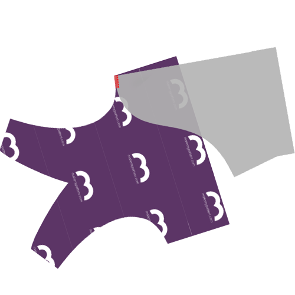
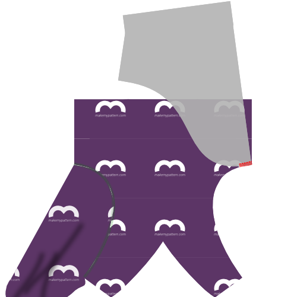
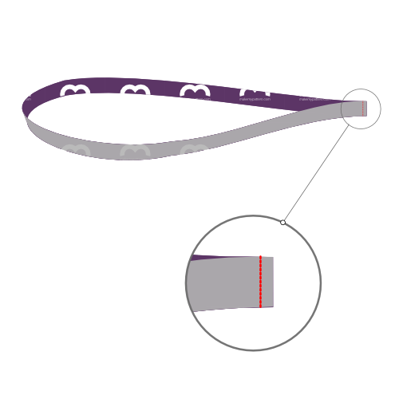

<YouTube id='PL1gv5yv3DoZME1xe5fBEHd0rKPW_xNpF3' playlist />

### Étape 1 : assembler le dos et le premier côté

Alignez le côté du dos (pièce 1) avec le côté (pièce 3) endroit contre endroit. Comme le côté (pièce 3) est symétrique, vous ne pouvez pas vous tromper.

Assemblez-les ensemble à la surjeteuse, en tenant compte d'une marge de couture de 1 cm. Placez donc l'aiguille extérieure de votre surjeteuse à 1cm du bord de votre tissu.

> Pour ceux dont la mesure métrique n'est pas la tasse de thé, 1 cm corresponds à 3/8 pouce.

> Certaines surjeteuses ont une manette permettant de choisir entre coutures plates et coutures roulottées. Si vous prévoyez de surpiquer plus tard (voir Étape 6), assurez-vous de choisir des coutures plates.

### Étape 2 : assembler le dos et le second côté

Alignez l'autre côté du dos (pièce 1) avec le second côté (pièce 3) endroit contre endroit. Comme le côté (pièce 3) est symétrique, vous ne pouvez pas vous tromper.

Assemblez-les ensemble à la surjeteuse, comme précédemment.

> Le dos et les côtés sont maintenant assemblés. Mettez-les de côté un instant.

### Étape 3 : Assebler le premier insert et les devants

  

Assemblez l'insert (pièce 4) avec les devants (pièce 2) à la surjeteuse sur leurs bords courbes.

> Rappelez-vous que vous avez deux devants. Vous devez les mettre l'un sur l'autre et les traiter comme une seule pièce à double épaisseur.

Face à une couture aussi délicate, vous pourriez être tenté d'épingler ou de bâtir, mais ne le faites pas. Cela rendrait la couture plus difficile.

Au lieu de cela, commencez en haut de la couture courbe, en alignant les pièces comme illustré, et en les assemblant à la surjeteuse lentement sur quelques cm.

Au fur et à mesure que vous avancez, maintenez les deux bords du tissu l'un sur l'autre.

Lorsque vous maintenez les bords du tissu alignés, vous risquez d'étirer un côté plus que l'autre. Le repère sur le bord courbe peut vous aider à éviter cela.

Après le repère, les choses seront plus faciles. Ce serait également le moment de comparer la longueur restante des coutures courbes. Si l'une est un peu plus longue que l'autre, étirez un peu la plus court jusqu'à ce qu'elles correspondent.

Si la différence est trop grande, laissez-la tout simplement. L'excédent sera coupé quand nous ferons la conture d'entrejamble.

<Note>

Il s'agit probablement de la couture la plus difficile de ce modèle. Prenez votre temps, et tout se passera bien.

</Note>

<Tip>

###### Ou enfermez ces coutures en sandwich entre les devants

Bien que ce soit un peu plus de travail, vous pouvez enfermer cette couture en bâtissant d'abord les inserts sur un des deux devants, puis en cousant les deux devants ensemble avec les inserts en sandwich à l'intérieur. 

Cousez les pinces du devant séparément et retourner le tout à l'ntérieur, et vous avez une belle zone d'emballage sans couture sur le devant. 

</Tip>

### Étape 4 : Assembler le second insert et les devants

Après avoir assemblé le premier insert et les devants, continuez avec le second.

Avec les devant et les entrées assemblés ensemble, vous avez 3 parties :

 - Les inserts + devants
 - Les côtés + dos
 - L'élastique

### Étape 5 : Fermer les pinces devant

Fold the fronts double along the center fronts line, so that the tusks at the bottom line up.

Serge the sides of the tusks to close the fronts dart. For best results, start at the top of the seam (where the fabric is folded) and work your way to the bottom.

<Tip>

###### Mettez cette couture loin de ma ...

Vous pouvez également coudre les pinces de chaque pièce individuellement afin que les deux coutures soient prises à l'intérieur.
Ne pas avoir de couture visible dans cette zone sera plus confortable.

</Tip>

### Étape 6 : Optionnel: Surpiquez

<Note>

Cette étape est facultative. Surpiquer ajoute un effet de style qui souligne les différentes pièces du patron. 
Ce peut être joli avec un tissu uni, mais pas nécessairement avec un imprimé, ou avec des pièces de différentes couleur.

</Note>

Si vous voulez surpiquer les coutures faites à la surjeteuse, faites le maintenant.

Si vous surpiquez, faites-le pour chaque couture, en vous assurant d'utiliser un point de couture extensible. Vous pouvez utiliser un point zig-zag ou une double aiguille si vous n'avez pas de point overlock ou de règlage spécial point extensible.

<Tip>

Pour surpiquer la couture qui ferme les pinces devant, commencez par le bas, en remontant jusqu'en haut, là où viendra la ceinture. 
La couture s’arrête à mi-chemin (où se termine la pince), mais votre surpiqûre doit continuer.

</Tip>

### Étape 7 : Assembler le premier côté et les devants

Alignez le bord latéral du premier côté avec le bord de l'ensemble devants+ insert (endroit contre endroit, comme d'habitude) et cousez les ensemble à la surjeteuse.

### Étape 8 : Assembler le second côté et les devants

Faites la même chose pour le second côté.

### Étape 9 : Optionnel: Surpiquer

If you've topstitched before, make sure to do the same now for the seams you made in step 7 and 8.

### Step 10: Finish the crotchseam

We will now serge the arched opening in the back part to the front parts of the boxers, made up of the fronts and insets.

The notches on the back piece will help you. There's the center notch, and the other two notches should match up with where the fronts and inset pieces are joined.

<Tip>

It's easier to start in the middle point and work your way to one side. Then start from the middle again to do the other side.

Take it slow, and be **very aware** of where your serger blade is cutting into.

</Tip>

### Step 11: Hem the first leg

Time to hem the legs. Hem them as you would do any other stretchy knit. Go for a flexible stitch. You can use a zig-zag stitch or twin needle if you don't have a coverlock or specific flexible stich setting.

<Note>

I feel that hemming is much easier when you pin things in place first. 
So fold back your hem, and pin it in place. 
Even better: pin both legs in place and only sew when you're happy with how it looks.

</Note>

### Step 12: Hem the second leg

You know it makes sense.

### Step 13: Make your elastic into a loop

Sew both ends of your elastic together with good sides together.

<Note>

###### Not sure how much elastic you need?
Simply wrap your elastic around your waist where it would end up sitting, and tighten it until if feels right. 
Make a mark of where the edge joins, add 2cm seam allowance, and that's your length.

</Note>

### Step 14: Attach elastic to waist

Attach the elastic to the waist.

Do so good sides together if you're using a flexible stitch or twin needle on a conventional sewing machine.

If you're using a coverlock, put the elastic on top of the good side of the fabric.

<Tip>

The length of your elastic will probably difffer from the fabric length, as they stretch differently. 
Pinning will help you achieve an even stretch.

Divide both your elastic and boxer waistline into 4 (or 8) parts. Pin elastic and fabric together at these point.

While sewing, stretch elastic and fabric together between each set of pins, removing the pins as your move on.

</Tip>

### Step 15: Trim and clean up

Trim any excess fabric you might have at elastic or hem, and any loose threads.
