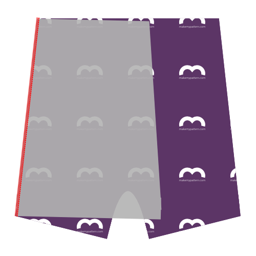
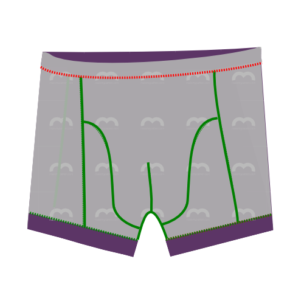

### Video

We hebben een videoreeks die toont hoe je Bruce moet maken:

@[youtube](https://www.youtube.com/watch?v=C6cpqEPWRwc&list=PL1gv5yv3DoZME1xe5fBEHd0rKPW_xNpF3)

### Wat je nodig hebt

Om Bruce te maken heb je het volgende nodig:

- Basis naaimateriaal
- Ongeveer 1 m geschikte stof ([zie Optionele stoffen](#fabric-options))
- Genoeg brede (3 cm of breder) elastiek om rond je taille te kunnen
- Een overlock, alhoewel je kan overleven zonder

### Stofkeuze

Je hebt een elastische stof nodig voor dit patroon. Liefst iets dat comfortabel is en zacht aanvoelt, en de huid laat ademen.

Ik vind persoonlijk dat niets beter werkt dan rayon (viscosejersey) voor dit patroon, alhoewel je ook een andere vezel kan gebruiken, zolang het maar jersey is.

Bij twijfel, kies dan rayon.

## Knippen

- **Buitenstof** 
 - Knip **1 rugpand** aan de stofvouw
 - Knip **2 voorpanden** aan de stofvouw
 - Knip **2 inzetstukken**
 - Knip **2 zijkanten**

> #### Opmerkingen
> 
> - **achterkant** 
>     - Extra toeslag voor de zoom aan het been
> - **voorkant** 
>     - Knip dit **twee keer**

Bruce bestaat uit een achterkant, twee zijkanten, inzetstukken en voorkanten. Hier is een typische layout:

> De [legende](/en/docs/patterns/notation) legt alle verschillende merktekens en lijnen op je patroon uit.

## Constructie

### Stap 1: Bevestig rugpand aan eerste zijkant

Leg de zijkant (stuk 3) op de rug (stuk 1) aan de zijrand, met de goede kanten op elkaar. Aangezien de zijkant (stuk 3) symmetrisch is kan dit niet fout lopen.

Lock de naad, met een naadwaarde van 1 cm. Mik dus met de buitenste naald van je lockmachine op 1 cm naast de rand van je stof.

> Als het metrieke stelsel niet je ding is, 1 cm is 3/8 inch.
> 
> Sommige overlockmachines hebben een hendeltje om te kiezen tussen platte of geplooide naden. Als je van plan bent om sierstiksels te gebruiken (zie stap 6), kies dan zeker voor platte naden.

### Stap 2: Bevestig rugpand aan tweede zijkant

Leg de tweede zijkant (stuk 3) op de rug (stuk 1) aan de zijrand, met de goede kanten op elkaar. Aangezien de zijkant (stuk 3) symmetrisch is kan dit niet fout lopen.

Lock de naad samen, zoals je aan de andere kant al deed.

> Het rugpand en de zijkanten zijn nu aan elkaar bevestigd. Leg ze even opzij terwijl we ons focussen op de andere stukken.

### Stap 3: Bevestig inzetstukken aan voorkanten

  

Om het inzetstuk (stuk 4) aan de voorkant (stuk 2) te bevestigen moet je langs de gebogen randen locken.

> Onthou dat je twee voorpanden hebt. Je moet deze bovenop elkaar leggen en als één dubbel gelaagd voorpand verwerken.

Een lastige naad als deze geeft je zin om naar spelden of driegdraad te grijpen, maar laat dat. Spelden of driegen maakt dit moeilijker.

Begin aan de top van de gebogen naad, de stukken samenleggend zoals getoond, en lock ze langzaam een paar cm samen.

Terwijl je voortgaat manipuleer je de stof zodat de lagen gelijk blijven liggen terwijl je ze door de overlock haalt.

Als je de stof zo manipuleert is het makkelijk om één stuk meer uit te rekken dan de andere. Het merkteken op de gebogen rand kan je helpen om te controleren of alles gelijk blijft.

Zodra je voorbij dit merkteken bent wordt alles makkelijker. Dit is ook een goed moment om de lengte van de overgebleven naad te controleren. Als één stuk een beetje langer is dan het andere, rek het korte stuk dan een beetje tot ze even lang zijn.

Als het verschil te groot is, laat het dan gewoon. Het zal afgeknipt worden bij het naaien van de kruisnaad.

> Dit is zo ongeveer de moeilijkste naad in het patroon. Doe rustig aan, en alles komt goed.
> 
> #### Of sluit deze naad in door ze tussen de voorpanden te verstoppen
> 
> Het is een beetje meer werk, maar je kan deze naad wegstoppen als je de inzetstukken eerst aan één van de voorpanden driegt, en dan je voorpanden op elkaar stikt met de inzetstukken ertussen.
> 
> Naai de nepen vooraan apart en keer alles binnenstebuiten, en je hebt een mooi naadloos pakketje vooraan.

### Stap 4: Bevestig tweede inzetstuk en voorkanten

Nadat je het eerste inzetstuk aan de voorpanden bevestigd hebt, doe je hetzelfde met het tweede.

Als de voorpanden en inzetstukken aan elkaar hangen heb je nog maar drie stukken:

- De inzetstukken en voorpanden, aan elkaar bevestigd
- De zijkanten en rugpand, aan elkaar bevestigd
- De elastiek

### Stap 5: Sluit de neep in de voorpanden

Vouw de voorpanden in twee langs de middenvoorlijn, zodat de gebogen stukken onderaan gelijk liggen.

Lock de zijkanten van de gebogen delen om de voorste neep te sluiten. Voor het beste resultaat start je bovenaan de naad (waar de stof geplooid is) en ga je zo naar beneden.

> #### Hou die naad uit de buurt van mijn...
> 
> Een andere optie is op de neep aan elk voorpand apart te naaien zodat de naden aan de binnenkant zitten. Het is iets meer werk, maar het is het extra comfort meer dan waard.

### Stap 6: Optioneel: Sierstiksel

> Deze stap is optioneel. Sierstiksel voegt een visueel effect toe dat de individuele patroondelen benadrukt. Het is een leuke manier om een effen stof visueel op te breken, maar als je een print gebruikt of verschillende kleuren, laat je het misschien beter.

Als je je gelockte naden wil doorstikken voor visueel effect is het nu het moment.

Als je een sierstiksel geeft, die dit dan gewoon langs elke naad, steeds met een elastische steek. Je kan een zigzagsteek gebruiken of een tweelingnaald als je geen coverlock of specifieke stretchsteek hebt.

> Als je een sierstiksel geeft op de naad van de voorste neep, start dan onderaan en laat het stiksel helemaal tot bovenaan doorlopen, tot waar de tailleband gaat komen. De naad stopt halverwege (waar de neep eindigt), maar je stiksel moet doorlopen.

### Stap 7: Bevestig de eerste zijkant aan de voorpanden

Leg de zijrand van de eerste zijkant gelijk met de rand van de voorpanden+inzetstuk (met de goede kanten op elkaar, zoals gewoonlijk) en lock de naad samen.

### Stap 8: Bevestig de tweede zijkant aan de voorpanden

Doe hetzelfde voor de tweede zijkant.

### Stap 9: Optioneel: Sierstiksel

Als je eerder al een sierstiksel gaf, doe dan nu hetzelfde voor de naden die je gemaakt hebt in stap 7 en 8.

### Stap 10: Werk de kruisnaad af

We gaan nu de gebogen opening aan de achterkant bevestigen aan de voorkant van de boxershort, bestaande uit de voorpanden en inzetstukken.

De merktekens op het rugpand zullen je helpen. Er is een merkteken in het midden, en de twee andere merktekens zouden moeten overeenkomen met waar de voorpanden en inzetstukken samenkomen.

> Het is makkelijker om in het midden te beginnen en één kant af te werken. Begin dan opnieuw in het midden om de andere kant af te werken.
> 
> Neem je tijd, en **kijk heel goed uit** wat het mes van je overlock wegsnijdt.

### Stap 11: Zoom de eerste pijp

Tijd om de pijpen om te zomen. Zoom ze op dezelfde manier als je elke andere elastische gebreide stof zou zomen. Ga voor een elastische steek. Je kan een zigzaksteek of tweelingnaald gebruiken als je geen coverlock of specifieke stretchsteek hebt.

> Ik vind zomen veel eenvoudiger als je de dingen eerst op de juiste plek speldt. Dus plooi je zoom om, en speld alles op z'n plaats. Nog beter: speld beide pijpen vast en naai pas als je vindt dat het er goed uitziet.

### Stap 12: Zoom de tweede pijp

Niet meer dan logisch.

### Stap 13: Maak een lus van je elastiek

Naai de uiteindes van je elastiek samen met de goede kanten op elkaar.

> #### Niet zeker hoeveel elastiek je nodig hebt?
> 
> Wikkel gewoon je elastiek rond je taille op de plek waar het zou zitten, en span aan tot het juist aanvoelt. Duid aan waar dat punt is, voeg 2 cm naadwaarde toe, en daar is je lengte.

### Stap 14: Bevestig elastiek aan de taille

Bevestig de elastiek aan de taille.

Doe dit met de juiste kanten op elkaar als je een stretchsteek of tweelingnaald gebruikt op een gewone naaimachine.

Als je een coverlock gebruikt, leg de elastiek bovenop de goede kant van de stof.

> De lengte van je elastiek is waarschijnlijk niet hetzelfde als de lengte van je stof, aangezien de twee op een andere manier uitrekken. Een paar spelden helpen om alles gelijk te krijgen.
> 
> Verdeel zowel je elastiek als de taille van je boxershort in 4 (of 8) gelijke delen. Speld elastiek en stof samen op deze punten.
> 
> Terwijl je naait rek je de elastiek en de stof uit tussen de spelden, verwijder de spelden als je ze passeert.

### Stap 15: Knip bij en kuis op

Knip eventuele overtollige stukken stof aan de tailleband of zoom bij, en eventuele losse draadjes.