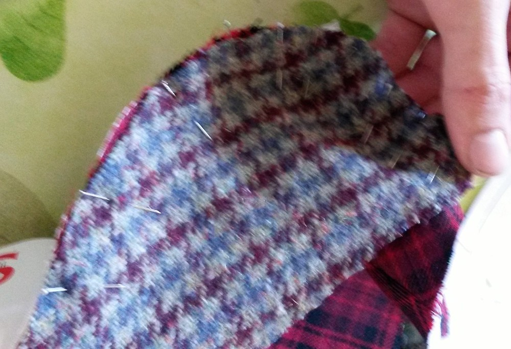
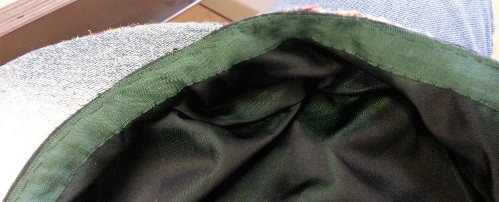

## Wat je nodig hebt

Om Florent te maken heb je het volgende nodig:

- Basis naaimateriaal
- Ongeveer 0.5 meter geschikte stof ([zie Stofkeuzes](#fabric-options))
- Ongeveer 0.5 meter voering
- Band, een beetje meer dan de afmeting van de **hoofdomtrek** + **overwijdte** die je voor het patroon gebruikt hebt
- Een vel plastic of iets anders plat en stevig voor de klep (1 mm dik of minder)

## Stofkeuze

Een zwaardere stof behoudt zijn vorm beter als buitenstof van je pet, maar als je een lichtere stof wil gebruiken kan je tussenvoering toevoegen.

De voering kan vanalles zijn, maar is meestal iets licht en aangenaam.

## Knippen

Afhankelijk van hoeveel stof je hebt kan je de boven- en/of zijkanten in twee stukken knippen, vandaar de instructies op het patroon zelf. Opgelet: het patroon heeft een naadwaarde rondom de bovenkant dus laat deze weg als je dit deel aan de stofvouw knipt!

De onderkant van de klep wordt iets naar binnen gezet, terwijl de bovenkant iets naar voor gezet wordt en de naad "onder de rand valt". Hou dat in gedachten terwijl je de delen knipt, en markeer dit duidelijk, zodat je niet eindigt met een naad bovenop de klep (ik wil je niet dwingen deze stijlkeuze te maken, maar je gewoon op het verschil wijzen zodat je erop kan letten).

- **Buitenstof** 
 - Knip **1 bovenkant** aan de stofvouw (laat dan de naadwaarde aan middenvoor weg) of **2 bovenkant** met naadwaarde middenvoor.
 - Knip **1zijpand** aan de stofvouw, of **2 zijpanden**.
 - Knip **1 bovenklep**.
 - Knip **1 onderklep**.
- **Voering** 
 - Knip **1 bovenkant** aan de stofvouw (laat dan de naadwaarde aan middenvoor weg) of **2 bovenkant** met naadwaarde middenvoor
 - Knip **1zijpand** aan de stofvouw, of **2 zijpanden**
- **Plastic** 
 - Knip **1 versteviging klep**. Kleef het patroon op het plastic, maar knip de markeringen niet in. Je kan ze in het plastic krassen of aanduiden met een stift. Je wil geen echte scherpe rand, dus let op dat alles glad en afgerond is (vooral aan de hoeken)

Een typisch Florent patroon ziet er zo uit:

## Constructie

### Stap 1: Bevestig tussenvoering

Afhankelijk van hoe zwaar je stof is kan het aan te raden zijn al je buitenste stofdelen te verstevigen. Onafhankelijk van de dikte van je stof is het een goed idee om de zijkanten van je klepdelen (waar de markering is) te verstevigen. Dit zal voorkomen dat de hoeken van het plastic deel hier uit de pet gaan steken

### Stap 2: Achterste neep sluiten

#### Versie met bovenkant aan de stofvouw geknipt

Markeer het eindpunt van de achterste neep op de verkeerde kant van de stof zodat je weet waar je moet stoppen

Er zijn verschillende trucjes om nepen te naaien, hier is het mijne (ik denk dat ze dit "een neep balanceren" noemen): knip een rechthoek van je buitenstof schuin van draad en plaats deze onder de punt van je neep. Stik de neep, van beneden tot de punt, en stik een paar steken voorbij de punt van de neep. Laat een paar lange draadjes hangen om ze te kunnen knopen.

Knip de naadwaarde die tegen het rechthoekige stukje stof ligt open tot aan de naad zodat de naad voor het rechthoekige stukje stof opengestreken kan worden. Op de plek waar de neep samen met het rechthoekige stukje stof gestikt is strijk je de naadwaarde naar 1 kant, en het geplooide rechthoekige stukje stof naar de andere kant. Knip de randen van het rechthoekige stukje stof bij. De rand aan de buitenstof is breder, die daarbovenop smaller

#### Versie met bovenkant in twee delen

Deze neep is eenvoudiger aangezien de naad doorloopt. Stik de naad gewoon van begin tot einde

#### De naad strijken

Het kan helpen om knipjes in de naadwaarde te geven zodat ze plat ligt. Gebruik een perskussen of iets rond onder je stof om de naad open te strijken en toch de vorm die je net gemaakt hebt te behouden.

#### Sierstiksel

Afhankelijk van de look die je wil kan je een sierstiksel langs je naden geven (met de machine of zelfs met de hand). De voorste klepnaad zal een beetje lastig zijn met de machine, maar niet onmogelijk. In elk geval zeg ik dit hier en zal ik het niet blijven herhalen, maar als je kiest voor een sierstiksel is dit het proces: Stik, Strijk, Sierstiksel, Herhaal.

### Stap 3: Optioneel: Bevestig zijpanden aan elkaar.

Dit is enkel relevant als je de zijpanden in twee delen geknipt hebt. Het is een rechte naad. Niet veel over te zeggen. Strijk de naadwaarde open.

### Stap 4: Bevestig de bovenkant aan de zijkant

Opgelet: hier komen een hoop spelden bij kijken.

 

For the stitching, I tend to start from the center front, do one half, and then start again, back from the center front to do the other half (the **side part** is on top for both stitches). So that, if my machine shifts the lower fabric, it would be a "symmetrical shift" on both sides. Clip the seam allowances where needed, on the curve, you might want to trim the seam allowance of the side part, and notch it, to help the ironing process.

### Step 5: The brim outer seam.

Align the notches and pin the top and bottom parts. Technically, the lower part has a shorter seam length, so you might have to stretch it so that the seam allowances meet. In practice, fabric is usually stretchy enough so that the length difference can be eased. Iron both seam allowance against the **Bottom part**

### Step 6: Inserting the plastic part

The plastic part is then inserted inside the brim, being careful to keep the seam allowance flat on the **Bottom part**. You then hand stitch the brim closed, keeping the parts in place and well tensioned.

### Step 7: Stitching the brim to the cap

Align the notches and stitch the brim to the cap. Be careful not to stitch onto the plastic. It might be easier if you "free" the arm of your machine

### Step 8: Prepare the lining

Basically, repeat the steps 2, 3 and 4 with the lining **top** and **side parts**. This would also be a good time to stitch a label on the **top part** of the lining if you are into this kind of things.

### Step 9: Join lining to main fabric.

Turn the lining outside out and place the main fabric in it (good side against good side). Pin and stitch from one end of the brim to the other end of the brim (leaving the brim seam open).

Don't forget to back tack this stitch quite well since it will get some stretch when we will turn the cap "outside out". Turn the cap outside out, so that the good side is outside. On the Brim area, baste the lining in place and hand stitch it to the brim in a way to hide the other stitches that are already on the seam allowance. 

### Step 10: Top stitching the bottom of the cap

It is a good idea to top stitch the bottom seam of the cap so that the lining stays inside. To have a better control I usually baste it first, so that the edge is sharp. 

### Step 11: The tape

Form a loop with the tape so that the circumference of the loop matches the measured head circumference of the wearer of the cap. The best result is achieved when you pin the tape while you are wrapping it around the head of the future owner of the cap. Once the loop is closed, you can even double check it and ask if this fit is OK for the wearer.

Trim the ends of the tape in an arrow shape to keep it from poking out. 

Divide the tape in two with two pins

Pin the tape in place: The two pins are used to distribute the tape equally on both sides. Place one pin at the back, and the other at the front. Since the brim is held in place it can't be much stretched, so pin the tape in this area "normally" For the remaining part you might need to ease the fabric along the tape. I recommend to hand stitch the tape in place, on both edges of the tape

### Step 12: Stitch the side to the brim

We are almost done, and the last step will be to attach the brim top to the front of the body of the cap. Pin the two part in position from the outside, turn the cap on the lining side and stitch both parts together several times.

 

