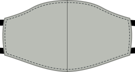

### Step 1: Join center seam

Join the curved seam that is center of our mask by placing the *good sides together* and sewing them in place.

<Note>Repeat this step for both the outer (main) fabric, and the inner (lining) fabric.</Note>

### Step 2: Press the center seam

Press the seam allowance on the center seam open so the seam lies nice and flat.

As this is a curved seam, it won't lay flat so use a tailor's hem or cushion to press.<Note>Repeat this step for both the outer (main) fabric, and the inner (lining) fabric.</Note>

### Step 3: Sew the outer to the inner fabric

Place your inner (lining) fabric on top of your outer (main) fabric with *good sides together* and sew them together, making sure to leave one side open so we can turn the mask inside-out later.

### Step 4: Turn the mask inside-out

Actually, your mask is inside-out now, so turning it inside out will mean we get it outside-out, or regular.

Just reach in through the side your left open and carefully pull the mask through to turn it.

### Step 5: Press the mask

Now that the mask is as it should be, it's time to press it. Before doing so, make sure to fold the seam allowance of the side we left open inwards, so that we press it flat as if it was sewn.

### Step 6: Insert closure strip (optional)

For best results, you should insert a closure strip at the top of your mask so you can shape it to fit your nose. When I say *closure strip* I mean one of them paper or plastic strips with a metal wire inlay, like these:

Insert the strip so that it sits in the center of the top seam of your mask. Tuck it between the layers of seam allowance to prevent the strip from poking through.

When it's in place, topstich below the strip (use the line on the pattern as a guide), and close of the encasing at the edges of the strip so it can't move around.

### Step 7: Close open side of the mask and edge-stitch around the edge

With our metal strip in place, it's time to close the side of our mask the we left open to turn it inside out and slip in our closure strip.

We are also going to edge-stitch around the entire mask to give our mask some extra stability, and keep the lining at the back.

Make sure the open side is folded neatly inside, then edge-stitch around the entire mask.

### Step 8: Attach snaps

The disposable face masks you see out there come with an elastic attached. As we're making face masks that you can wash and re-use, we'll use snaps to attach our elastic. This way, we can make a several days worth of facemasks, but only need one elastic per person.

Attach your snaps in the four corners, in the location indicated on the pattern. You will typically want to put the *male* side of the snap on your mask, and the *female* side on the elastic.

<Tip>

If you're making a bunch of mask so you can regularly replace them, you can stop here.
The remaining steps are about the elastic to attach our mask, but you only need 1 elastic per person,
whereas you will probably want multiple masks per person.

</Tip>

### Step 9: Measure elastic

Your face mask is now ready, apart from the fact that we need a way to keep it on our face. That's where the elastic comes in.

You have two choices:

 - Run an elastic cord around your ears. This is what you see in the disposable masks because it's cheap.
 - Run an elastic ribbon around your head. This is a bit better looking and what I would suggest.

Regardless what option you choose, measure how long the elastic must be by trying it on and finding a length that strikes a balance between good fit and comfort.

### Step 10: Attach snaps to the elastic

If you opted for an elastic cord, you will need to sew it to a small piece of fabric, leather, foam, or anything that can hold the snap. That's because you can't put a snap on an elastic cord.

If you went with a (wide) flat ribbon elastic, you should be able to directly attach the snaps to the elastic.

<Note>

Remember, if you put the *male* side of the snaps on your mask, then you should but the *female* sides on your elastic.

</Note>

### Step 11: Wear your mask

That's it, you're done! Now go make a bunch and keep in mind that you will probably want to make a couple of masks and 1 elastic per person.

