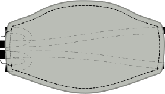

### Étape 1 : Coudre la couture centrale

Placer les deux pièces du tissu destiné à l'extérieur du masque endroit contre endroit, et les coudre ensemble sur les côtés courbes qui seront au milieu de notre masque *bons côtés*.

<Note>Répétez cette étape pour le tissu intérieur (doublure).</Note>

### Etape 2 (facultative) : Repasser la couture centrale

<Note>

Cette étape n'a aucune valeur fonctionnelle, elle améliore seulement l'aspect de votre masque.
Donc, si le look n'est pas une préoccupation pour vous, n'hésitez pas à la sauter.

</Note>

Repasser la couture centrale ouverte pour qu'elle soit bien plate.

Comme il s'agit d'une couture courbe, elle ne sera pas complètement plate. Mais vous pouvez vous en approcher en repassant d'abord la moitié d'un côté, puis la seconde moitié de l'autre côté. Ou bien vous pouvez également utiliser un coussin de repassage.<Note>Répétez cette étape pour le tissu intérieur (doublure).</Note>

### Etape 3 : Coudre ensemble l'extérieur et la doublure

Maintenant nous allons coudre ensemble le tissu intérieur (doublure) et le tissu extérieur, et les liens, en une seule étape.

 - Placez votre doublure sur l'envers.
 - Ensuite, placez deux liens aux coins d'un des côtés (à droite dans notre exemple) afin qu'ils sortent juste un peu du masque, le reste étant maintenu à l'intérieur.
 - Maintenant, placez dessus le tissu extérieur, sur l'endroit. Vous devriez maintenant avoir les deux épaisseurs de votre masque l'une sur l'autre *endroits contre endroits* avec deux liens en sandwich entre elles
 - Épingler les liens et les épaisseurs de tissu ensemble
 - Maintenant, faites la même chose de l'autre côté

<Tip>

As you get some practice, you will find you don't need to pin this and can just insert the
ribbons as you approach a corner.

</Tip>

Maintenant cousez autour du masque, en veillant à laisser un côté ouvert pour pouvoir retourner le masque par la suite.

<Warning>

Faites attention à ne pas coincer les liens dans la couture en dehors de l'endroit où vous le souhaitez.
Either guide them through the opening you leave on one side, or bunch them up in between
the masks of your layer to keep them out of the way.

</Warning>

### Step 4: Turn the mask inside-out

Actually, your mask is inside-out now, so turning it inside out will mean we get it outside-out, or regular.

Just reach in through the side your left open and carefully pull the mask through to turn it.

### Step 5 (optional): Press the mask

<Note>

This step has little functional value, it will only make your mask look better.
Donc, si le look n'est pas une préoccupation pour vous, n'hésitez pas à la sauter.

</Note>

Now that the mask is as it should be, it's time to press it. Before doing so, make sure to fold the seam allowance of the side we left open inwards, so that we press it flat as if it was sewn.

### Step 6: Close open side of the mask and edge-stitch around the edge

Now it's time to close the side of our mask the we left open to turn it inside out.

We are not merely going to close the opening, but also edge-stitch around the entire mask to give our mask some extra stability, and keep the lining at the back.

Make sure the open side is folded neatly inside, then edge-stitch around the entire mask.

### Step 7: Wear your mask or make a bunch

That's it, you're done! You can now wear your mask.

Even better, make a bunch so you can give others masks too.

