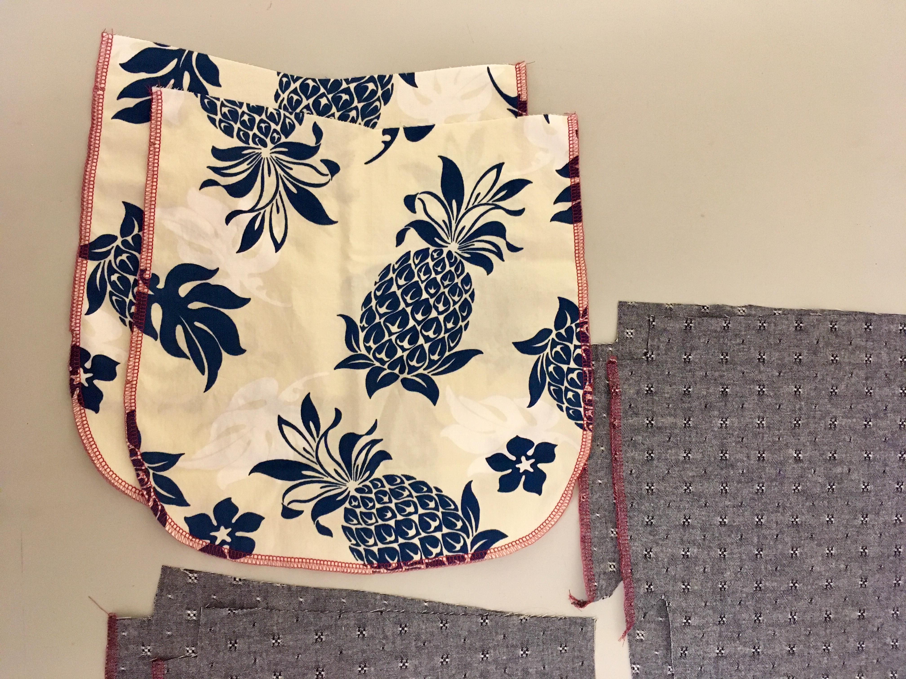
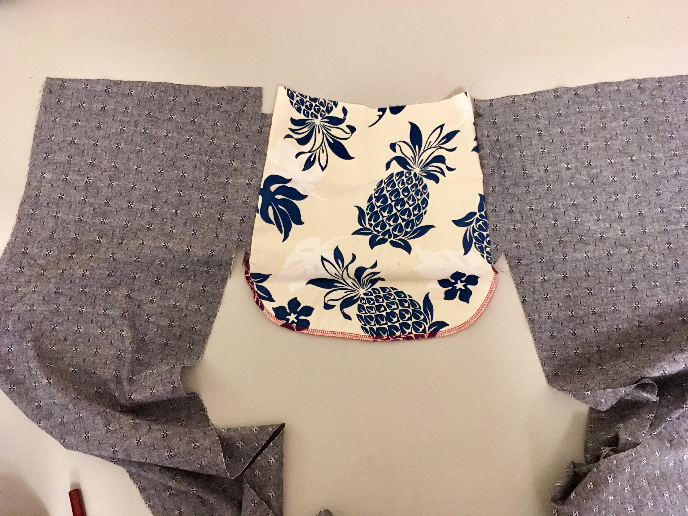
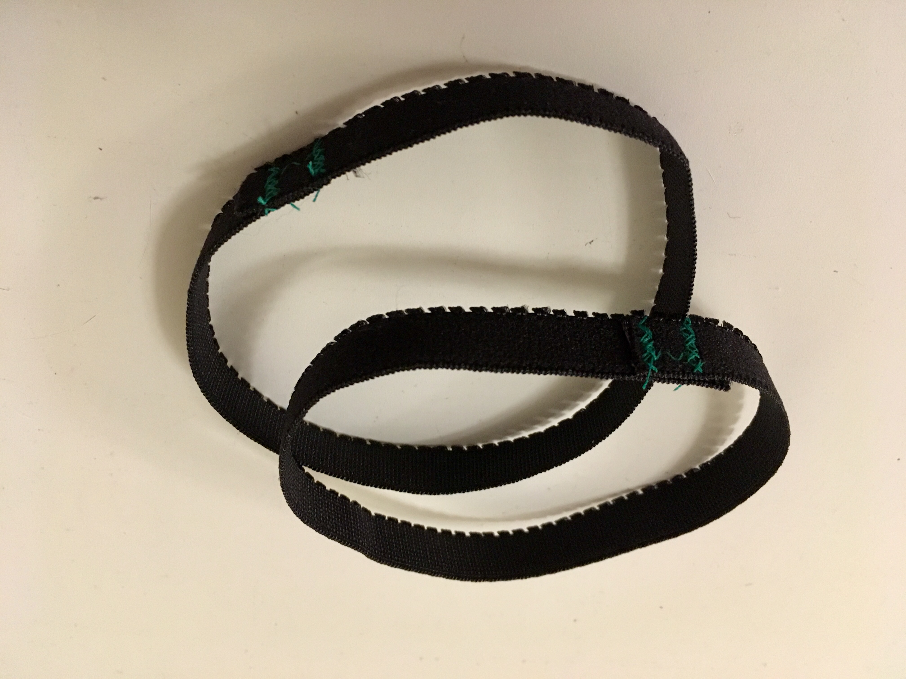
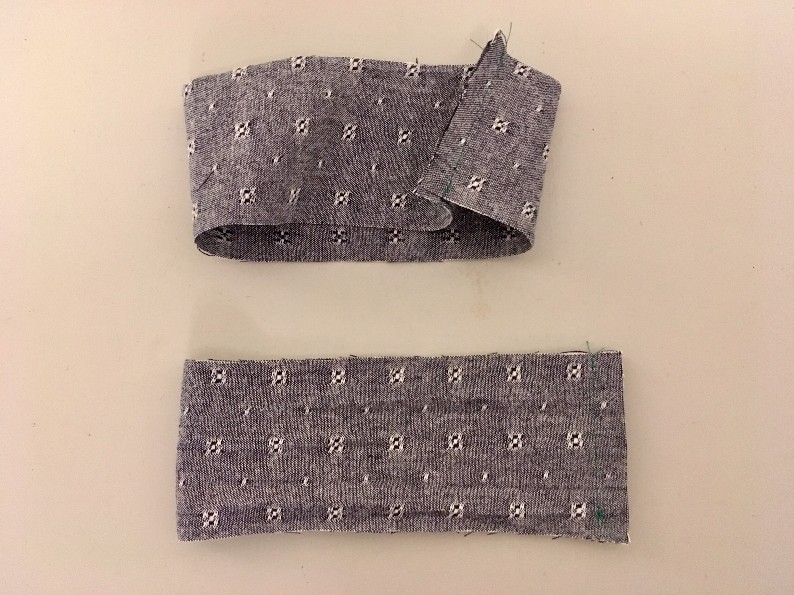
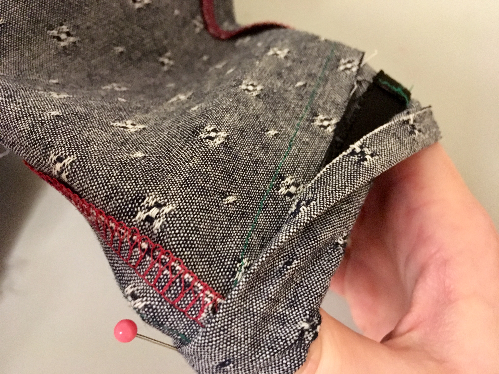

<Tip>

##### Een opmerking over naadafwerking

Voordat je begint, zal je moeten beslissen welke naadafwerking je wilt gebruiken. De naadafwerking is de methode waarmee je de afgeknipte rand van de stof afwerkt zodat de naden niet gaan rafelen. Hiervoor heb je een heel aantal keuzes. Veelgebruikte opties zijn om de rafelrand af te werken met de overlocker, of de rafelranden in te sluiten met een Engelse naad.

In deze instructies gaan we ervan uit dat je een overlocker gebruikt om de naden af te werken, maar we geven je ook een paar alternatieven. Andere mogelijkheden om naden af te werken zijn bijvoorbeeld om de rafelranden met een kartelschaar bij te knippen, met een zigzagsteek te versterken, of met biaislint om te boorden.
 </Tip>

## Stap 1: Maak de achterzakken

Ga je paspelzakken gebruiken op de achterkant van je Paco-broek? Top! Dit is misschien wel het lastige stuk van de constructie, en we gaan het als eerste aanpakken. Als je niet voor paspelzakken kiest, ga dan meteen over naar de volgende stap: de voorzakken.

Maak de paspelzakken aan de achterkant van de broekdelen, inclusief de broekzak.

<Tip>

##### Paspelzakken

Paspelzakken worden in verschillende kledingstukken gebruikt. Daarom hebben we er een aparte documentatiepagina voor gemaakt.

We hebben zowel geschreven documentatie als een videoreeks om je te tonen hoe het moet. Dus zelfs als je nog nooit paspelzakken gemaakt hebt, komt het helemaal goed.

[Naar de documentatie voor paspelzakken (in het Engels)](https://freesewing.org/docs/sewing/double-welt-pockets/)

</Tip>

<!--- One tricky bit, this documentation is for double welts, but this is I think a single welt? 
Does it need a note to that effect? --->

## Stap 2: Maak de voorzakken
De zakken knip je uit voeringstof. Dat maakt ze minder zwaar en dik, maar het betekent ook dat je niet wilt dat ze zichtbaar zijn aan de buitenkant. Daarom verstop je ze een stukje verder aan de binnenkant van de zijnaad. Daarvoor dient de flap bovenaan de buitennaad van de broekspijp.

Als je een overlocker gebruikt, werk dan nu de gebogen randen van je zakstukken af. Overlock daarna de lange kanten van de zakextensie.

## Stap 3: Bevestig de zakken aan de broekspijpen

Leg de patroondelen van de steekzak en de zakextensie aan de buitennaad van het voorpand [met de goede kant tegen elkaar](https://freesewing.org/docs/sewing/good-sides-together/) zodat de markeringen op de steekzak samenvallen met de uiteinden van de zakextensie. Stik ze aan elkaar. Herhaal dit voor de andere pijp.

Doe nu hetzelfde met de achterpanden. Leg de patroondelen van de steekzak en de zakextensie aan de buitennaad van het achterpand met de goede kant tegen elkaar zodat de markeringen op de steekzak samenvallen met de uiteinden van de zakextensie. Voordat je gaat naaien, kijk je het best even na dat je het voor- en achterpand van de linkerpijp aan één zak vastmaakt, en het voor- en achterpand van de rechterpijp aan de andere. Stik ze aan elkaar.

Pers de naadwaarde van de steekzak en de broekspijp weg van de zak, tegen de broekspijp.

<Note>

Optioneel: Je kan de naadwaarde nu tegenstikken om te voorkomen dat het zakdeel naar buiten rolt tijdens het dragen. Dat doe je door een lijn stiksel toe te voegen waarmee je de naadwaarde aan de steekzak vastmaakt, zo'n twee millimeter naast de naad. Doe dit aan beide kanten van de steekzak.

</Note>

## Stap 4: Bereid de zijnaden en de steekzak voor

Je hebt nu twee grote delen voor elke pijp, elk met een voor- en achterpand die aan elkaar vasthangen met een zak.

Neem één van de pijpen en leg het voor- en achterpand op elkaar met de goede kant naar binnen. Leg de buitennaad zó, dat de boven- en onderkanten van het voor- en achterpand precies op elkaar liggen, net zoals de randen van de zak. De goede kant van de stof zit aan de binnenkant.

## Stap 5: Stik de zijnaden

Stik twee afzonderlijke naden: eentje boven de zak en eentje eronder. Op die manier blijven je steekzakken open.

Begin aan de bovenkant van de broekspijpen. Stik langs de zijnaad. Om te draaien aan de steekzak, stop je met de naald in de stof. Hef de persvoet op en draai het werk. Hier kan je eventueel een kortere steeklengte gebruiken om de hoek van de zakopening te verstevigen. Volg de zijnaad, draai opnieuw en stop aan de bovenkant van de zak.

Nu ga je de onderkant van de steekzak sluiten en de rest van de zijnaad stikken. Begin aan de onderzijde van de steekzak. Stik langs de onderzijde en draai het werk wanneer je aan de zijnaad van de broekspijp komt. Je kan opnieuw een kortere steeklengte instellen voor de eerste steken van de zijnaad. Zo versterk je de onderkant van de zakopening. Stik de hele zijkant van de broekspijp naar beneden.

Herhaal dit voor de andere pijp.

## Step 6: Finish the side seams

Finishing these seams requires a touch of delicacy, especially around the tops of the pockets.

It would be difficult to finish the top part of the side seam with a serger, so we'll use a zig-zag stitch. Starting at the top of the side seam, zig-zag stitch along the raw edge of the seam allowance, pivoting around the pocket opening. Continue the zig-zag stitch up the side of the pocket, unless you've serged your pockets already (in which case you can stop when you reach the pocket).

The bottom opening of the pocket is a tight corner. To finish the seam around this corner, zig-zag stitch the raw edge of the seam allowance, starting where it joins the pocket, pivoting at the corner and continuing about 5 cm (2 in.) down the side seam. You can continue finishing the side seam with a zig-zag stitch all the way down. Alternatively, you can serge the side seam, making sure to stop the line of serger stitches a little ways from the pocket.

<Note>

Make sure to secure these serger stitches. They won't be caught in any other seams, so they risk 
unravelling if left unsecured.

</Note>

Herhaal dit voor de andere pijp.

Press the side seams toward the front.

<Note>

This may feel counterintuitive, as a lot of pants suggest pressing the side seams to the back. 
However, with inseam pockets, you'll want the pockets pressed toward the front of the pants. Your 
pockets will be fighting your side seam if you press the seam to the back, so we'll press it all 
to the front. This will will result in a smoother finish.

</Note>

<Note>

The corners of a pocket opening are one of the most likely places to wear out or tear, especially 
if you use your pockets a lot. If you're worried about tearing at the corners of your pockets, or 
if your fabric is more delicate, you can reinforce the pocket openings with bar tacks along the seam 
line, just outside the pocket openings.

</Note>

## Step 7: Anchor pocket bag to waist

The pockets in Paco are anchored at the waist. This means that you can put things in your pockets without them becoming unsightly bump that’s just dangling around in your trouser leg.

To anchor each pocket, align the top of the pocket with the mark along the waistline of your pattern. Sew a line of basting stitches inside your seam allowance to hold the pocket in place.

## Step 8: Sew and finish the inseams

Align the inseams with good sides together, then sew up the inseams. Finish the seams the same way you finished the side seams. Press inseams to the back.

## Step 9: Sew and finish crotch seam

To attach the individual legs, flip one leg good side out (it doesn't matter which leg), then place it inside the other leg, good sides together. You should now have what looks like just one pant leg, with wrong sides visible. Align the center front, center back, and inseams of each leg, then pin along the length of the crotch seam. Sew and finish the crotch seam.

<Note>

If you sew from center front to center back, it's easier to keep your inseam seam allowances 
pressed to the back as they feed through the machine.

</Note>

<!--- Insert image --->

## Step 10: Place eyelets for the draw string (optional)
Markeer het midden van de lengte van je tailleband. Fold one of your waistband pieces double, and mark the middle of the width (do not take the seam allowance into account).

Installeer twee vetergaten links en rechts van deze markering. Because your Paco pants have elastic in the waistband, as well, this is a nice detail, but is not required.

<Tip>

##### It’s best to add some reinforcement

If you've chosen a fabric that is slippery, drapey, or thin, you might want to add some reinforcement 
behind these eyelets. A bit of interfacing or a leftover piece of denim will do just fine.

</Tip>

<!--- Insert image --->

## Step 11: Prepare the waist elastic
There’s no magic formula for the length of your elastic. So you wrap it around your waist and pull it tight until you get a good fit. Paco is cut to sit at the high hip, so make sure your elastic is long enough to sit comfortably at the high hip.

Markeer deze lengte, knip het elastiek en naai de uiteindes aan elkaar.

## Step 12: Join the waistband
Place the two waistband pieces good sides together, and align the short edges. Sew the short edges together, then press open. These will be inside the waistband, so you don't need to finish the edges of these seams unless your fabric is particularly likely to fray.

Vouw de tailleband dubbel in de lengte met de goede kanten naar buiten. Pers. Deze vouw wordt de bovenkant van de tailleband.

## Stap 13: Bevestig de tailleband

Je kan de tailleband op twee manieren vastmaken. De ene is wat eenvoudiger, maar laat een naad 'bloot' aan de binnenkant van het werk. De andere is wat lastiger, maar verbergt wel alle rafelranden aan de binnenkant van de tailleband.

### De eenvoudige methode
Houd je tailleband dubbelgevouwen en schuif de elastiek erin. Zorg ervoor dat je de naad van de elastiek gelijklegt met de middenachternaad van de tailleband (diametraal tegenover de oogjes).

<!--- Insert image with elastic sticking out, step13 --->

Zoek het middenvoor van de tailleband (makkelijk als je oogjes hebt toegevoegd, maar anders plooi je de tailleband gewoon dubbel in de breedte). Plaats dit punt gelijk met de middenvoornaad van de broek. Let erop dat je de tailleband vastmaakt aan de buitenkant van de broek met de goede kanten op elkaar. Speld vast. 

<Tip>

##### Let op je oogjes

Als je oogjes in de tailleband hebt gemaakt, let dan goed op dat ze aan de buitenkant van de tailleband terechtkomen. Wanneer je de tailleband vaststikt, moet die dus zó op de broeksdelen liggen, dat de kant met de oogjes tegen de goede kant van de broek ligt.

</Tip>

Next, align the center front of your waistband with the center front seam. Speld vast. Then, align the center backs and pin in place, adding additional pins around the waistband as needed.

Sew the waistband to the pants, as close to the the elastic as you can, but don’t sew into the elastic.

<!--- Insert image, step13b --->

It’s fine to not sew too close the first time around, and once your elastic is attached and encased, make a second round to sew it a bit more snugly.

Remove any basting stitches from the tops of the pocket bags.

Finish the seam with a serger or other method.

### The enclosed seam method

Open the waistband. You will still be able to see the fold along its length, but you will be working with each side of the waistband individually.

Find the center front of your waistband (easy if there are eyelets, if not just fold it double), and align that with the center front seam of your pants. Make sure that your waistband is outside of your pants, with good sides together. Speld vast. 

<Tip>

##### Mind your eyelets
To make sure your eyelets will end up on the outside, make sure they are closer to the top of your 
waistband, above the fold, for now.

</Tip>

<!--- Insert image, step 13c --->

Next, align the center back of your waistband with the center back seam. Speld vast. Then, add additional pins around the waistband as needed.

Sew the waistband to the pants.

Press the waistband up. Press the seam allowance in on the opposite side of the waistband, maintaining the fold along the center of the waistband.

Refold the waistband, turning half the waistband to the inside. Pin so that the seam allowance on the inside is just below the seam joining the waistband to the pants, and pin in place around the waistband. From the outside, stitch in the ditch, catching the inner waistband as you go.

<!--- Probably put a note here about stitching in the ditch? --->

## Step 14: Prepare the cuff elastic

As you did with the waistband elastic, wrap the elastic for your cuff around your ankle and pull it tight until you get a good fit.

Markeer deze lengte, knip het elastiek en naai de uiteindes aan elkaar. Repeat for the other cuff elastic.

## Step 15: Join the cuffs
Fold each cuff with good sides together, aligning the short edges. For each cuff, sew the short edges together, then press open. These will be inside the cuff, so you don't need to finish the edges of these seams unless your fabric is particularly likely to fray.

Fold each cuff double along the length, with good sides out, and press. This fold will be the bottom of your cuffs.

<!--- Insert image --->

## Step 16: Attach the cuffs

You will attach your cuffs the same way that you attached the waistband. As with the waistband, there are two options - a simpler choice, and a choice without exposed seams on the inside.

<Note>

 If your sewing machine has a detachable bed (usually removed to expose the "free arm" for sewing 
 sleeve cuffs), this will make sewing the cuffs easier.

 </Note>

### De eenvoudige methode

Keep your cuffs folded double, and place the elastic inside.

<!--- Insert image, step16 --->

Align the seam in the cuff with the inseam of the pants. Make sure that your cuff is outside of your pants, with good sides together. Pin in place, then pin the rest of the way around the cuff.

<Tip>

##### Pinning the cuffs

The elastic will make the cuffs more difficult to pin. To make sure that your cuffs are pinned evenly 
to the pants, place your second pin on the opposite side of the leg opening from the first. You can 
stretch the elastic to make sure that everything is lined up smoothly, then place your next pins halfway 
between the first two. Continue this way, pinning halfway between other pins, until you feel confident 
there are enough.

</Tip>

<!--- Insert image, step16b --->

Sew the cuff to the pants opening, as close to the the elastic as you can, but don’t sew into the elastic.

<!--- Insert image, step16c --->

Finish the seam with a serger or other method.

### The enclosed seam method

Open the cuff. You will still be able to see the fold along its length, but you will be working with each side of the cuff individually.

Align the seam in the cuff with the inseam of the pants. Make sure that your cuff is outside of your pants, with good sides together. Pin in place, then pin the rest of the way around the cuff.

Sew the cuff to the pants.

Press the cuff away from the pants. Press the seam allowance in on the opposite side of the cuff, maintaining the fold along the center of the cuff.

Refold the cuff, turning half the cuff to the inside. Pin so that the seam allowance on the inside is just past the seam joining the cuff to the pants, and pin in place around the cuff. From the outside, stitch in the ditch, catching the inner cuff as you go.

## Step 17: Stitching the cuffs and waistband (optional)

If you have wider cuff elastic, you may want to stitch a horizontal line halfway up the cuff. This will hold your elastic in place and help keep it from folding or twisting. Make sure to stretch the elastic evenly as you sew, so that it gathers the fabric evenly. (If you sew without stretching the elastic, you risk lumpy gathers and a leg opening too narrow to get your foot through.)

<!--- You could also do a zig-zag stitch here, but I think straight probably looks nicer? --->

If you like the look, you can also sew more than one line of stitches, evenly spaced between the top and bottom of the cuff.

<!--- Insert image --->

You can do the same for the waistband.

<Note>

If you put in eyelets for a drawstring, sew a line of stitches above the eyelets and a separate line 
below the eyelets, leaving a channel wide enough for your drawstring.

</Note>

<!--- Insert image --->

## Step 18: Thread a draw string around the waist (optional)
If you put eyelets in your waistband, thread a drawstring through one eyelet, around the waist, and out of the other eyelet.

<Note>

There are tools to make this task easier, but one that almost everyone has is a simple safety pin. 
Pin the safety pin to one end of your drawstring, then push it through the channel. The safety pin 
will be easier to maneuver through the fabric, and it will pull the drawstring along with it. 

</Note>

## Step 19: Enjoy your Paco pants!
You did it! Way to go!

<!--- Maybe we want to put a fun gif here? --->
