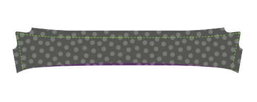
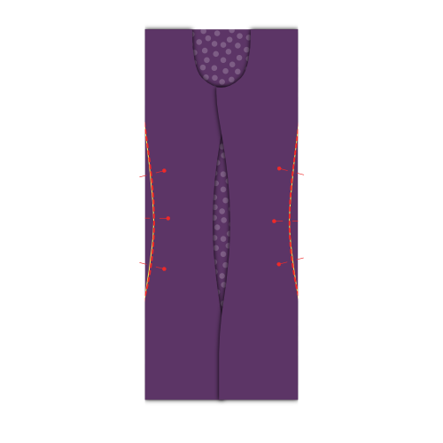
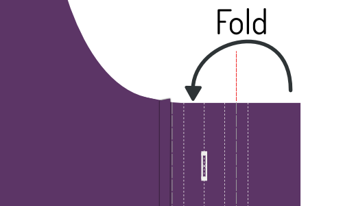
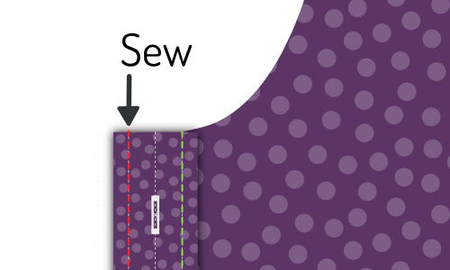
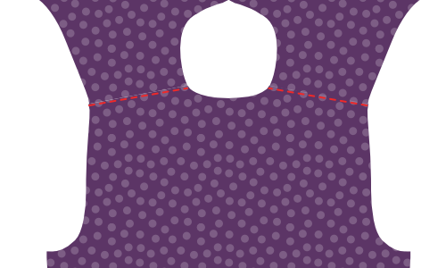
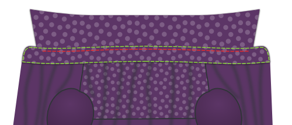

## Wat je nodig hebt

Om Simon te maken heb je het volgende nodig:

- Ongeveer 2 meter geschikte stof (zie [Stofkeuzes](#fabric-options))
- Knopen
- Kleefbare tussenvoering voor de kraag en manchetten (en mogelijk voor het knopenpat)

## Stofkeuze

Elke stoffenwinkel die je tijd waard is zou een afdeling hemdstoffen moeten hebben. Je kan binnenwandelen, vragen waar de hemdstoffen zijn, en iets kiezen dat je mooi vindt.

Meestal zullen dit katoenen stoffen zijn, of een mengeling van katoen en iets anders. Maar ga gerust voor een andere vezel.

Als je online winkelt is het soms moeilijker om te weten wat je juist koopt. Als je de stoffen niet kan aanraken helpt het om iets te weten over verschillende weefsels. Het weefsel slaat of hoe de stof geweven is, en dit bepaalt niet alleen hoe ze eruit ziet, maar ook hoe ze zal voelen en vallen.

> Ik heb niet meteen de ambitie om hier een stoffenencyclopedie te starten, maar hier zijn een aantal termen die je kan tegenkomen als je online hemdstoffen koopt.
> 
> **Laken of popeline**
> 
> Laken is dé keuze voor dat ene witte hemd voor je sollicitatiegesprek, of huwelijk.
> 
> Laken (soms ook popeline genoemd) is een eenvoudig weefsel dat een gladde effen stof produceert, wat voor die kraaknette formele look zorgt.
> 
> Het is vaak een lichtere stof en kan een beetje transparant zijn, vooral als het een lichte kleur is.
> 
> **Keper**
> 
> Je herkent keperstoffen aan hun typische diagonale textuur.
> 
> Het valt een beetje soepeler dan laken, kreukt minder en is makkelijker te strijken.
> 
> Het nadeel is wel dat het er nooit zo glad en gesteven zal uitzien als laken.
> 
> **Oxford**
> 
> Oxford is een echte muilezel onder de hemdstoffen. De stof is meestal iets zwaarder en dikker, en dus ook duurzamer.
> 
> Oxford is minder formeel dan laken of keper. Dit, samen met de duurzaamheid, maken het een goede keuze voor je dagelijkse werkhemden.
> 
> **Chambray**
> 
> Chambray heeft een eenvoudige platbinding, gelijkaardig aan laken. Het verschilt omdat het een veel zwaarder garen gebruikt, en meestal verschillende kleuren voor de schering en inslag.
> 
> Het resultaat is een stof met veel meer textuur, zowel qua aanvoelen als het tweekleurige effect van het weefsel.
> 
> **Denim**
> 
> Denim heeft geen introductie nodig. Het is het spul waar je jeans van gemaakt is.
> 
> Gewoonlijk een keperstof (kijk uit voor de typische diagonale textuur) die soms ook in een veel lichtere versie dan die van je jeans gemaakt wordt. Dat zijn de soorten die je voor een hemd kan gebruiken.
> 
> **Flanel**
> 
> Van Kurt Cobain tot de hipsters in je lokale koffiebar, ze zweren allemaal bij (geruite) flanellen hemden.
> 
> Dit is de warmste van alle opties hier, en wordt meestal gemaakt van opgeruwd katoen. Soms vind je ook wollen versies. 
> 
> **Linnen**
> 
> Linnen kreukt als je ernaar wijst, maar het is een perfecte kandidaat voor safari looks.
> 
> De reden waarom je deze stof associeert met avonturen in de tropen is dat linnen ongelooflijk goed ademt en je huidje koel zal houden.
> 
> **Draaddichtheid**
> 
> Een hogere draaddichtheid betekent een gladdere (en duurdere) stof.
> 
> Draaddichtheid wordt in nummers uitgedrukt, zoals 60, 80, 100 enzovoort tot 300 en meer.
> 
> Er zit wel een addertje onder het gras. Draaddichtheid boven de 100 wordt meestal verkregen door twee garens samen te twijnen. Bijvoorbeeld: een draaddichtheid van 160 betekent dat twee garens van 80 samen verwerkt werden tot één garen.
> 
> **Eendraads of tweedraads**
> 
> Als een draad gemaakt is van twee garens (zie Draaddichtheid hierboven) noemen we dat tweedraads.
> 
> Als de draad gemaakt is van een enkel garen wordt dat eendraads genoemd.
> 
> Zoals te verwachten is tweedraads duurzamer, en duurder.

## Knippen

- **Buitenstof** 
 - Knip **1 linkervoorpand**
 - Knip **1 knopenpat** (enkel als je voor een apart knopenpat koos)
 - Knip **1 rechtervoorpand**
 - Knip **1 knoopsgatenpat** (enkel als je voor een apart knoopsgatenpat koos)
 - Knip **1 rugpand**
 - Knip **1 kraag**
 - Knip **1 onderkraag**
 - Knip **2 schouderpassen** of **4 schouderpassen** als je voor een gesplitste schouderpas koos
 - Knip **2 mouwen**
 - Knip**2 kraagstaanders**
 - Knip **2 onderkant mouwsplit**
 - Knip **2 overlap mouwsplit**
 - Knip **4 manchetten**
- **Kleefbare tussenvoering** 
 - Knip **1 kraag**
 - Knip **1 onderkraag**
 - Knip**2 kraagstaanders**
 - Knip **2 manchetten**

> Als je twee stukken nodig hebt van één patroondeel, kan je dit met de [goede kanten van de stof](/en/docs/sewing/good-sides-together) samen knippen. Als ik echter een stof met een patroon gebruik knip ik ze liever apart zodat ik meer controle heb over de plaatsing van het patroon.
> 
> Als je alles apart uitknipt, onthou dan dat de delen gespiegeld moeten zijn. Dus draai of je patroondeel of je stof om als je een tweede deel knips.

### Opmerkingen

- Het **rechtervoorpand**, **linkervoorpand** en de **mouw** hebben naden die afgewerkt worden met een platte naad. Zodoende hebben deze naden extra naadwaarde. Let op dat je deze naadwaarde **zeker**toevoegt als je deze stukken uitknipt.
- The cuff guard and cuff placket have no seam allowance. Dat is normaal, knip ze gewoon uit zoals ze op je patroon staan.
- Knip de nepen in het **rugpand** niet uit. Je moet ze markeren, maar niet uitknippen.

Simon is een heel veelzijdig patroon, dus jouw versie kan verschillen van het voorbeeld hier:

> The [notation legend](/en/docs/patterns/notation) explains all the different markings and lines on your draft.

## Constructie

### Stap 1: Bevestig tussenvoering

 

#### Kleef tussenvoering aan manchetten

Om twee manchetten te maken heb je je patroondeel vier keer uit stof geknipt, en twee keer uit tussenvoering.

Strijk de tussenvoering op de slechte kant van twee van de manchetstukken.

> Als je stof geen slechte kant heeft maakt het niet uit aan welke twee stukken je de tussenvoering kleeft.
> 
> Het is echter een leuk detail om de binnenkant van je manchet van een andere stof te maken. In dat geval moet je zeker zijn dat je de tussenvoering aan het stuk kleeft dat je als buitenkant wil gebruiken.
> 
> De vorm van je manchet zal anders zijn, afhankelijk van welke soort je gekozen hebt.
> 
> In de eerste illustratie zie je zowel een klassieke afgeronde manchet en een franse manchet als voorbeeld.
> 
> Vanaf nu gebruiken we de klassieke manchet in de illustraties, maar het proces is hetzelfde voor de andere soorten manchetten.

#### Kleef tussenvoering aan kraag en onderkraag, en kraagstaander

Om je kraag te maken heb je één onderkraag, één kraag en twee kraagstaanders nodig. Dit alles zowel in stof als in tussenvoering.

Strijk de tussenvoering tegen de slechte kant van elk deel.

### Stap 2: bereid de manchetten voor

#### Stik de manchet aan elkaar

Leg beide delen van je manchet (één met tussenvoering, één zonder) op elkaar met de goede kanten samen, en stik ze samen met de standaard naadwaarde.

> **Let op**
> 
> - Laat de kant die later aan de mouw bevestigd wordt open
> - Stop aan de naadwaarde van de rand die aan de mouw bevestigd wordt

#### Knip naadwaarde bij

Voor we de manchet keren is het belangrijk de naadwaarde bij te knippen om wat volume te verwijderen.

#### Strijk de naadwaarde terug

Plooi de naadwaarde aan de kant van de mouw naar binnen, en strijk.

> Als je eerder iets te ver langs de rand gestikt hebt ga je nu een paar steken moeten lostornen.

#### Keer manchet en strijk

Keer je manchet met de goede kant naar buiten, en strijk grondig.

> Let op dat je de naad van de manchet een beetje naar de binnenkant rolt tijdens het strijken zodat ze niet zichtbaar is langs de buitenkant.

Je mag je manchetten nu opzij leggen, we komen hier later op terug.

### Stap 3: Bereid de kraag voor

#### Stik de kraag en onderkraag samen

Leg de twee kraagdelen op elkaar met goede kanten samen en stik ze vast met de standaard naadwaarde.

#### Knip naadwaarde bij

Voor we de kraag gaan keren is het belangrijk de naadwaarde bij te knippen om wat volume te verwijderen.

#### Keer kraag en strijk

Keer de goede kanten van je kraag naar buiten, maak de puntjes zo scherp mogelijk, en strijk grondig.

> Denk er bij het strijken aan dat de onderkraag een beetje smaller is dan de bovenkraag.
> 
> Wanneer je de niet-gestikte randen op elkaar legt zorgt dit dat de naad naar de onderkant van de kraag rolt zodat deze niet zichtbaar is aan de goede kant.

#### Stik de kraag door

Geef een sierstiksel langs de rand van de kraag. Dit houdt de naadwaarde op z'n plaats en zorgt dat alles er scherp uitziet.

> Hoe ver je van de rand stikt is een stijlkeuze. Het is meestal een beetje minder dan de standaard naadwaarde. Kijk eens naar een paar bestaande hemden om een idee te krijgen.

### Stap 4: Bevestig kraag aan kraagstaander

#### Leg de kraag tussen de kraagstaanders en drieg vast

Geef het middelpunt van je kraag en kraagstaanders aan met een speld. Het middelpunt van elke kraagstaander is eigenlijk net niet in het midden, aangezien één kant langer is dan de andere. Zoek dus naar het middelpunt tussen de twee merktekens.

Leg eerst een kraagstaander met de goede kant omhoog, dan je kraag met de onderkraag naar omhoog (en de ongestikte rand bovenaan), en uiteindelijk de tweede kraagstaander met de goede kant naar beneden.

Je kraag zou tussen je twee kraagstaanders moeten zitten, en de middelpunten (waar je je speld geplaatst hebt) moeten overeenkomen.

> Hoe dit eruitziet hangt wat al van je keuzes, maar over het algemeen zal je kraag naar beneden buigen, en je kraagstaander naar boven.
> 
> Om dit allemaal mooi gelijk te krijgen gaan we het driegen, in plaats van te spelden. Je kraag is een belangrijk deel van je hemd, dus het is de moeite om dit te driegen.

Vervang eerst de spelden die de middelpunten markeren door één speld die alle lagen samenhoudt.

Begin nu vanaf deze speld te driegen en werk zo in de richting van de hoek van de kraag. Zorg dat je de randen van de stof netjes gelijk legt.

Blijf driegen als je aan de hoek van je kraag komt, en drieg de uiteindes van de kraagstaanders samen.

Wanneer je één kant gedaan hebt kan je opnieuw beginnen vanaf de speld in het midden en de andere kant doen. Zodra je klaar bent met driegen kan je de speld verwijderen.

#### Stik je kraag aan de kraagstaanders

Stik langs de rand van je kraagstaander, met de standaard naadwaarde.

> Let op dat je 2 cm voor de rand stopt (twee keer de standaard naadwaarde) aangezien we de naadwaarde omplooien in de volgende stap, en we de kraagstaander nog open genoeg moeten laten om het hemd ertussen te krijgen.

#### Plooi en strijk de naadwaarde van de kraagstaander

Plooi de naadwaarde van de bovenste kraagstaander om en strijk.

> In het midden zal het makkelijk zijn om de naadwaarde te strijken. Maar naar de punten toe zal dit moeilijk worden zonder plooien in je kraag te strijken.
> 
> Strijk zo goed als je kan zonder plooien te maken. We strijken dit opnieuw zodra de kraagstaander gekeerd is.

#### Keer de kraagstaander en strijk

Keer de goede kanten van je kraagstaander naar buiten en strijk grondig. Let op dat de naadwaarde van de kraagstaander naar binnen gekeerd blijft.

Je kan je kraag nu opzij leggen, we komen hier later op terug.

### Stap 5: Optioneel: Bevestig je label

De volgende stap is het vastnaaien van de schouderpas. Maar deze schouderpas is een ideale plek om een label te hangen. Dus als je dat graag wil doen, doen we het best nu.

Kies een schouderpas, en je kan het label in het midden vastnaaien (aan de goede kant).

### Stap 6: Bevestig de schouderpassen aan het rugpand

 

Leg één schouderpas met de goede kant omhoog. Leg hier het rugpand op, met de goede kant naar boven, en leg de aanzetnaad van de schouderpas gelijk.

Leg hier dan de tweede schouderpas bovenop, met de goede kant naar beneden.

Je rugpand zit nu tussen de goede kanten van je twee schouderpassen.

Als dat zo is, stik dan door de drie lagen van aanzetnaad. Let op dat je de juiste naadwarde respecteert.

> Let op dat de schouderpas met het label aan de verkeerde kant van je rugpand zit, mocht je een label hebben toegevoegd.

Vergeet niet deze naad goed te strijken zodat hij plat ligt.

### Stap 7: Stik de schouderpas door

Als je schouderpassen aan het rugpand bevestigd zijn gaan we ze doorstikken langs de aanzetnaad, aan de kant van de schouderpas.

> Vouw de binnenste schouderpas uit de weg. Het stiksel gaat door de buitenste schouderpas en alle naadwaarde, maar niet door de binnenste schouderpas.

Stik net naast de aanzetnaad.

> Doorstikken is als een sierstiksel, maar heel dicht bij de rand

### Stap 8: Sluit de achterste nepen

  

> Afhankelijk van je maten heeft je patroon wel of geen nepen. Indien geen nepen, ga dan voort met de volgende stap.

Je patroon heeft misschien nepen in het rugpand. Als er nepen zijn, zou je ze nu moeten sluiten.

Leg je rugpand met de goede kant omhoog, en plooi het langs de zijkant om zodat de vouw van de bovenste naar de onderste punt van de neep loopt.

Doe hetzelfde voor de andere neep, zodat beide kanten teruggeplooid zijn.

Het is ok om deze vouw lichtjes te strijken, dat helpt om de nepen accuraat te stikken.

Stik langs de lijn die de nepen aangeeft om ze te sluiten. Probeer op te letten dat de bovenste en onderste punten exact zijn waar ze moeten zijn. Als één neep hoger zit dan de andere ziet het er niet uit.

Vergeet niet grondig te strijken! Strijk de stof van de neep naar de zijnaden.

### Stap 9: Bereid het knopenpat voor

> Als je een aangeknipt knopenpat gekozen heb kan je de eerste twee substapjes overslaan en verdergaan met [Plooi het knopenpat](#fold-the-button-placket).

#### Stik het knopenpat vast

Als je een apart knopenpat gekozen hebt stik je het nu vast aan het rechtervoorpand.

Leg het rechtervoorpand (deel 1) neer met de goede kant omhoog, en leg het knopenpat (deel 1b) erop met de goede kant naar beneden. Leg de randen netjes gelijk.

Stik vast met de standaard naadwaarde.

#### Strijk de naadwaarde in de richting van het knopenpat

Leg je voorpand met de goede kant naar beneden, en strijk de naadwaarde naar het knopenpat toe.

#### Plooi het knopenpat

Plooi nu het knopenpat aan de eerste vouwlijn, en strijk deze vouw.

Plooi het knopenpat opnieuw om, en let op dat de stof tot net voorbij de aanzetnaad aan het voorpand komt zodat deze bedekt is.

Als je daarmee blij bent, strijk dan het geplooide knopenpat.

#### Stik het geplooide knopenpat

> Dit is de klassieke aanpak. Als je voor het naadloze knopenpat gekozen heb moet je dit niet doen.
> 
> In plaats van het knopenpat door te stikken, laat je het gewoon geplooid. De plooien worden op hun plaats gehouden wanneer we later de knopen aannaaien.

Stik het geplooide knopenpat vast door langs de goede kant van je hemd in de naad te stikken.

Om dit te doen stik je exact bovenop je eerdere naad. Aangezien je het knopenpat een beetje verder dan deze naad geplooid hebt wordt het nu aan de achterkant vastgestikt. Op deze manier blijft je knopenpat zitten en blijft de naadwaarde mooi binnenin.

### Stap 10: Bereid het knoopsgatenpat voor

> Als je een aangeknipt knoopsgatenpat gekozen heb kan je de eerste twee substapjes overslaan en verdergaan met Hoe werkt een klassiek knopenpat.

#### Stik het knoopsgatenpat vast

Als je een apart knoopsgatenpat gekozen hebt stik je het nu vast aan het linkervoorpand.

Leg het linkervoorpand (deel 2) neer met de goede kant omhoog, en leg het knoopsgatenpat (deel 2b) erop met de goede kant naar beneden. Leg de randen netjes gelijk.

Stik vast met de standaard naadwaarde.

Vergeet niet grondig te strijken! Strijk de naadwaarde in de richting van het knoopsgatenpat.

#### Strijk de naadwaarde in de richting van het knoopsgatenpat

Leg je voorpand met de goede kant naar beneden, en strijk de naadwaarde naar het knoopsgatenpat toe.

#### Hoe werkt een klassiek knopenpat

> Als je een naadloos knopenpat gekozen hebt moet je de stappen voor het knopenpat volgen, aangezien de constructie identiek is.
> 
> De stappen hieronder zijn voor een klassiek knopenpat.

Er staan een hoop lijnen op het knopenpat, dus laat ons eerst eens kijken wat die betekenen:

- De knoopsgatenlijn heeft is een lange stippellijn met knoopsgaten op. Ze geeft aan waar de knoopsgaten moeten komen
- De twee vouwlijnen zijn lange stippellijnen en zitten op gelijke afstand rechts en links van de knoopsgatenlijn
- De twee+twee stiklijnen zijn stippellijntjes die op gelijke afstand van elke vouwlijn zitten

#### Knip naadwaarde bij

> Als je een aangesneden knopenpat gekozen hebt is dit niet van toepassing.

De naadwaarde van de aanzetnaad van het knoopsgatenpat zou in je geplooide knoopsgatenpat moeten passen.

Om dat te verkrijgen knip je de naadwaarde bij zodat ze niet verder komt dan de eerste vouwlijn op het knoopsgatenpat.

#### Plooi het knoopsgatenpat

 

Plooi het knoopsgatenpat langs de eerste vouwlijn. Strijk de vouw.

Plooi dan het deel dat je net plooide nog een keer, nu op de tweede vouwlijn. Strijk deze vouw ook.

> Als je knoopsgatenpat geplooid en gestreken is helpen een paar spelden wel eens om te voorkomen dat dingen gaan verschuiven

#### Stik het geplooide knoopsgatenpat

 

Stik op de eerste stiklijn, het dichtst bij de rand.

Draai dan je hemd om zodat de goede kant naar boven ligt, en je knoopsgatenpat ook. Stik dan op de tweede stiklijn.

> Deze twee rijen stiksel gaan altijd zichtbaar zijn, dus hou het netjes

#### Strijk het knoopsgatenpat

Gefeliciteerd, je hebt een klassiek knopenpat gemaakt.

Strijk het nu naar de verdoemenis. You know you want to.

### Stap 11: Sluit de schoudernaden

> **Laten we een burrito maken**
> 
> We gaan de schoudernaad sluiten met een techniek die ook wel de **burritomethode** genoemd wordt.
> 
> Als dit je bekend in de oren klinkt weet je al wat te doen. Indien niet, lees dan even verder voor een slimme manier om de schoudernaden van je hemd te stikken en tegelijk alle naadwaarde weg te stoppen.

#### Speld de voorpanden aan de buitenste schouderpas

 

Leg het rugpand neer met de goede kant omhoog, maar let op dat je de binnenste schouderpas naar beneden plooit (zoals aangeduid met de stippellijn).

Leg de voorpanden op het rugpand, met de goede kanten naar beneden. Speld de voorpanden aan de schouderpas langs de schoudernaad, met de goede kanten samen.

#### Rol hemden, geen zakken

Rol je achterpand en voorpanden op, beginnend aan de zoom. Rol alles in een strakke worst naar boven tot je de volledige binnenste schouderpas kan zien.

Nu kan je die schouderpas over het opgerolde hemd leggen om de schoudernaden gelijk te leggen met de buitenste schouderpas.

Speld de naden vast en stik de schoudernaden. Let op dat je de hemdworst (of burritovulling) uit de weg houdt zodat ze niet in de naad terechtkomt.

> Let op dat je de eigenlijke stiklijn gelijk legt. Door de hoeken van de halsopening kan het zijn dat de rand van de stof aan één kant langer is dan aan de andere.
> 
> De stiklijnen zijn echter even lang, dus zorg dat je deze mooi gelijk legt, met hulp van de merktekens.

#### Keer het binnenstebuiten door de halsopening

Wanneer je de twee schoudernaden gestikt hebt haal je de voorpanden en het achterpand naar buiten door de halsopening van je burrito.

#### Strijk de schoudernaden

Dit was veel werk, dus zorg ook dat het er superscherp uitziet door het flink te strijken. Zorg dat de naadwaarde tussen je schouderpassen mooi plat ligt.

### Stap 12: Stik de schoudernaden van de schouderpas door

We gaan de schouderpas ook aan de schoudernaden doorstikken, net zoals we met de aanzetnaad van het rugpand in Stap 3 gedaan hebben.

Aangezien je deze schoudernaden gestreken hebt zou alles mooi plat moeten liggen, en moet je gewoon recht naast de naad stikken.

> Zorg dat je op de schouderpas doorstikt, waar je alle naadwaarde mee vastzet, en niet op het voorpand.

### Step 13: Construct the sleeve placket

#### Sew in the cuff guard

  

- Place your sleeve with the good side down, and your cuff guard on top, also with the good side down.
- Align the edge of your cuff guard (aka sleeve placket underlap) with the cut in your sleeve, on the side shortest to the side seam.
- Now sew along the fold line marked on the cuff guard, closest to the edge.

> If during cutting out your pattern pieces you had not cut into your sleeve on the line where the sleeve placket needs to be put in, you need to do that first.

- Fold over the cuff guard, and press down this seam.
- Turn your sleeve over with the good side up, and bring your cuff guard through the slit in your sleeve.
- Fold it twice on the lines so that the unfinished seam is tucked inwards.
- Make your folds so that the upper folds sits ever so slightly further than the seam you already made.
- Press everything down, and then edge-stitch the cuff guard in place.

#### Fold and press the placket

Origami time! We're going to fold the sleeve placket overlap using the marked fold lines as our guide. This will be a lot easier if you press between each fold.

- First, fold the outer edges of the placket inwards.
- Next, fold the entire thing double.
- Then, fold down both tips into a nice pointy shape.
- Now give it a final good press.

@[youtube](kgd5eubxShM)

> Here's [a very short YouTube video of me folding the placket](https://www.youtube.com/watch?v=kgd5eubxShM).

#### Pin placket in place

 

Place your sleeve down with the good side up. The guard we have sewn in earlier sits against the other unfinished fabric edge of where you cut into your sleeve.

Place your placket around that edge, one side above it, one underneath.

You need to slide the placket onto your sleeve until the middle of it (the tip) aligns with the cut in your sleeve.

The idea is that the placket closes up the unfinished edge, but also covers the guard of the other edge.

When you've got it where you want it, pin the placket down.

#### Sew the sleeve placket

Start at the edge of the sleeve (the bottom of the sleeve placket) and edge-stitch along the edge upwards.

Go around the tip, and come down again on the other side (the fold side) until you have passed the point where your guard ends.

Then, sew horizontal to the other side of the placket to finish.

> I have included an extra illustration here that only shows the outline of the placket. You can see that the end of the guard is caught in our stitching of the placket, and is thus neatly tucked away.

### Step 14: Set in sleeves

#### Remember, this is a flat-felled seam

> **Careful with the extra seam allowance for the flat-felled seam** There is extra seam allowance on the sleeve to allow for the creation of the flat-felled seam.
> 
> As such, be careful to not align the fabric edge, but align the seam so that the sleeve sits out 1cm.

#### Pin shirt in place

Spread your shirt open so that both fronts and back lie flat with their good sides up.

Now place your sleeve on top with the good side down, matching the notch at the top of the sleeve with the shoulder seam.

> Be careful, your sleeve is not symmetric, so be sure to have the double notch (and cuff guard) on the back side, and the single notch on the front side.
> 
> Also note that the double notches on the back of your sleeve do not have corresponding notches on the back. That's because it should match op with the seam where your yoke joins the back.

You now need to pin the sleeve to the armhole. To do so, make sure to:

- Match the start and end of the sleevehead to the start and end of the armhole
- Match the notches on the sleevehead to the notches on the back and fronts
- Distribute the sleevecap ease between the notches as shown

#### Distribute sleavecap ease

The default sleevecap ease for this pattern is 0.5cm. If you have sleevecap ease, you need to distribute that extra length evenly between the notches as shown.

> If you are unsure what sleevecap ease is, have a look at the [documentation for the sleevecap ease pattern option](/en/docs/patterns/simon/options#sleevecapEase).

#### Sew sleeve in armhole

When you've got your sleeve neatly pinned in your armhole, sew it in place. Be careful to avoid any pleats in the part between the notches where you need to ease in the sleevecap ease.

> Needless to say, but I'll say it anyway: Repeat this step for the other sleeve.

### Step 15: Flat-fell armhole seam

#### Press seam allowance to one side

Lay down your freshly sewn sleeve seam with the good side down

We are going to press the seam allowance to one side. To do so, identify the seam allowance that is wider (for the flat-felled seam).

The longer seam allowance needs to lie on top of the shorter (standard seam allowance).

Once you have verified that, press down the seam allowance.

#### Fold under extra seam allowance

Now, fold the extra seam allowance for the flat-felled seam under the standard seam allowance.

You can use pins to hold this in place, but it's simpler to just press it.

> This will be relatively easy on the straight parts of the seam, but a bit more tricky at the curved sections. Take your time, and if needed you can cut into the extra seam allowance to allow it to flare open, or bend.

#### Sew the flat-felled seam

Now, from the bad side of the fabric, sew the seam allowance down just at the edge where it folds under the other seam allowance.

Important here it to keep an even distance from the seam of your sleeve. If you have a felling foot for your sewing machine, it will help you with that. But if not, just be careful.

> It is more important to keep and even distance from the sleeve seam than to sew exactly at the edge of the fold. Ideally, the fold sits at an even distance anyhow, but if it doesn't, just make sure to sew parallel to the sleeve seam. Even if that means you deviate a bit from the folded edge.

#### Press the flat-felled seam

When it's all done, press the flat-felled seam from the good side so it lies nice and flat.

### Step 16: Close the side/sleeve seams

 

Place your shirt with the good sides together, and sew the side and sleeve seams to close the shirt.

> There is extra seam allowance on the sleeve and front sides to allow for the creation of the flat-felled seam. As such, be careful to not align the fabric edge, but align the seam so that the extra seam allowance sits out 1cm.

### Step 17: Flat-fell the side/sleeve seams

#### Press seam allowance to one side

We are going to press the seam allowance to one side. To do so, identify the seam allowance that is wider (for the flat-felled seam).

The longer seam allowance needs to lie on top of the shorter (standard seam allowance).

Once you have verified that, press down the seam allowance.

#### Fold under extra seam allowance

Now, fold the extra seam allowance for the flat-felled seam under the standard seam allowance.

You can use pins to hold this in place, but it's simpler to just press it.

> This will be relatively easy on the straight parts of the seam, but a bit more tricky at the curved sections. Take your time, and if needed you can cut into the extra seam allowance to allow it to flare open, or bend.

#### Sew the flat-felled seam

Now, from the bad side of the fabric, sew the seam allowance down just at the edge where it folds under the other seam allowance.

Important here it to keep an even distance from the seam of your sleeve. If you have a felling foot for your sewing machine, it will help you with that. But if not, just be careful.

> It is more important to keep and even distance from the sleeve seam than to sew exactly at the edge of the fold. Ideally, the fold sits at an even distance anyhow, but if it doesn't, just make sure to sew parallel to the sleeve seam. Even if that means you deviate a bit from the folded edge.

#### Press the flat-felled seam

When it's all done, press the flat-felled seam from the good side so it lies nice and flat.

### Step 18: Attach cuffs to sleeves

#### Pin cuff in place

You need to insert the sleeve between the two layers of your cuff, making sure that that good side of the fabric sits against the side of your cuff that has the interfacing applied to it.

You will need to pin this in place, because depending on how long your sleeve placket is, it might be hard or even impossible to get this to lie flat.

Also note that your sleeve edge will be longer than your cuff (how much longer depends on the sleeve drape). You need to make one or a few folds in your sleeve to accommodate for this.

> Your pattern contains helplines on the sleeve to help you place to folds.
> 
> Take your time to pin everything carefully in place. We are going to edge-stitch this later, so it's important that front and back of your cuff align nicely.

#### Edge-stitch cuffs to sleeves

Once everything is pinned in place, edge stitch along the edge of your cuff to attach it to your sleeve.

It's important to catch both outer and inner layer of your cuff on the edge.

> Make sure to edge-stitch from the outer layer side (the good side of your sleeve) and keep it parallel with your cuff edge.

When you're done, give your cuffs a good press.

#### Top-stitch the cuffs

> Make sure to press your cuffs before you do this.

Top-stitch around your cuff at a distance from the edge that is a bit less than your seam allowance. Go all the way around your cuff.

### Step 19: Attach the collar

#### Baste collar in place

This is an important seam, so we are going to baste this in place to make sure it sits exactly right before we sew it.

Start at the center back, and place the seam allowance of your back part between your two collar stands. Work your way around one side, and then do the other.

Make sure to respect the standard seam allowance and - important - avoid any wrinkles.

> While your collar stand is relatively straight, we are going to sew it to what is essentially a hole in your shirt.
> 
> That's a bit tricky, so take extra care at those parts that are most curved: where the back joins the fronts.

#### Edge-stitch collar in place

 

When you're happy with how you've basted your collar in place, it's time to sew that thing down.

We're going to start at center-back and sew all the way around the collar stand.

#### Sew along the collar edge

To give more body to your collar, and firmly secure it in place we're going to sew along the top edge of the collar stand.

Sew about half the seam allowance from your earlier edge-stitching. Make sure to stop a few cm before the end of the collar.

> You need to stop a few cm before the end of the collar (note: the end of the collar, not the end of the collar stand) so that this seam is entirely covered when the collar is folded down.

#### Press the collar

Now that your collar is attached, give it a good press.

### Step 20: Hem your shirt

  

Time to finish the hem (that's the part you tuck in your trousers).

Fold up half of the hem allowance and press down. Then, fold up again and press again.

Now, sew along upper edge to finish the hem.

### Step 21: Create buttonholes

If you haven't done so initially, mark all the places you should have buttonholes.

They sit along the front closure and at your cuffs.

When you've marked them, make buttonholes there.

### Step 22: Attach buttons

Pin your shirt closed to transfer the place of the buttonholes to the button sides.

When you've marked where buttons should go, sew them on.

> Rather than mark the location of the buttons from the pattern, I prefer to transfer the location of the created buttonholes.
> 
> This way, if a buttonhole sits a little bit out of place, the button will simply follow it.

