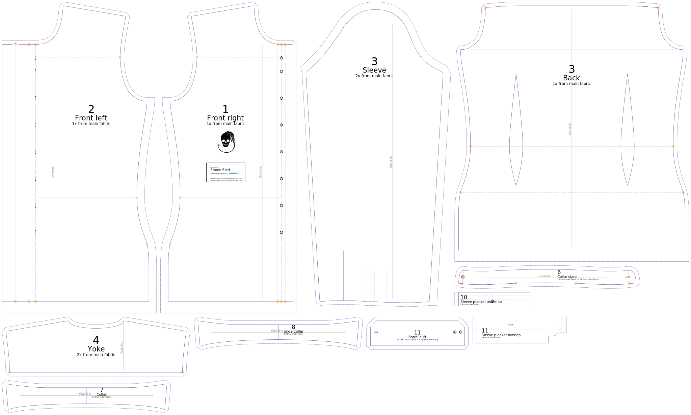
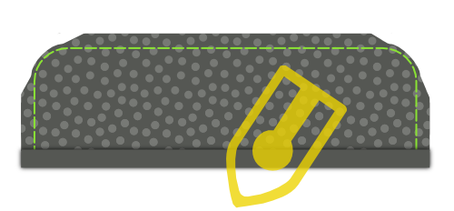
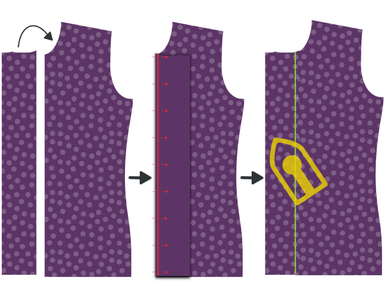
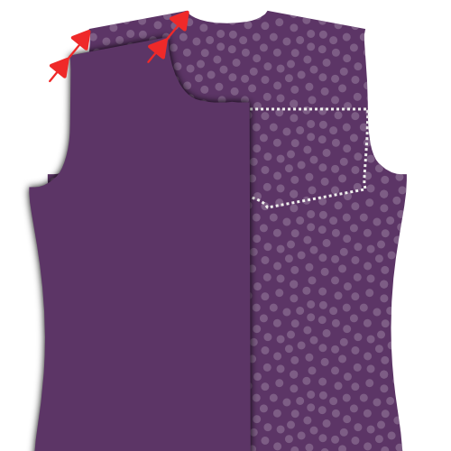
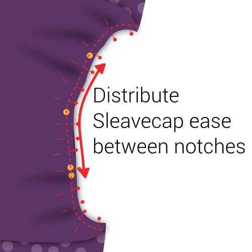
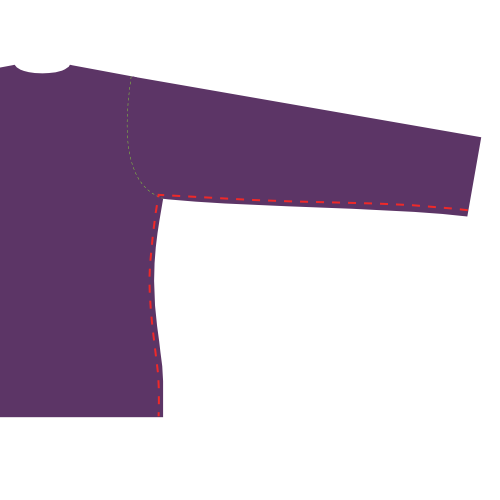
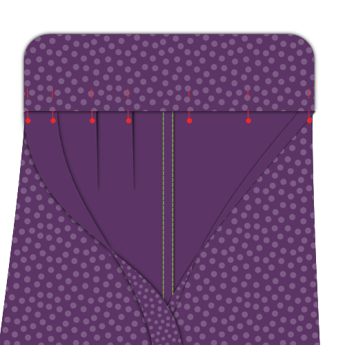
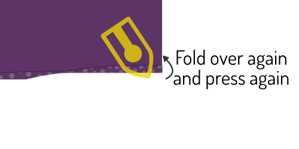

## Wat je nodig hebt

Om Simon te maken heb je het volgende nodig:

- Ongeveer 2 meter geschikte stof (zie [Stofkeuzes](#fabric-options))
- Knopen
- Kleefbare tussenvoering voor de kraag en manchetten (en mogelijk voor het knopenpat)

## Stofkeuze

Elke stoffenwinkel die je tijd waard is zou een afdeling hemdstoffen moeten hebben. Je kan binnenwandelen, vragen waar de hemdstoffen zijn, en iets kiezen dat je mooi vindt.

Meestal zullen dit katoenen stoffen zijn, of een mengeling van katoen en iets anders. Maar ga gerust voor een andere vezel.

Als je online winkelt is het soms moeilijker om te weten wat je juist koopt. Als je de stoffen niet kan aanraken helpt het om iets te weten over verschillende weefsels. Het weefsel slaat of hoe de stof geweven is, en dit bepaalt niet alleen hoe ze eruit ziet, maar ook hoe ze zal voelen en vallen.

> Ik heb niet meteen de ambitie om hier een stoffenencyclopedie te starten, maar hier zijn een aantal termen die je kan tegenkomen als je online hemdstoffen koopt.
> 
> **Laken of popeline**
> 
> Laken is dé keuze voor dat ene witte hemd voor je sollicitatiegesprek, of huwelijk.
> 
> Laken (soms ook popeline genoemd) is een eenvoudig weefsel dat een gladde effen stof produceert, wat voor die kraaknette formele look zorgt.
> 
> Het is vaak een lichtere stof en kan een beetje transparant zijn, vooral als het een lichte kleur is.
> 
> **Keper**
> 
> Je herkent keperstoffen aan hun typische diagonale textuur.
> 
> Het valt een beetje soepeler dan laken, kreukt minder en is makkelijker te strijken.
> 
> Het nadeel is wel dat het er nooit zo glad en gesteven zal uitzien als laken.
> 
> **Oxford**
> 
> Oxford is een echte muilezel onder de hemdstoffen. De stof is meestal iets zwaarder en dikker, en dus ook duurzamer.
> 
> Oxford is minder formeel dan laken of keper. Dit, samen met de duurzaamheid, maken het een goede keuze voor je dagelijkse werkhemden.
> 
> **Chambray**
> 
> Chambray heeft een eenvoudige platbinding, gelijkaardig aan laken. Het verschilt omdat het een veel zwaarder garen gebruikt, en meestal verschillende kleuren voor de schering en inslag.
> 
> Het resultaat is een stof met veel meer textuur, zowel qua aanvoelen als het tweekleurige effect van het weefsel.
> 
> **Denim**
> 
> Denim heeft geen introductie nodig. Het is het spul waar je jeans van gemaakt is.
> 
> Gewoonlijk een keperstof (kijk uit voor de typische diagonale textuur) die soms ook in een veel lichtere versie dan die van je jeans gemaakt wordt. Dat zijn de soorten die je voor een hemd kan gebruiken.
> 
> **Flanel**
> 
> Van Kurt Cobain tot de hipsters in je lokale koffiebar, ze zweren allemaal bij (geruite) flanellen hemden.
> 
> Dit is de warmste van alle opties hier, en wordt meestal gemaakt van opgeruwd katoen. Soms vind je ook wollen versies. 
> 
> **Linnen**
> 
> Linnen kreukt als je ernaar wijst, maar het is een perfecte kandidaat voor safari looks.
> 
> De reden waarom je deze stof associeert met avonturen in de tropen is dat linnen ongelooflijk goed ademt en je huidje koel zal houden.
> 
> **Draaddichtheid**
> 
> Een hogere draaddichtheid betekent een gladdere (en duurdere) stof.
> 
> Draaddichtheid wordt in nummers uitgedrukt, zoals 60, 80, 100 enzovoort tot 300 en meer.
> 
> Er zit wel een addertje onder het gras. Draaddichtheid boven de 100 wordt meestal verkregen door twee garens samen te twijnen. Bijvoorbeeld: een draaddichtheid van 160 betekent dat twee garens van 80 samen verwerkt werden tot één garen.
> 
> **Eendraads of tweedraads**
> 
> Als een draad gemaakt is van twee garens (zie Draaddichtheid hierboven) noemen we dat tweedraads.
> 
> Als de draad gemaakt is van een enkel garen wordt dat eendraads genoemd.
> 
> Zoals te verwachten is tweedraads duurzamer, en duurder.

## Knippen

- **Buitenstof** 
 - Knip **1 linkervoorpand**
 - Knip **1 knopenpat** (enkel als je voor een apart knopenpat koos)
 - Knip **1 rechtervoorpand**
 - Knip **1 knoopsgatenpat** (enkel als je voor een apart knoopsgatenpat koos)
 - Knip **1 rugpand**
 - Knip **1 kraag**
 - Knip **1 onderkraag**
 - Knip **2 schouderpassen** of **4 schouderpassen** als je voor een gesplitste schouderpas koos
 - Knip **2 mouwen**
 - Knip**2 kraagstaanders**
 - Knip **2 onderkant mouwsplit**
 - Knip **2 overlap mouwsplit**
 - Knip **4 manchetten**
- **Kleefbare tussenvoering** 
 - Knip **1 kraag**
 - Knip **1 onderkraag**
 - Knip**2 kraagstaanders**
 - Knip **2 manchetten**

> Als je twee stukken nodig hebt van één patroondeel, kan je dit met de [goede kanten van de stof](/en/docs/sewing/good-sides-together) samen knippen. Als ik echter een stof met een patroon gebruik knip ik ze liever apart zodat ik meer controle heb over de plaatsing van het patroon.
> 
> Als je alles apart uitknipt, onthou dan dat de delen gespiegeld moeten zijn. Dus draai of je patroondeel of je stof om als je een tweede deel knips.

### Opmerkingen

- Het **rechtervoorpand**, **linkervoorpand** en de **mouw** hebben naden die afgewerkt worden met een platte naad. Zodoende hebben deze naden extra naadwaarde. Let op dat je deze naadwaarde **zeker**toevoegt als je deze stukken uitknipt.
- De mouwsplitreep en mouwsplitbies hebben geen naadwaarde. Dat is normaal, knip ze gewoon uit zoals ze op je patroon staan.
- Knip de nepen in het **rugpand** niet uit. Je moet ze markeren, maar niet uitknippen.

Simon is een heel veelzijdig patroon, dus jouw versie kan verschillen van het voorbeeld hier:

> The [notation legend](/en/docs/patterns/notation) explains all the different markings and lines on your draft.

## Constructie

### Stap 1: Bevestig tussenvoering

 

#### Kleef tussenvoering aan manchetten

Om twee manchetten te maken heb je je patroondeel vier keer uit stof geknipt, en twee keer uit tussenvoering.

Strijk de tussenvoering op de slechte kant van twee van de manchetstukken.

> Als je stof geen slechte kant heeft maakt het niet uit aan welke twee stukken je de tussenvoering kleeft.
> 
> Het is echter een leuk detail om de binnenkant van je manchet van een andere stof te maken. In dat geval moet je zeker zijn dat je de tussenvoering aan het stuk kleeft dat je als buitenkant wil gebruiken.
> 
> De vorm van je manchet zal anders zijn, afhankelijk van welke soort je gekozen hebt.
> 
> In de eerste illustratie zie je zowel een klassieke afgeronde manchet en een franse manchet als voorbeeld.
> 
> Vanaf nu gebruiken we de klassieke manchet in de illustraties, maar het proces is hetzelfde voor de andere soorten manchetten.

#### Kleef tussenvoering aan kraag en onderkraag, en kraagstaander

Om je kraag te maken heb je één onderkraag, één kraag en twee kraagstaanders nodig. Dit alles zowel in stof als in tussenvoering.

Strijk de tussenvoering tegen de slechte kant van elk deel.

### Stap 2: bereid de manchetten voor

#### Stik de manchet aan elkaar

Leg beide delen van je manchet (één met tussenvoering, één zonder) op elkaar met de goede kanten samen, en stik ze samen met de standaard naadwaarde.

> **Let op**
> 
> - Laat de kant die later aan de mouw bevestigd wordt open
> - Stop aan de naadwaarde van de rand die aan de mouw bevestigd wordt

#### Knip naadwaarde bij

Voor we de manchet keren is het belangrijk de naadwaarde bij te knippen om wat volume te verwijderen.

#### Strijk de naadwaarde terug

Plooi de naadwaarde aan de kant van de mouw naar binnen, en strijk.

> Als je eerder iets te ver langs de rand gestikt hebt ga je nu een paar steken moeten lostornen.

#### Keer manchet en strijk

Keer je manchet met de goede kant naar buiten, en strijk grondig.

> Let op dat je de naad van de manchet een beetje naar de binnenkant rolt tijdens het strijken zodat ze niet zichtbaar is langs de buitenkant.

Je mag je manchetten nu opzij leggen, we komen hier later op terug.

### Stap 3: Bereid de kraag voor

#### Stik de kraag en onderkraag samen

Leg de twee kraagdelen op elkaar met goede kanten samen en stik ze vast met de standaard naadwaarde.

#### Knip naadwaarde bij

Voor we de kraag gaan keren is het belangrijk de naadwaarde bij te knippen om wat volume te verwijderen.

#### Keer kraag en strijk

Keer de goede kanten van je kraag naar buiten, maak de puntjes zo scherp mogelijk, en strijk grondig.

> Denk er bij het strijken aan dat de onderkraag een beetje smaller is dan de bovenkraag.
> 
> Wanneer je de niet-gestikte randen op elkaar legt zorgt dit dat de naad naar de onderkant van de kraag rolt zodat deze niet zichtbaar is aan de goede kant.

#### Stik de kraag door

Geef een sierstiksel langs de rand van de kraag. Dit houdt de naadwaarde op z'n plaats en zorgt dat alles er scherp uitziet.

> Hoe ver je van de rand stikt is een stijlkeuze. Het is meestal een beetje minder dan de standaard naadwaarde. Kijk eens naar een paar bestaande hemden om een idee te krijgen.

### Stap 4: Bevestig kraag aan kraagstaander

#### Leg de kraag tussen de kraagstaanders en drieg vast

Geef het middelpunt van je kraag en kraagstaanders aan met een speld. Het middelpunt van elke kraagstaander is eigenlijk net niet in het midden, aangezien één kant langer is dan de andere. Zoek dus naar het middelpunt tussen de twee merktekens.

Leg eerst een kraagstaander met de goede kant omhoog, dan je kraag met de onderkraag naar omhoog (en de ongestikte rand bovenaan), en uiteindelijk de tweede kraagstaander met de goede kant naar beneden.

Je kraag zou tussen je twee kraagstaanders moeten zitten, en de middelpunten (waar je je speld geplaatst hebt) moeten overeenkomen.

> Hoe dit eruitziet hangt wat al van je keuzes, maar over het algemeen zal je kraag naar beneden buigen, en je kraagstaander naar boven.
> 
> Om dit allemaal mooi gelijk te krijgen gaan we het driegen, in plaats van te spelden. Je kraag is een belangrijk deel van je hemd, dus het is de moeite om dit te driegen.

Vervang eerst de spelden die de middelpunten markeren door één speld die alle lagen samenhoudt.

Begin nu vanaf deze speld te driegen en werk zo in de richting van de hoek van de kraag. Zorg dat je de randen van de stof netjes gelijk legt.

Blijf driegen als je aan de hoek van je kraag komt, en drieg de uiteindes van de kraagstaanders samen.

Wanneer je één kant gedaan hebt kan je opnieuw beginnen vanaf de speld in het midden en de andere kant doen. Zodra je klaar bent met driegen kan je de speld verwijderen.

#### Stik je kraag aan de kraagstaanders

Stik langs de rand van je kraagstaander, met de standaard naadwaarde.

> Let op dat je 2 cm voor de rand stopt (twee keer de standaard naadwaarde) aangezien we de naadwaarde omplooien in de volgende stap, en we de kraagstaander nog open genoeg moeten laten om het hemd ertussen te krijgen.

#### Plooi en strijk de naadwaarde van de kraagstaander

Plooi de naadwaarde van de bovenste kraagstaander om en strijk.

> In het midden zal het makkelijk zijn om de naadwaarde te strijken. Maar naar de punten toe zal dit moeilijk worden zonder plooien in je kraag te strijken.
> 
> Strijk zo goed als je kan zonder plooien te maken. We strijken dit opnieuw zodra de kraagstaander gekeerd is.

#### Keer de kraagstaander en strijk

Keer de goede kanten van je kraagstaander naar buiten en strijk grondig. Let op dat de naadwaarde van de kraagstaander naar binnen gekeerd blijft.

Je kan je kraag nu opzij leggen, we komen hier later op terug.

### Stap 5: Optioneel: Bevestig je label

De volgende stap is het vastnaaien van de schouderpas. Maar deze schouderpas is een ideale plek om een label te hangen. Dus als je dat graag wil doen, doen we het best nu.

Kies een schouderpas, en je kan het label in het midden vastnaaien (aan de goede kant).

### Stap 6: Bevestig de schouderpassen aan het rugpand

 

Leg één schouderpas met de goede kant omhoog. Leg hier het rugpand op, met de goede kant naar boven, en leg de aanzetnaad van de schouderpas gelijk.

Leg hier dan de tweede schouderpas bovenop, met de goede kant naar beneden.

Je rugpand zit nu tussen de goede kanten van je twee schouderpassen.

Als dat zo is, stik dan door de drie lagen van aanzetnaad. Let op dat je de juiste naadwarde respecteert.

> Let op dat de schouderpas met het label aan de verkeerde kant van je rugpand zit, mocht je een label hebben toegevoegd.

Vergeet niet deze naad goed te strijken zodat hij plat ligt.

### Stap 7: Stik de schouderpas door

Als je schouderpassen aan het rugpand bevestigd zijn gaan we ze doorstikken langs de aanzetnaad, aan de kant van de schouderpas.

> Vouw de binnenste schouderpas uit de weg. Het stiksel gaat door de buitenste schouderpas en alle naadwaarde, maar niet door de binnenste schouderpas.

Stik net naast de aanzetnaad.

> Doorstikken is als een sierstiksel, maar heel dicht bij de rand

### Stap 8: Sluit de achterste nepen

  

> Afhankelijk van je maten heeft je patroon wel of geen nepen. Indien geen nepen, ga dan voort met de volgende stap.

Je patroon heeft misschien nepen in het rugpand. Als er nepen zijn, zou je ze nu moeten sluiten.

Leg je rugpand met de goede kant omhoog, en plooi het langs de zijkant om zodat de vouw van de bovenste naar de onderste punt van de neep loopt.

Doe hetzelfde voor de andere neep, zodat beide kanten teruggeplooid zijn.

Het is ok om deze vouw lichtjes te strijken, dat helpt om de nepen accuraat te stikken.

Stik langs de lijn die de nepen aangeeft om ze te sluiten. Probeer op te letten dat de bovenste en onderste punten exact zijn waar ze moeten zijn. Als één neep hoger zit dan de andere ziet het er niet uit.

Vergeet niet grondig te strijken! Strijk de stof van de neep naar de zijnaden.

### Stap 9: Bereid het knopenpat voor

> Als je een aangeknipt knopenpat gekozen heb kan je de eerste twee substapjes overslaan en verdergaan met [Plooi het knopenpat](#fold-the-button-placket).

#### Stik het knopenpat vast

Als je een apart knopenpat gekozen hebt stik je het nu vast aan het rechtervoorpand.

Leg het rechtervoorpand (deel 1) neer met de goede kant omhoog, en leg het knopenpat (deel 1b) erop met de goede kant naar beneden. Leg de randen netjes gelijk.

Stik vast met de standaard naadwaarde.

#### Strijk de naadwaarde in de richting van het knopenpat

Leg je voorpand met de goede kant naar beneden, en strijk de naadwaarde naar het knopenpat toe.

#### Plooi het knopenpat

Plooi nu het knopenpat aan de eerste vouwlijn, en strijk deze vouw.

Plooi het knopenpat opnieuw om, en let op dat de stof tot net voorbij de aanzetnaad aan het voorpand komt zodat deze bedekt is.

Als je daarmee blij bent, strijk dan het geplooide knopenpat.

#### Stik het geplooide knopenpat

> Dit is de klassieke aanpak. Als je voor het naadloze knopenpat gekozen heb moet je dit niet doen.
> 
> In plaats van het knopenpat door te stikken, laat je het gewoon geplooid. De plooien worden op hun plaats gehouden wanneer we later de knopen aannaaien.

Stik het geplooide knopenpat vast door langs de goede kant van je hemd in de naad te stikken.

Om dit te doen stik je exact bovenop je eerdere naad. Aangezien je het knopenpat een beetje verder dan deze naad geplooid hebt wordt het nu aan de achterkant vastgestikt. Op deze manier blijft je knopenpat zitten en blijft de naadwaarde mooi binnenin.

### Stap 10: Bereid het knoopsgatenpat voor

> Als je een aangeknipt knoopsgatenpat gekozen heb kan je de eerste twee substapjes overslaan en verdergaan met Hoe werkt een klassiek knopenpat.

#### Stik het knoopsgatenpat vast

Als je een apart knoopsgatenpat gekozen hebt stik je het nu vast aan het linkervoorpand.

Leg het linkervoorpand (deel 2) neer met de goede kant omhoog, en leg het knoopsgatenpat (deel 2b) erop met de goede kant naar beneden. Leg de randen netjes gelijk.

Stik vast met de standaard naadwaarde.

Vergeet niet grondig te strijken! Strijk de naadwaarde in de richting van het knoopsgatenpat.

#### Strijk de naadwaarde in de richting van het knoopsgatenpat

Leg je voorpand met de goede kant naar beneden, en strijk de naadwaarde naar het knoopsgatenpat toe.

#### Hoe werkt een klassiek knopenpat

> Als je een naadloos knopenpat gekozen hebt moet je de stappen voor het knopenpat volgen, aangezien de constructie identiek is.
> 
> De stappen hieronder zijn voor een klassiek knopenpat.

Er staan een hoop lijnen op het knopenpat, dus laat ons eerst eens kijken wat die betekenen:

- De knoopsgatenlijn heeft is een lange stippellijn met knoopsgaten op. Ze geeft aan waar de knoopsgaten moeten komen
- De twee vouwlijnen zijn lange stippellijnen en zitten op gelijke afstand rechts en links van de knoopsgatenlijn
- De twee+twee stiklijnen zijn stippellijntjes die op gelijke afstand van elke vouwlijn zitten

#### Knip naadwaarde bij

> Als je een aangesneden knopenpat gekozen hebt is dit niet van toepassing.

De naadwaarde van de aanzetnaad van het knoopsgatenpat zou in je geplooide knoopsgatenpat moeten passen.

Om dat te verkrijgen knip je de naadwaarde bij zodat ze niet verder komt dan de eerste vouwlijn op het knoopsgatenpat.

#### Plooi het knoopsgatenpat

 

Plooi het knoopsgatenpat langs de eerste vouwlijn. Strijk de vouw.

Plooi dan het deel dat je net plooide nog een keer, nu op de tweede vouwlijn. Strijk deze vouw ook.

> Als je knoopsgatenpat geplooid en gestreken is helpen een paar spelden wel eens om te voorkomen dat dingen gaan verschuiven

#### Stik het geplooide knoopsgatenpat

 

Stik op de eerste stiklijn, het dichtst bij de rand.

Draai dan je hemd om zodat de goede kant naar boven ligt, en je knoopsgatenpat ook. Stik dan op de tweede stiklijn.

> Deze twee rijen stiksel gaan altijd zichtbaar zijn, dus hou het netjes

#### Strijk het knoopsgatenpat

Gefeliciteerd, je hebt een klassiek knopenpat gemaakt.

Strijk het nu naar de verdoemenis. You know you want to.

### Stap 11: Sluit de schoudernaden

> **Laten we een burrito maken**
> 
> We gaan de schoudernaad sluiten met een techniek die ook wel de **burritomethode** genoemd wordt.
> 
> Als dit je bekend in de oren klinkt weet je al wat te doen. Indien niet, lees dan even verder voor een slimme manier om de schoudernaden van je hemd te stikken en tegelijk alle naadwaarde weg te stoppen.

#### Speld de voorpanden aan de buitenste schouderpas

 

Leg het rugpand neer met de goede kant omhoog, maar let op dat je de binnenste schouderpas naar beneden plooit (zoals aangeduid met de stippellijn).

Leg de voorpanden op het rugpand, met de goede kanten naar beneden. Speld de voorpanden aan de schouderpas langs de schoudernaad, met de goede kanten samen.

#### Rol hemden, geen zakken

Rol je achterpand en voorpanden op, beginnend aan de zoom. Rol alles in een strakke worst naar boven tot je de volledige binnenste schouderpas kan zien.

Nu kan je die schouderpas over het opgerolde hemd leggen om de schoudernaden gelijk te leggen met de buitenste schouderpas.

Speld de naden vast en stik de schoudernaden. Let op dat je de hemdworst (of burritovulling) uit de weg houdt zodat ze niet in de naad terechtkomt.

> Let op dat je de eigenlijke stiklijn gelijk legt. Door de hoeken van de halsopening kan het zijn dat de rand van de stof aan één kant langer is dan aan de andere.
> 
> De stiklijnen zijn echter even lang, dus zorg dat je deze mooi gelijk legt, met hulp van de merktekens.

#### Keer het binnenstebuiten door de halsopening

Wanneer je de twee schoudernaden gestikt hebt haal je de voorpanden en het achterpand naar buiten door de halsopening van je burrito.

#### Strijk de schoudernaden

Dit was veel werk, dus zorg ook dat het er superscherp uitziet door het flink te strijken. Zorg dat de naadwaarde tussen je schouderpassen mooi plat ligt.

### Stap 12: Stik de schoudernaden van de schouderpas door

We gaan de schouderpas ook aan de schoudernaden doorstikken, net zoals we met de aanzetnaad van het rugpand in Stap 3 gedaan hebben.

Aangezien je deze schoudernaden gestreken hebt zou alles mooi plat moeten liggen, en moet je gewoon recht naast de naad stikken.

> Zorg dat je op de schouderpas doorstikt, waar je alle naadwaarde mee vastzet, en niet op het voorpand.

### Stap 13: Maak het mouwsplit

#### Stik de mouwsplitreep

  

- Leg je mouw met de goede kant naar beneden, en de mouwsplitreep bovenop, ook met de goede kant naar beneden.
- Leg de rand van de mouwsplitreep (de onderlap van het mouwsplit) gelijk met de knip in de mouw, aan de kant het dichtst bij de zijnaad.
- Stik nu op de vouwlijn die op de mouwsplitreep aangeduid is, het dichtst bij de rand.

> Als je bij het uitknippen van je patroondelen het mouwsplit nog niet ingeknipt had volgens de aangegeven lijn, moet je dat eerst doen.

- Plooi de mouwsplitreep om, en strijk deze naad.
- Leg je mouw met de goede kant naar boven, en haal de mouwsplitreep door de knip in de mouw.
- Plooi twee keer op de aangegeven lijnen zodat de naadwaarde ingepakt zit.
- Leg je plooien zo zodat de geplooide rand iets over de naad heen ligt.
- Strijk alles goed plat, en stik de mouwsplitreep door aan de zijkant, door alle lagen heen.

#### Plooi en strijk de mouwsplitbies

Tijd voor origami! We gaan de mouwsplitbies plooien, met de aangegeven vouwlijnen als gids. Dit is veel makkelijker als je elke plooi strijkt voor je de volgende maakt.

- Plooi eerst de buitenste randen van de mouwsplitbies naar binnen.
- Plooi dan het hele spel dubbel.
- Plooi daarna de twee hoekjes tot een mooie punt.
- Strijk alles nog eens grondig.

@[youtube](kgd5eubxShM)

> Hier is [een heel kort filmpje van mij die een mouwsplitbies plooit](https://www.youtube.com/watch?v=kgd5eubxShM).

#### Speld de mouwsplitbies

 

Leg je mouw neer met de goede kant naar omhoog. De mouwsplitreep die we eerder gemaakt hebben zit tegen de andere onafgewerkte rand van de knip die we in onze mouw gemaakt hebben.

Leg je mouwsplitbies rond die onafgewerkte rand, één kant erbovenop, één kant eronder.

Je moet de mouwsplitbies over de mouw heen schuiven tot het midden (het puntje) overeenkomt met de knip in je mouw.

Het idee is dat de mouwsplitbies de onafgewerkte rand verbergt, en meteen ook de mouwsplitreep bedekt.

Als dit er voor jou goed uitziet, speld het dan maar vast.

#### Stik de mouwsplitbies

Begin aan de rand van de mouw (de onderkant van de mouwsplitbies) en stik langs de rand naar boven.

Ga rond de punt, en langs de andere (geplooide) kant weer naar beneden tot net voorbij het einde van de mouwsplitreep.

Stik dan in een horizontale lijn over de mouwsplitbies om af te werken.

> Ik heb hier een extra illustratie gemaakt die enkel de omlijning van de mouwsplitbies toont. Je ziet dat het einde van de mouwsplitreep vastzit in het stiksel van de mouwsplitbies, en dus netjes weggewerkt wordt.

### Stap 14: Zet de mouwen in

#### Belangrijk! Dit is een platte naad

> **Let op met de extra naadwaarde voor de platte naad**. Er is extra naadwaarde aan de mouw om de platte naad te kunnen maken.
> 
> Zorg dus dat je niet de rand van de stof gelijk legt, maar leg de stiklijnen zo op elkaar dat de mouw een extra centimeter uitsteekt.

#### Speld het hemd op z'n plek

Leg je hemd open zodat de voor- en achterkanten plat liggen met de goede kanten omhoog.

Leg nu je mouw bovenop met de goede kant naar beneden, en leg het merkteken aan de bovenkant van de mouw gelijk met de schoudernaad.

> Let op: je mouw is niet symmetrisch, dus zorg dat de het dubbele merkteken (en de kant met het mouwsplit) aan de rug legt, en het enkele merkteken aan het voorpand.
> 
> Hou ook in gedachten dat het dubbele merkteken aan de achterkant van de mouwkop geen overeenkomstige merktekens heeft op het rugpand. Dit is omdat het zou moeten overeenkomen met de naad van de schouderpas en het rugpand.

Je moet nu de mouw in het armsgat spelden. Om dit te doen, let dan op dat:

- Het begin en het einde van de mouwkop overeenkomen met het begin en het einde van het armsgat
- De merktekens op de mouwkop overeenkomen met die op de voorpanden en het rugpand
- De extra stof in de mouwkop tussen de merktekens verdeeld wordt, zoals getoond

#### Verdeel extra stof in de mouwkop

De standaard hoeveelheid extra stof in de mouwkop van dit patroon is 0.5 cm. Als je extra stof in de mouwkop hebt moet je die extra lengte gelijk verdelen tussen de merktekens, zoals getoond.

> Als je niet zeker bent wat deze extra stof is, bekijk dan even de [documentatie voor de optie voor extra stof in de mouwkop](/en/docs/patterns/simon/options#sleevecapEase).

#### Stik mouw in armsgat

Wanneer je je mouw netjes in het armsgat gespeld hebt, kan je ze vaststikken. Let op dat je geen plooien maakt in het stuk tussen de merktekens waar je de extra stof moet verdelen.

> Het zou niet nodig moeten zijn, maar ik ga het toch doen: Herhaal deze stap voor de andere mouw.

### Stap 15: Platte armsgatnaad

#### Strijk naadwaarde naar één kant

Leg je versgestikte mouwnaad neer met de goede kant naar beneden

We gaan de naadwaarde naar één kant strijken. Om dit te doen kijk je aan welke kant de naadwaarde breder is (voor de platte naad).

De langere naadwaarde moet bovenop de kortere (standaard) naadwaarde liggen.

Zodra je dat bepaald hebt kan je de naadwaarde strijken.

#### Plooi de extra naadwaarde weg

Plooi nu de extra naadwaarde voor de platte naad onder de standaard naadwaarde.

Je kan spelden gebruiken om dit op z'n plek te houden, maar gewoon strijken is makkelijker.

> Dit zal redelijk eenvoudig zijn aan de rechte stukken van de naad, maar een beetje lastiger aan de afgeronde stukken. Neem je tijd, en indien nodig kan je kleine knipjes in de extra naadwaarde geven zodat ze de curves mooier kan volgen.

#### Stik de platte naad

Stik nu, langs de slechte kant van de stof, de naadwaarde door, net aan de rand waar ze onder de andere naadwaarde plooit.

Hier is het belangrijk om op gelijke afstand van de naad te stikken. Als je een speciaal voetje voor je naaimachine hebt, kan dit helpen. Indien niet, wees dan gewoon voorzichtig.

> Het is belangrijker om op gelijke afstand van de naad te blijven dan om exact op de rand van de plooi te stikken. In een ideale wereld zit die plooi al op een gelijke afstand, maar als dit niet zo is, zorg dan gewoon dat je stiksel tenminste gelijk is. Zelfs al betekent dit dat je een beetje van de geplooide rand afwijkt.

#### Strijk de platte naad

Als je hiermee klaar bent strijk je de platte naad van de goede kant zodat ze mooi plat ligt.

### Stap 16: Sluit de zij- en mouwnaden

 

Leg je hemd met de goede kanten op elkaar, en stik de zij- en mouwnaden om het hemd te sluiten.

> Er is extra naadwaarde aan de mouw en de voorpanden om een platte naad te maken. Zorg dus dat je niet de rand van de stof gelijk legt, maar leg de stiklijnen zo op elkaar dat de extra naadwaarde een centimeter uitsteekt.

### Stap 17: Platte naad aan de zij- en mouwnaden

#### Strijk naadwaarde naar één kant

We gaan de naadwaarde naar één kant strijken. Om dit te doen kijk je aan welke kant de naadwaarde breder is (voor de platte naad).

De langere naadwaarde moet bovenop de kortere (standaard) naadwaarde liggen.

Zodra je dat bepaald hebt kan je de naadwaarde strijken.

#### Plooi de extra naadwaarde weg

Plooi nu de extra naadwaarde voor de platte naad onder de standaard naadwaarde.

Je kan spelden gebruiken om dit op z'n plek te houden, maar gewoon strijken is makkelijker.

> Dit zal redelijk eenvoudig zijn aan de rechte stukken van de naad, maar een beetje lastiger aan de afgeronde stukken. Neem je tijd, en indien nodig kan je kleine knipjes in de extra naadwaarde geven zodat ze de curves mooier kan volgen.

#### Stik de platte naad

Stik nu, langs de slechte kant van de stof, de naadwaarde door, net aan de rand waar ze onder de andere naadwaarde plooit.

Hier is het belangrijk om op gelijke afstand van de naad te stikken. Als je een speciaal voetje voor je naaimachine hebt, kan dit helpen. Indien niet, wees dan gewoon voorzichtig.

> Het is belangrijker om op gelijke afstand van de naad te blijven dan om exact op de rand van de plooi te stikken. In een ideale wereld zit die plooi al op een gelijke afstand, maar als dit niet zo is, zorg dan gewoon dat je stiksel tenminste gelijk is. Zelfs al betekent dit dat je een beetje van de geplooide rand afwijkt.

#### Strijk de platte naad

Als je hiermee klaar bent strijk je de platte naad van de goede kant zodat ze mooi plat ligt.

### Stap 18: Bevestig de manchetten aan de mouwen

#### Speld de manchet op z'n plaats

Je moet de mouw tussen de twee lagen van de manchet schuiven, en let op dat de goede kant van de stof aan de kant van de manchet zit die tussenvoering heeft.

Je zal dit moeten spelden, want afhankelijk van hoe lang je mouwsplit is, is dit moeilijk of zelfs onmogelijk om plat te leggen.

Merk ook op dat de rand van je mouw langer is dan je manchet (hoeveel langer hangt af van het volume van de mouw). Je zal één of meerdere plooien moeten maken om dit verschil weg te werken.

> Het patroon heeft hulplijnen op de mouw om de plooien de plaatsen.
> 
> Neem je tijd om alles nauwkeurig te spelden. We gaan dit later smal doorstikken, dus het is belangrijk dat de voor- en achterkant van de manchet mooi overeenkomen.

#### Stik de manchetten smal door

Zodra alles vastgespeld is kan je de rand van de manchet smal doorstikken om ze aan je mouw te bevestigen.

Het is belangrijk dat je zowel de buitenste als de binnenste laag van de manchet mee vaststikt.

> Zorg dat je langs de goede kant doorstikt, en hou het stiksel parallel met de rand van je manchet.

Strijk alles nog eens grondig als je dit gedaan hebt.

#### Sierstiksel op de manchetten

> Let op dat je je manchetten strijkt voor je dit doet.

Stik rond je manchet op een afstand van de rand die een beetje kleiner is dan je naadwaarde. Ga helemaal rond je manchet.

### Stap 19: Bevestig de kraag

#### Drieg de kraag vast

Dit is een belangrijke naad, en daarom driegen we alles vast zodat we zeker zijn dat het helemaal juist is voor we het naaien.

Begin aan de middenrug, en schuif de naadwaarde van het rugpand tussen je kraagstaanders. Ga verder langs één kant, en doe dan de andere.

Zorg dat je de standaard naadwaarde in het oog houdt en - belangrijk - plooien vermijdt.

> Ook al is je kraagstaander, redelijk recht, hij wordt bevestigd aan wat in feite een gat in je hemd is.
> 
> Dat is een beetje lastig, dus wees extra nauwkeurig aan de delen die het meest gebogen zijn: aan de schoudernaden.

#### Stik de kraag smal door

 

Als je blij bent met hoe je kraag gedriegd is, wordt het tijd om het ding definitief vast te stikken.

We beginnen aan de middenrug, en gaan helemaal rond de kraagstaander stikken.

#### Stik langs de rand van de kraag

Om wat meer body aan je kraag te geven en hem stevig vast te zetten gaan we langs de bovenrand van de kraagstaander stikken.

Stik op ongeveer de helft van de naadwaarde van je eerdere stiksel. Stop een paar cm voor het einde van de kraag.

> Je moet een paar cm voor het einde van de kraag stoppen (opgelet: het einde van de kraag, niet het einde van de kraagstaander) zodat dit stiksel helemaal bedekt is wanneer de kraag naar beneden geplooid ligt.

#### Strijk de kraag

Nu je kraag vasthangt mag je hem nog eens goed strijken.

### Stap 20: Zoom je hemd

  

Tijd om de zoom af te werken (dat is het stuk dat je in je broek stopt).

Plooi de helft van de zoomtoeslag naar boven en strijk. Plooi de zoom een tweede keer om en strijk opnieuw.

Stik nu langs de bovenrand om de zoom af te werken.

### Stap 21: Maak knoopsgaten

Markeer alle plekken waar knoopsgaten nodig zijn, mocht je dit nog niet gedaan hebben.

Ze zitten aan de sluiting vooraan en aan je manchetten.

Zodra je ze aangeduid hebt kan je knoopsgaten maken.

### Stap 22: Naai knopen aan

Speld je hemd dicht om de locatie van de knoopsgaten op de kant met de knopen aan te duiden.

Naai de knopen op de gemarkeerde plaatsen.

> In plaats van de locatie van de knopen op het patroon te gebruiken, duid ik liever de gemaakte knoopsgaten aan.
> 
> Als een knoopsgat dan een beetje alternatief geplaatst is zal de knoop dit gewoon volgen.

