## Video

Tekst een beetje te droog voor je? Ik probeer video's beschikbaar te maken als deel van de documentatie.

In dit geval is er een hoop videomateriaal beschikbaar, maar dit is origineel opgenomen voor een eerdere versie van dit patroon. Nog steeds relevant wel.

@[youtube](https://www.youtube.com/embed/videoseries?list=PL1gv5yv3DoZOcmOJf6f0YWi522VXXv-mM)

## Wat je nodig hebt

Om Theodore te maken heb je het volgende nodig:

- Basis naaimateriaal
- Ongeveer 2 meter geschikte stof ([zie Stofkeuzes](#fabric-options))
- Ongeveer een meter voering
- Kleefbare tussenvoering voor de achterzakken en tailleband
- Een rits, knoop en broekhaak voor de gulp

## Stofkeuze

Je hebt hier veel opties, maar hou in je achterhoofd dat dit een klassiek model van broek is. In andere woorden, gebruik geen stretchstof, denim, nepleer of andere onzin. Veilige opties zijn wol, katoen of linnen, eventueel gemengd met iets synthetisch.

Als je **wol** wil, kijk dan in de afdeling met pakstoffen van je stoffenwinkel. Voor een eerste paar is een wol-polyestermix een budgetvriendelijke optie. Maar focus niet te hard op de prijs, een goedkoop stofje is de beste manier om met een mottige broek en een hoop frustraties te eindigen.

Als je **katoen** wil, kies dan een zwaardere stof. Katoen is ook wat makkelijker voor een beginner dan wol. Als je niet zeker bent over wat te gebruiken, vraag dan om chino stof in de stoffenwinkel en kies een kleurtje.

Niets beter dan **linen** op een hete zomerdag. Het is ook fijn om mee te werken, maar kreukt als de pest, en zelfs de best genaaide broeken zien er een beetje rommelig uit in linnen. Wat ik wil zeggen is: misschien niet voor je eerste paar.

## Knippen

- **Buitenstof** 
 - Knip **2 achterpanden** met de goede kanten op elkaar
 - Knip **2 voorpanden** met de goede kanten op elkaar
 - Knip **1 linker tailleband**
 - Knip **1 rechter tailleband**
 - Knip **2 gulp delen** met de goede kanten op elkaar
 - Knip **2 belegdelen voorzak** met de goede kanten op elkaar
 - Knip **4 belegdelen achterzak** 
 - Knip **8 riemlusjes** 
- **Voering** 
 - Knip **2 voering voorpand** met de goede kanten op elkaar
 - Knip **1 voering tailleband links**
 - Knip **1 voering tailleband rechts**
 - Knip **1 gulpbeleg**
 - Knip **4 zakdelen voor** 2x2 met goede kanten op elkaar (**zie opmerkingen**)
 - Knip **2 binnenste achterzakken** 
 - Knip **2 buitenste achterzakken** 
- **Tussenvoering** 
 - Knip **1 tussenvoering tailleband links**
 - Knip **1 tussenvoering tailleband rechts**
 - Knip **4 tussenvoering achterzak**

### Opmerkingen

- De **voering voorpand** wordt geknipt van het **voorpand** van het patroon, tot aan de lijn net onder de knie
- Let op de draadrichting van het **gulpdeel**, **gulpbeleg**, en **belegdeel voorzak**
- Er zijn twee versies van het voorste zakdeel. Je moet twee van elk knippen: 
 - Knip twee van het complete deel
 - Knip twee tot aan de stippellijn aan de linkerkant
- De **binnenste achterzak** en **buitenste achterzak** lijken erg op elkaar. Zorg dat je ze correct markeert zodat je ze niet verwart.

Hier is een typisch Theodore patroon:

> The [notation legend](/en/docs/patterns/notation) explains all the different markings and lines on your draft.

## Constructie

> Veel van de stappen hieronder worden herhaald voor beide broekspijpen.
> 
> Dit wordt niet altijd vermeld want het leven is kort en constant *herhaal dit voor de tweede broekspijp* schrijven wordt snel saai.

### Stap 1: Drieg de plooilijnen

Het eerst dat je doet is over de plooilijn van je broekspijpen driegen. Doe dit op zowel voor- als achterpanden van beide broekspijpen.

### Stap 2: Sluit de nepen achteraan en strijk

### Sluit de achterste nepen

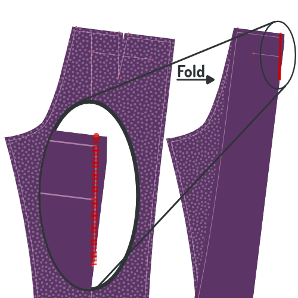

Plooi deel 1 (achterpand) dubbel zodat de merktekens van de neep aan de tailleband gelijk liggen, en een scherpe plooi naar het merkteken aan het einde van de neep loopt. Strijk deze plooi gerust lichtjes, dit maakt het makkelijker om de neep accuraat te stikken.

Sluit de neep door van de taillerand naar het einde van de neep te stikken.

Gebruik een kleine steeklengte, en laat je stiksel helemaal tot het einde van de neep (en eraf) lopen. Stik daarna een eindje terug, let op dat je enkel in de naadwaarde stikt.

#### Strijk de nepen naar de zijkant

Strijk de nepen plat, en leg de naadwaarde naar de zijkant van je broek.

### Stap 3: Maak de achterzakken

Maak de dubbele paspelzakken aan de achterkant van je broek, inclusief de broekzak.

> **Dubbele paspelzak**
> 
> Het maken van een dubbele paspelzak is een techniek die in verschillende kledingstukken gebruikt wordt. Daarom heb ik er een aparte pagina met documentatie voor gemaakt.
> 
> Er is zowel geschreven documentatie en een reeks video's die je tonen hoe dit werkt, dus zelfs als je nog nooit paspelzakken gemaakt hebt komt het wel in orde.
> 
> [Naar de documentatie over paspelzakken!](/en/docs/sewing/double-welt-pockets)

### Stap 4: Optioneel: Knip je voering bij met een kartelschaar

Als je je broek gaat voeren (dit is optioneel), moet je de rand van je voering afwerken. Om dit te doen knip je de rand van de voering bij met een kartelschaar.

Let op dat je dit alleen doet voor de delen van je voering die niet vastzitten in een naad. In andere woorden, enkel de onderrand van je voering.

> Als je geen kartelschaar hebt kan je een andere methode gebruiken, zoals een zigzag- of overlocksteek. Kartelscharen zijn hier echter de beste optie omdat ze geen extra bulk toevoegen, wat belangrijk is als we willen vermijden dat de onderrand van de voering zichtbaar is door de stof van je broek.

### Stap 5: Knip delen voor voorste steekzakken bij

Leg je voorpand, voering en zakdeel bovenop elkaar. Voorpand en zakdeel met de goede kanten naar beneden, voering met de goede kant omhoog.

Speld ze samen om te zorgen dat niets verschuift. Doe dit weg van de schuine rand van de zak zodat de spelden niet in de weg zitten.

Knip het zakdeel (dat bovenaan ligt) exact op de lijn van de steekzak (aangegeven op het patroon) bij.

Knip nu het voorpand (ligt onderaan) 3 cm voorbij en parallel met de schuine lijn bij.

Knip als laatste je voering bij zodat ze 0.5 cm korter is dan re rand van het voorpand.

> De voering wordt een beetje korter geknipt zodat ze niet zichtbaar is als ze teruggeplooid wordt. Maar het is niet zo belangrijk om ze exact 0.5 cm korter te krijgen.

### Stap 6: Plooi de voorste zakopening en stik

Plooi de voering en het voorpand om langs de lijn van de steekzak (en dus langs de bijgeknipte rand van het zakdeel). Speld dit vast en strijk.

Je gaat langs de zakopening stikken, maar keer alles eerst om zodat je van de goede kant kan stikken.

Stik door op 0.5 cm van de plooi. Hou het parallel en rek je stof niet uit.

> Dit stiksel is altijd zichtbaar, dus zorg dat de draadkleur bij je stof past en maak het mooi.
> 
> Om te voorkomen dat je zakken uitrekken kan je een stuk niet-elastisch lint tussen de vouw stoppen. Wanneer je stikt wordt dit lint mee vastgemaakt, en zorgt het dat de zak niet uitrekt.

### Stap 7: werk de rand aan de binnenkant van de voorzak af

Plooi het grootste deel van het voorpand weg, zodat je de voering, zakdeel en geplooide rand van het voorpand plat kan leggen.

Zigzag de rand van het weggeplooide deel van het voorpand om het af te werken en vast te maken aan het zakdeel en de voering.

### Stap 8: Strijk de steekzak

Wanneer je klaar bent leg je het voorpand, de voering en het zakdeel plat, en strijk je het eens grondig.

> Dit is misschien een goed moment om je nog eens te vertellen dat alle stappen tot nu toe gelden voor de twee broekspijpen.
> 
> Gewoon zodat je eraan denkt, de volgende stappen moeten trouwens ook twee keer gedaan worden.

### Stap 9: Bevestig belegdeel voorzak aan zakdeel

Leg de andere helft van het zakdeel met de goede kant naar beneden, en leg het belegdeel voorzak bovenop met de goede kant omhoog.

Zigzag langs de rand van het belegdeel voorzak om het af te werken en tegelijk aan het zakdeel te bevestigen.

### Stap 10: Sluit het zakdeel

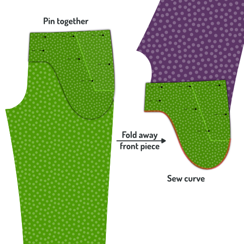

Leg het voorpand, de voering en het zakdeel met het zakdeel naar boven.

Leg het tweede zakdeel met het bevestigde beleg bovenop, met het beleg naar beneden.

Speld alle delen samen, en let op dat de onderrand van het zakdeel gelijk ligt.

Plooi wanneer alles samengespeld is het voorpand en de voering opzij en sluit de onderrand van het zakdeel.

> Stik de onderrand van het zakdeel tot aan het punt waar het belegdeel begint
> 
> Je kan het zakdeel op verschillende manieren afwerken, zoals:
> 
> - Lock de randen samen
> - Werk de randen af met biaislint
> - Stik samen en werk de rand af met een zigzagsteek

### Stap 11: Strijk de steekzak

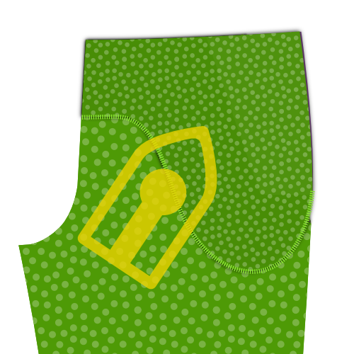

Leg alles plat met het voorpand onderaan, en strijk het grondig.

### Stap 12: Speld de voorzak vast

Speld de zak aan het voorpand langs de zakopening en de randen van het zakdeel. Dit voorkomt dat dingen verschuiven terwijl we aan de rest van onze broek werken.

### Stap 13: Werk de zijranden af

Voor we de zijnaden stikken, werken we de randen af met een zigzagsteek langs de rand van je voor- en zijpanden. Let op dat je binnen de naadwaarde blijft.

> Zorg dat je de voering en randen van het zakdeel mee vastmaakt, dit zorgt ervoor dat niets verschuift terwijl we de zijnaden stikken.

### Stap 14: Stik de zijnaden

Leg het voor- en achterpand van elke broekspijp op elkaar, met de goede kanten op elkaar.

Leg de zijnaad gelijk, de zijnaad aan de buitenkant om precies te zijn, waar er geen kruiscurve is.

> Je kan de delen samenspelden om te zorgen dat alles op z'n plaats blijft bij het stikken van deze lange naad

Stik de naad, van de tailleband tot onderaan de broekspijp.

### Stap 15: Strijk de naadwaarde open

Strijk de naadwaarde langs de zijnaad open. Doe dit langs de verkeerde kant, en herhaal nog eens langs de goede kant van de stof.

Neem je tijd, en gebruik genoeg hitte, maar niet te veel. Gebruik stoom of sproei wat water voor het beste effect.

> Een mooi platte zijnaad ziet er geweldig uit, dus neem je tijd om het goed te krijgen.

### Stap 16: stik het gulpbeleg aan het gulpdeel

Leg het gulpdeel op het gulpbeleg met de goede kanten op elkaar, en leg de rand gelijk met de grootste curve.

Stik langs de gebogen rand op de standaard naadwaarde van 1 cm om de twee stukken aan elkaar te bevestigen.

> Als je voering een beetje stretch heeft, rek de voering dan wat uit terwijl je de curve stikt. Dit maakt het makkelijker om de voering plat te laten liggen zonder plooien.

### Stap 17: Strijk het gulpbeleg

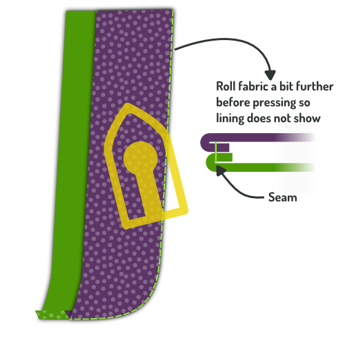

> Voor je dit deel platstrijkt rol je de naad een beetje naar binnen zodat de voering naar de onderkant gekeerd wordt, en ongeveer 2 mm van de rand ligt. Dit voorkomt dat de voering aan de rand zichtbaar is.

Als je het gulpdeel en gulpbeleg vastgestikt hebt keer je alles naar de goede kant en strijk je de naad plat.

### Stap 18: Speld de rits aan het rechtervoorpand

> Stap 18 tot 21 leiden allemaal naar een enkel stiksel dat de rits aan het voorpand bevestigt, en tegelijk het gulpdeel en gulpbeleg vastmaakt.
> 
> Dit is de moeilijkste naad in het hele proces, dus ik ga mijn tijd nemen om alles uit te leggen en te illustreren voor je begint te naaien.

Leg het voorpand van de rechterbroekspijp met de goede kant omhoog. Zorg dat de voering en het zakdeel onderaan liggen, en mooi plat.

Neem je rits en open ze. Keer ze nu om zodat ze met de goede kant naar beneden ligt. In andere woorden, met de trekker naar beneden.

Leg je rits gelijk met de kruisnaad zoals in de illustratie. Hou het volgende in gedachten:

- Het einde van je rits zou aan de bovenrand van je broek moeten zitten, waar je tailleband begint. Denk er wel aan dat daar nog naadwaarde zit, dus leg het einde niet exact samen met de rand, maar 1 cm lager.
- Leg de rits gelijk met de kruisnaad. Let niet op de rand van de rits, aangezien deze in verschillende breedtes bestaan. Zorg in de plaats dat je naast de tandjes van de rits kan stikken en binnen de naadwaarde van het voorpand blijven.

Speld de rits vast met een paar spelden haaks op de rits (zoals getoond). In andere woorden, speld niet langs de rits, maar door de rits.

> Als je niet zeker bent over de plaatsing van je rits, leg ze dan zo dicht mogelijk tegen de rand. Dit zorgt dat je rits iets verder in de gulp zit, zodat ze zeker niet zichtbaar is.

### Stap 19: Speld gulpbeleg aan rits

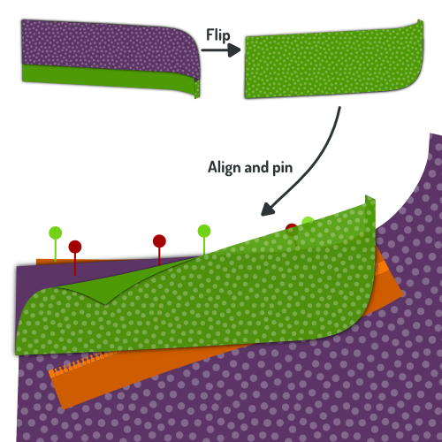

Neem het gulpbeleg/gulpdeel dat je in stap 16 en 17 samengestikt hebt en leg het neer met de stof naar beneden en de voering naar boven.

Leg de bovenste laag voering opzij, en leg de rand van de stof met de lichte curve (waar het niet aan de voering bevestigd is) gelijk met de rand van de stof van het voorpand.

> Voor de duidelijkheid, de kant van het gulpbeleg die omhoog moet liggen is getoond in het bovenste deel van de illustratie, op een kleinere schaal.

Speld deze laag vast met een paar spelden haaks op de rits (zoals getoond in het rood). Zorg dat je alle lagen mee vastspeldt, ook de rits. Zo kan je de spelden van de vorige stap (getoond in het groen) verwijderen als je klaar bent.

> Als je zeker genoeg bent dat je alles op z'n plaats kan houden kan je de voering terug laten vallen en alles samenspelden zoals in de volgende stap. Dit is een beetje sneller, maar je maakt sneller fouten omdat dingen snel kunnen verschuiven.

### Stap 20: Speld het gulpbeleg vast langs de rits

Leg de voering weer op z'n plek, en speld nu alle lagen samen langs de rits.

Wanneer je dit gedaan hebt kan je je eerdere spelden verwijderen.

### Stap 21: Plooi het gulpbeleg om en speld het neer

 

Draai alles om zodat het gulpbeleg onderaan ligt.

Plooi de voering van het gulpbeleg rond de gulp, het voorpand en het gulpdeel, zodat de onafgewerkte rand aan de binnenkant zit.

Speld dit vast, en verwijder je eerdere spelden.

### Stap 22: Stik de gulp vast langs de rits

Nu kan je langs het geplooide gulpdeel stikken. Dit zet het voorpand, de rits, het gulpbeleg en het gulpdeel in één keer vast.

> Je stikt langs je rits, dus gebruik je ritsvoet hiervoor.

### Stap 23: Plooi de gulp om en strijk

Wanneer je klaar bent, plooi de gulp dan om zodat ze van het voorpand wegligt, en strijk grondig van de verkeerde kant. En strijk nog eens zachtjes van de voorkant.

### Stap 24: Stik biaislint aan het tweede gulpdeel en strijk

Stik bieslint aan de rand met de grootste curve van je tweede gulpdeel.

Strijk de afgewerkte rand plat wanneer je klaar bent.

> Biaislint is een manier om een rand af te werken. Als je niet zeker bent wat het is of hoe je het gebruikt, laat het me dan weten.

### Stap 25: Speld en stik het gulpdeel aan de kruisnaad

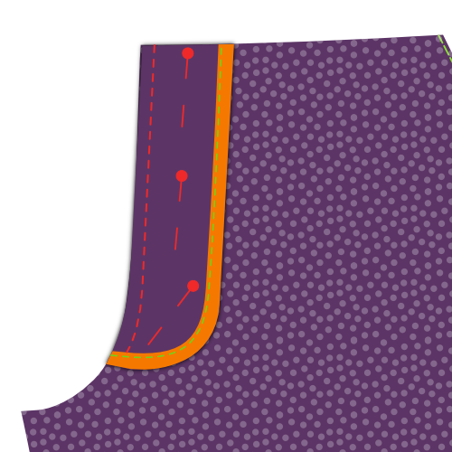

Leg de linkerbroekpijp met de goede kant omhoog. Leg het tweede gulpdeel bovenop met de goede kant naar beneden, en leg de onafgewerkte rand samen met de kruisnaad.

Speld het gulpdeel vast, en stik het dan vast langs de kruisnaad.

> Let op dat je de voering mee vaststikt bij het stikken van deze naad.

Strijk de afgewerkte rand plat wanneer je klaar bent.

### Stap 26: Keer het gulpdeel naar achter en strijk de naad

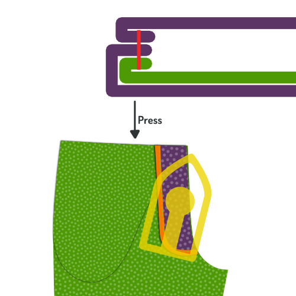

Plooi het gulpdeel naar de verkeerde kant. Rol de naad een beetje verder naar achter voor je dit strijkt zodat deze niet meer zichtbaar is langs de goede kant.

Op deze manier zal de naad of het gulpbeleg onzichtbaar zijn aan de voorkant.

Strijk eens goed langs de achterkant.

### Stap 27: Speld en stik de rits aan het gulpdeel

  

Leg de rechterbroekspijp neer met de goede kant omhoog. Leg de linkerbroekspijp bovenop met de goede kant naar beneden.

Leg de kruisnaden gelijk en speld de rits langs de rand van het gulpdeel met de goede kant van de rits naar beneden.

Zorg dat je de rits enkel aan het gulpdeel speldt. Vermijd alle andere lagen.

> Ik vind het makkelijker om de rits door alle lagen te spelden, en wanneer ze stevig vastzit extra spelden toe te voegen om ze enkel aan het gulpdeel te spelden. Als dat gebeurd is kan je de spelden die door alle lagen gaan verwijderen.

Stik uiteindelijk langs de rits met je ritsvoet om ze vast te maken aan het gulpdeel.

> Let op het volgende terwijl je de rits goedlegt:
> 
> - De rits ligt met de goede kant naar beneden
> - De rits ligt een beetje verder dan de rand van je gulpdeel
> - Leg de bovenkant van de rits gelijk met de andere helft van de rits aan de rechterbroekspijp

### Stap 28: Zigzag de rand van de rits aan het gulpdeel

Zigzag langs de rand van de rits om ze vast te maken aan het gulpdeel.

### Stap 29: Bevestig de gulpdelen met een trens

Leg de twee gulpdelen samen, en leg de voorpanden uit de weg.

Gebruik een trens om ze aan elkaar te bevestigen, aan de onderkant van de rits. Stik aan beide kanten van de rits, en zo dicht bij de rits als je kan.

> Als je rits te lang is kan je ze onder de trensen bijknippen.

### Stap 30: Sluit de kruisnaad

 

Leg beide voorpanden met goede kanten naar boven. Ze zijn nu verbonden met de gulp.

Zorg dat de gulp netjes weggeplooid is, en speld beide voorpanden samen onder de rits, waar je eerder trensen maakte. Zorg dat de speld samenligt met de plooi van je voorpand.

Plooi de voorpanden met goede kanten samen, en speld de kruisnaad dicht.

You'll need to get the fly shields out of the way, so if you've pinned through all layers before, remove that pin now, making sure to replace it with a horizontal pin. This will tell you how far to sew.

Sew the crotch seam, starting at the cross-seam point, and going up to your horizontal pin.

> I find this step hard to explain, and hard to illustrate. I hope it will make sense when you're looking at your fly. If not, check the video instructions.

### Step 31: Pin fly closed and baste fly curve

Close the fly, and pin the fronts together making sure the fly is neatly tucked away.

We will be topstitching the fly curve next, and it's a good idea to baste it first.

You should start a bit above your earlier bar tack, and make sure you catch only the fly shield of the left leg.

Curve upwards toward the edge of the fly shield, and then proceed in parallel with the zip.

### Step 32: Topstitch the fly curve

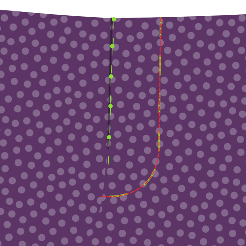

Now topstitch your fly curve, using your basting as a guide.

When doing so, you will be locking your front, fly piece, pocket bag and lining all together.

### Step 33: Pin together the inner leg seam

Close the legs with the good sides together, and pin together the inner leg seam. Start at the cross seam point and work your way to the bottom of the legs.

Make sure to do this for both legs.

### Step 34: Sew the inner leg seams

On both legs, sew the inner leg seams that you just pinned. Make sure to respect the seam allowance.

### Step 35: Press open seam allowance of the inner leg seam

Place your leg inside-out on your ironing board, and press open the seam allowance of the inner leg seam.

### Step 36: Close the cross-seam

We are now going to close the cross-seam, from the bottom of your fly between your legs, up your bum to the center back of where you'll add the waistband later.

To do so, turn on of the legs inside out, so that that good side of the fabric is turned inside, and the bad side and lining sits on the outside.

The other leg should not be turned inside-out, but should just have its good side on the outside.

Now, put the leg that has the good side out (the normal leg) into the leg that has the bad side out (the inside-out leg).

This way, the good sides of both legs will sit against each other, and this is how you should sew the cross seam.

> Be careful that your leg is not twisted inside the other leg. When in doubt, turn the inside-out leg outside-out again after you've pinned the cross-seam to make sure it's all ok.

Pin the cross-seam in place, and then sew it close, starting at the side of the fly, and making sure to respect the seam allowance.

When done, press the seam allowance open.

### Step 37: Press the leg crease in place

Turn your trousers good side out, and carefully place one leg on your ironing board so that it lies flat and folds exactly on the crease line your basted earlier.

When it's looking good, press the crease lines in your leg, front a back. Repeat for the other leg.

Give it a firm press because you want the pleats to still be there after you wash your trousers (so you can see where to press them again).

> In the industry, chemicals are applied along the crease line before it is pressed together. Some tailors use some sort of wooden hammer and anvil to bang the fibers in a permanent crease.

Depending on your fabric, your crease might last longer, but ultimately, you can't expect to have a crease that can withstand a few washes without being reapplied.

> Maybe this goes without saying, but there's also another option: Do not press the crease. This give your trousers a more informal look.

### Step 38: Fuse interfacing to waistband

Fuse the waistband interfacing (Piece 3) to the waistband (Piece 4).

Align the interfacing in the middle of the waistband, and make sure to keep it nicely aligned as you fuse it in place with your iron.

### Step 39: Close waistband and waistband lining

Join the waistband (Pieces 4a and 4b) by sewing both pieces good sides together.

Join the waistband lining (Pieces 5a and 5b) by sewing both pieces good sides together.

### Step 40: Sew waistband to waistband lining

Place your waistband on the waistband lining, good sides together, so that the waistband interfacing is facing upwards.

Align the edge, and pin them together.

> We are going to sew along the edge of the interfacing, but we will sew about 3mm or 1/8 inch from the actual interfacing edge. This will prevent the lining from being visible from the front later.

On one side of the waistband, end with a curve and then go down vertically along the edge of the waistband interfacing. Check the illustration to make sure you do it on the correct side.

### Step 41: Roll fabric around interfacing edge and press waistband

Before pressing the waistband, make sure to roll over the fabric around the edge of the interfacing.

Remember that in the previous step your sewed 3mm from the interfacing edge? You need to make the fold around the edge of the interfacing so that the actual seam sits 3mm more inwards.

This will make sure that our lining fabric is never on display from the front of your trousers.

### Step 42: Pin waistband to trousers

Pin the edge of your waistband (the side you did not sew the lining to) to the top of your trousers, good sides together.

Tuck the edge of your fly into the end of the waistband with the curved corner. On the other end of the waistband, it will be longer. In other words, your waistband will overlap here.

> Be careful to match the vertical alignment of the waistband at the zip. With the zip closed, both sides of the waistband should sit at an equal height. This is easy to miss if you don't check it.

### Step 43: Sew waistband to trousers

Now that the waistband is pinned to top of your trousers, sew it in place.

On the side with the curved corner, get as close to the edge as possible. On the other side, stop when you reach the edge of your fly.

### Step 44: Press waistband

Give your newly sewn seam a good press. Do not press the seam open, instead press it towards the top (put both trousers and waistband seam allowance in the waistband).

### Step 45: Prepare the belt loops

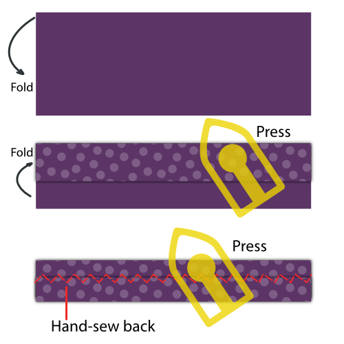

The belt loops are a part of your trousers where you can let your creativity run free. There's load of different ways to make and shape belt loops, not to mention that where you place them is also up to you.

That being said, here's what to do to make a standard belt loop:

Find the belt loop pattern part, a small rectangular piece of fabric. There should be 8 of them, and these will become your belt loops. For each of them, take these steps:

- Zig-zag (or serge) along the longest edges of the rectangle
- Fold one side back along the length, and press
- Fold the other side back, along the length, and press
- Hand sew along the back of the belt loop so that the folded sides stay in place, but the stitches do not show at the front
- Give it a final good press when you're done

> While the width of your belt loops is not all that important, it does matter to make sure they are all the same width.
> 
> To make it easier to have a consistent width, you can fold your belt loops around a strip of cardboard, thick paper, or plastic of the desired belt loop width.
> 
> This strip can also help you with the hand sewing. Keep it in your belt loop and it will prevent your needle from piercing through all layers and your thread won't show at the front.

### Step 46: Attach the belt loops: Bottom

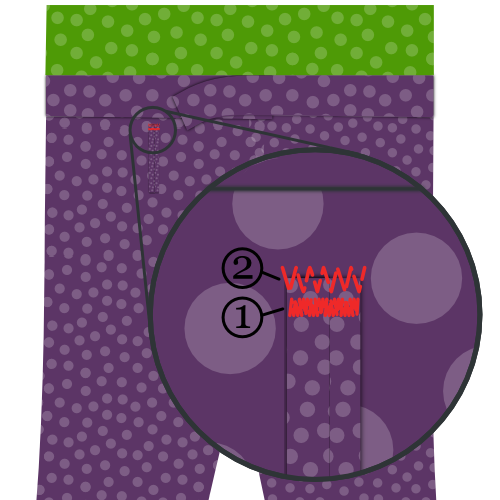

Attach the bottom of the belt loops to your trousers. Place them about 1.5 cm below your waistband, depending on your waistband width.

Place the good side of the belt loop down on the good side of the trousers (good sides together) and secure with a bar tack or narrow zig-zag.

Then, zig zag the edge of the belt loop to the trousers.

> It is important to get the waistband lining out of the way while doing this. Make sure to attach the belt loops only to your trousers, and not to the waistband lining.
> 
> You have 8 belt loops, so you need to distribute them around your waistband. Have a look at an existing pair if you are uncertain how to do this.
> 
> Make sure to place belt hoops close to the center back, and not too close to each other at the front (for belt buckles).

### Step 47: Waistband facing

The waistband facing needs to be cut out and attached to your waistband.

This will be a lot simpler to understand if you have a look at the relevant video:

@[youtube](https://www.youtube.com/embed/8dLOuOtb18U?list=PL1gv5yv3DoZOcmOJf6f0YWi522VXXv-mM)

### Step 48: Trim waistband seam allowance

Before we finalize the waistband, we're going to trim back some of its seam allowance.

> **About seam allowance grading** When trimming back different layers of seam allowance, always try to cut them at different lengths so that the bulk is reduced in incremental steps.
> 
> The layer that lies closest to the good side of the garment should be the longest, so trim back from there.
> 
> Doing so will make it less likely that the outline of the seam allowance is visible from the good side.

### Step 49: Press and baste the waistband lining

The waistband lining will be sewn from the front of the trousers on top of the seam that joins the waistband to the trousers (so called *stitch in the ditch*).

Doing so will catch the lining and secure it in place. However, since we'll be sewing this from the good side, the lining will lie beneath all other layers, and we won't see what we're doing.

That is why, to make sure it all lies clean and flat, we will first press and baste the lining.

The lining will extend downward from the top, and it needs to be folded back up under itself, so that it will get caught by the seam when we sew it in place later.

To make sure things look pretty, the distance between the top of our waistband and the (folded back) bottom edge of our lining should be constant. You can mark an even distance from the top of your trousers, and then pin back the lining at this line. Last but not least, press that fold in your lining.

When you're happy with how it looks, baste the lining in place just next to the seam joining the waistband and trousers.

> It's best to baste next to the seam, and not actually in the seam. This will make it a lot easier to remove your basting when after we've sewn in the last step.

### Step 50: Sew the waistband lining in place

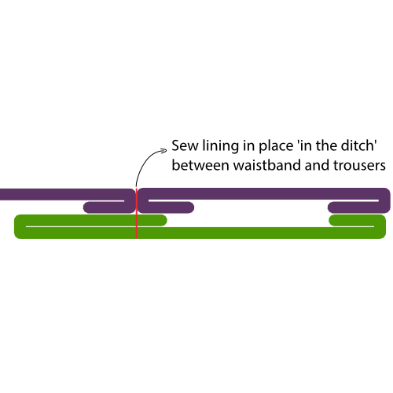

After you basted the waistband lining, sew it in place from the good side, exactly in the seam between the waistband and trousers.

### Step 51: Attach the belt loops: Top

With your waistband and lining properly secured, it's time to attach the top of the belt loops.

Sew them in place just as you did at the bottom. That is, use a bar tack or close zig-zag to attach them, then zig-zag over the end to secure it.

> Don't sew through the top of the belt loops. You'll have to work the foot of your sewing machine under the belt loop so you only sew the piece that is folded back.
> 
> Feel free to trim back the length of your belt loops after you bar tack and before you zig-zag the end of them, as they might be too long.

### Step 52: Finish the edge of the legs

Before we hem the trousers, finish the raw edge of the legs with a zig-zag stitch or serger.

> This would also be a good time to try on your trousers and mark exactly how long you want them to be after they are hemmed.

### Step 53: (Optional) Sew in a hem ribbon

> The hem ribbon is a ribbon that sits on the inside of your trouser hem. At the place your hem folds back, the fabric has to take a lot of abuse from bumping into shoes and other things.
> 
> Placing a ribbon inside the hem protects your fabric to some extent, and it is a neat finish.

Mark the hemline on your trousers (good side out).

Place the ribbon as shown in the illustration making sure that it extends a few mm above the hemline. Sew it in place all the way around the leg, making sure to sew close but not on the hemline.

### Step 54: Press the hem

Fold back the trouser legs at the hemline, and press the hem.

> If you've sewn in a hem ribbon, the ribbon will extend a few mm below the hem line, thereby protecting the fabric at the hem.

### Step 55: Hem the legs

With the hem neatly pressed, simply hand-sew the folded back part to the inside of your trousers.

> Hemming is done by hand because it's important that the stitches don't show on the front. So when hand-sewing the hem, don't push your needle through the fabric, but just catch a few threads so your stitches don't show on the front
> 
> While there are machine alternatives, they aren't as neat (blind hem stitch) or probably not accessible to the home-sewer (industrial blind hem machine).

### Step 56: Trim, clean up, and press

Trim any loose threads or basting that remains, and give your trousers a good final press.