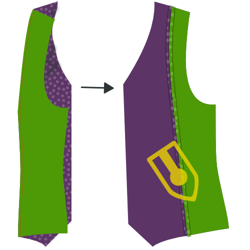
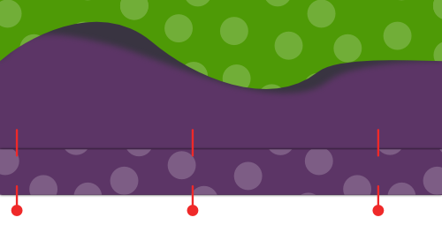

## Wat je nodig hebt

Om Wahid te maken heb je het volgende nodig:

- Basis naaimateriaal
- Een meter geschikte stof ([zie Stofkeuzes](#fabric-options))
- Een meter voering
- Kleefbare tussenvoering
- Knopen

## Stofkeuze

Alle pakstoffen zijn een goede keuze voor je gilets. Elke stoffenwinkel die de moeite is zou een afdeling met pakstoffen moeten hebben. Je kan binnenwandelen, vragen waar de stoffen voor kostuums zijn, en iets kiezen dat je mooi vindt.

Deze stoffen zijn gewoonlijk van wol, maar je kan ook wat creatiever zijn en iets anders kiezen.

> Je stof heeft wel wat gewicht nodig. Denim is ok, een licht katoentje niet.

## Knippen

- **Buitenstof** 
 - Knip **2 voorpanden** met de goede kanten op elkaar
 - Knip **2 achterpanden** met de goede kanten op elkaar
 - Knip **2 beleg voor** met de goede kanten op elkaar
 - Knip **2 paspels zak** met de goede kanten op elkaar
 - Knip **2 beleg zak** met de goede kanten op elkaar
- **Voering** 
 - Knip **2 voering voorpand** met de goede kanten op elkaar
 - Knip **2 achterpanden** met de goede kanten op elkaar
 - Knip **2 zakdelen** met de goede kanten op elkaar
- **Tussenvoering** 
 - Knip **2 voorpanden** met de goede kanten op elkaar
 - Knip **2 tussenvoering zak**

### Opmerkingen

- Knip de **voorste** neep niet uit
- Knip de **achterste** neep niet uit
- Let op de draadrichting op de **paspel zak** en het **beleg zak**</li> </ul> 
    
    Wahid is een relatief eenvoudig patroon, hier is een typische layout:
    
    
    
    > The [notation legend](/en/docs/patterns/notation) explains all the different markings and lines on your draft.
    
    ## Constructie
    
    ### Stap 1: Bevestig tussenvoering
    
    #### Strijk de tussenvoering aan de paspels
    
    
    
    Leg je paspels neer met de goede kant naar beneden, en je tussenvoering zak bovenop.
    
    De tussenvoering is een beetje korter dan de paspel, dus let op de hulplijn om het goed te leggen.
    
    Strijk de tussenvoering aan de verkeerde kant van elke paspel.
    
    #### Strijk de tussenvoering aan de voorpanden
    
    
    
    Leg je voorpanden met de goede kant naar beneden, en je tussenvoering bovenop.
    
    Strijk de tussenvoering vast.
    
    > **Neem je tijd**
    > 
    > Strijk dit niet gewoon even om ermee klaar te zijn, je moet de tussenvoering echt op de stof persen zodat ze goed vastkleeft.
    > 
    > Zet je strijkijzer neer en zet er 10 seconden lang druk op voor je opschuift naar het volgende stukje.
    
    ### Stap 2: Bevestig het beleg aan de voering
    
    #### Stik beleg aan voering
    
    
    
    Leg je beleg voorpand en voering met de goede kanten op elkaar. Speld de randen van de naad tussen beleg en voering vast.
    
    Stik.
    
    #### Strijk de naadwaarde open
    
    Strijk de naadwaarde tussen beleg en voering open.
    
    ### Stap 3: Sluit alle nepen
    
    
    
    #### Close back darts
    
    Plooi je rugpand met de goede kanten op elkaar, en stik de achterste neep.
    
    > Vergeet niet hetzelfde te doen voor de voering
    
    #### Sluit de voorste nepen
    
    Plooi je voorpand (en de tussenvoering die eraan kleeft) met de goede kanten op elkaar, en stik de voorste neep.
    
    ### Stap 4: Strijk alle nepen
    
    
    
    #### Strijk de voorste nepen
    
    Knip de nepen open en strijk ze dan open.
    
    #### Strijk de achterste nepen
    
    Knip de nepen open en strijk ze dan open. Indien je ze niet openknipt, strijk ze dan opzij.
    
    > Vergeet niet hetzelfde te doen voor de voering
    
    ### Stap 5: Maak de zakken
    
    #### Bevestig het zakdeel aan de paspel
    
    
    
    Leg je zakdeel neer met de goede kant omhoog, en je paspel bovenop met de goede kant neer beneden.
    
    Leg de rechte kant van het zakdeel gelijk met de kant van de paspel die geen tussenvoering heeft, en stik ze samen met de standaard naadwaarde.
    
    #### Strijk de naad open
    
    Strijk deze naad open wanneer je klaar bent.
    
    #### Markeer waar je zak moet komen
    
    
    
    Je voorpand heeft een hulplijn om aan te geven waar de paspelzak moet komen. Het zijn twee halve rechthoeken die samenkwamen wanneer je de neep sloot, en samen de vorm van je paspelzak hebben.
    
    Als je de vier hoeken van die rechthoek nog niet aangeduid hebt, zou je dat nu moeten doen.
    
    > De zak zit een beetje schuin op je patroon. Vanaf nu teken ik de zak recht op de illustraties, omdat dat iets makkelijker is.
    
    #### Bevestig paspel en beleg zak
    
     
    
    Leg je voorpand neer met de goede kant naar omhoog. We gaan de paspel aan de onderste lijn van de zakmarkering bevestigen, en het beleg aan de bovenste lijn.
    
    > Als je nog nooit een paspelzak gemaakt hebt kan het een beetje vreemd lijken om de zak aan de buitenkant van het kledingstuk te bevestigen. Zakken zitten toch aan de binnenkant?
    > 
    > Rustig blijven, de zak komt uiteindelijk aan de binnenkant terecht
    
    Zowel je paspel als je beleg zak hebben een hulplijn. Deze lijn moet overeenkomen met de lange randen van je zakmarkering.
    
    Leg de paspel onderaan, en het beleg zak bovenaan, beide met de goede kanten naar beneden.
    
    Leg de hulplijnen voorzichtig op de zakmarkering. Ze liggen nu naast elkaar, en raken elkaar maar net in het midden van de zakopening.
    
    Stik nu langs de hulplijnen die de lange rand van je zakopening aangeeft.
    
    > Het is belangrijk dat de lijnen die je nu stikt een perfecte rechthoek vormen. Dit bepaalt de vorm van je zak, dus als de ene lijn langer is dan de andere, of ze zijn niet parallel of zitten op de verkeerde plek zal je zak er niet mooi uitzien.
    
    #### Knip de zak open
    
    
    
    Tijd om de zak voorzichtig open te knippen. Begin in het midden van de zakopening, en knip langs de lange randen naar de zijkant.
    
    Aan de zijranden van de zakopening moet je stoppen met in het midden te knippen en in de plaats naar de eindpunten van je gestikte lijnen, in een hoek van 45 graden.
    
    > Dit kleine driehoekje dat je zo aan het einde krijgt is belangrijk. Wees voorzichtig en knip tot vlak voor je steken, zonder in het stiksel te knoppen.
    
    #### Strijk de naadwaarde open
    
    
    
    Strijk de naadwaarde aan de lange kanten van je zakopening open.
    
    #### Keer het zakbeleg naar de achterkant en strijk
    
    
    
    Keer het zakbeleg naar de achterkant van de stof en strijk plat.
    
    #### Strijk de driehoekjes aan de korte kanten plat
    
    
    
    Leg je zakbeleg uit de weg om die kleine driehoekjes aan het uiteinde van de zakopening zichtbaar te maken.
    
    Plooi ze terug, en let op dat je zakopening een mooie rechthoek blijft, en strijk ze plat.
    
    #### Keer de paspel naar de achterkant, plooi en strijk
    
     
    
    Keer de paspel met het bevestigde zakdeel naar de achterkant van de stof.
    
    Plooi je paspel om aan het punt waar hij de bovenrand van de zakopening raakt. De paspel zou de hele zakopening moeten bedekken.
    
    > De illustratie toont dit langs de achterkant aangezien het zo duidelijker is wat er allemaal gebeurt. Kijk sowieso ook even naar de voorkant om te zien of je paspelzak er mooi uitziet.
    
    #### Stik de driehoekjes vast
    
    
    
    Leg je voorpand neer met de goede kant omhoog en zorg dat het zakbeleg en de paspel plat liggen.
    
    Plooi je voorpand verticaal opzij aan de rand van je zak zodat het kleine driehoekje aan het uiteinde van de zakopening zichtbaar wordt.
    
    Stik deze driehoek vast door vlak naast de plooi en rand van de zak te naaien.
    
    #### Sluit het zakdeel
    
    
    
    Stik je zakbeleg aan het zakdeel om je zak af te maken.
    
    > Dit zou duidelijk moeten zijn, maar let op dat je je zakdeel niet aan je voorpand vastmaakt.
    
    #### Strijk je afgewerkte zak
    
    
    
    Strijk alles nog eens grondig als je klaar bent.
    
    ### Stap 6: Middenrugnaad
    
    
    
    Leg je twee rugpanden met de goede kanten op elkaar en stik de middenrugnaad.
    
    Strijk deze naad open wanneer je klaar bent.
    
    > Vergeet niet hetzelfde te doen voor de voering
    
    ### Stap 7: Bevestig rugpand aan voorpanden
    
    
    
    Leg je rugpand met de goede kant omhoog en leg je voorpanden bovenop met de goede kant omlaag. Leg de zijnaden gelijk, speld en stik.
    
    Strijk deze naden open wanneer je klaar bent.
    
    ### Stap 8: Bevestig de schouders aan elkaar
    
    
    
    Leg de schoudernaden gelijk, stik ze, en strijk de naadwaarde open.
    
    > Vergeet niet hetzelfde te doen voor de voering
    
    ### Stap 9: Bevestig de voering
    
    #### Schuif de voering in het gilet
    
    
    
    Leg je voering in je gilet, met de goede kanten op elkaar. In andere woorden, je gilet ligt met de goede kant naar binnen en de verkeerde kant naar buiten. De voering heeft de verkeerde kant naar binnen en de goede kant naar buiten.
    
    #### Speld de voering aan de stof
    
    
    
    Leg de voering gelijk met de rand van de stof, en speld vast.
    
    Begin aan de middenrug, en volg de halslijn tot aan de sluiting vooraan. Ga rond de zoom, maar laat een stuk van 15 cm open onder aan de middenrug.
    
    #### Stik voering aan de stof
    
    
    
    Als je voering netjes vastgespeld is, stik je de voering en de buitenstof samen.
    
    Vergeet niet die 15 cm aan de middenrug open te laten.
    
    #### Keer het gilet en strijk de randen
    
    
    
    Keer je gilet naar de goede kant door de opening die je aan de zoom liet.
    
    Strijk de randen die je net gestikt hebt, en let op dat je de stof een beetje omrolt zodat de voering altijd verborgen is.
    
    ### Stap 10: Werk de armsgaten af
    
    #### Speld de naadwaarde van de stof om
    
    
    
    Speld de naadwaarde van je buitenstof naar de verkeerde kant, helemaal rond het armsgat. Hou je voering uit de weg terwijl je dit doet.
    
    #### Speld de voering om
    
    
    
    Plooi nu de voering tot net voor de rand van het armsgat en speld ze vast.
    
    #### Naai de voering aan de stof
    
    
    
    Gebruik een blinde steek om de voering rond het hele armsgat aan de buitenstof te naaien.
    
    ### Stap 11: Werk de zoom af
    
    Weet je nog, die opening uit stap 9? Tijd om die dicht te maken.
    
    Gebruik een blinde steek om de voering met de hand aan de buitenstof te naaien en de zoom te sluiten.
    
    ### Stap 12: Maak de knoopsgaten
    
    
    
    Markeer de knoopsgaten op je gilet, als je dit nog niet gedaan hebt.
    
    Maak deze knoopsgaten.
    
    ### Stap 13: Naai knopen aan
    
    
    
    Speld je gilet dicht en markeer de plaats van je knoopsgaten op de kant waar de knopen moeten komen.
    
    Naai de knopen aan.
    
    > Je kan de plaats van de knopen ook overnemen van het patroon. Door je te baseren op de knoopsgaten die je net maakte verzeker je dat de knopen en knoopsgaten overeenkomen, zelfs als je knoopsgaten een beetje afwijken.
    
    ### Stap 14: Optioneel: Pit de randen door
    
    
    
    Als je wil kan je een doorpitsteek rond de randen van je gilet gebruiken.
    
    Een doorpitsteek wordt met de hand gemaakt. Je maakt een eenvoudige steek een paar mm van de randen van je gilet, maar maakt je steekje maar voor een paar draadjes aan de buitenkant zichtbaar. Je hebt dit sowieso al gezien als een afwerking aan kostuumjasjes.
    
    > Je kan de doorpitsteek maken met garen van dezelfde kleur, of een contrasterende kleur gebruiken als je eens gek wil doen.
    > 
    > Een doorpitsteek geeft een bepaald uitzicht, maar bevestigt ook de stof aan de voering en beleg zodat dingen minder gaan rondschuiven.
    
    Hierna zou je je gilet best nog eens goed strijken.