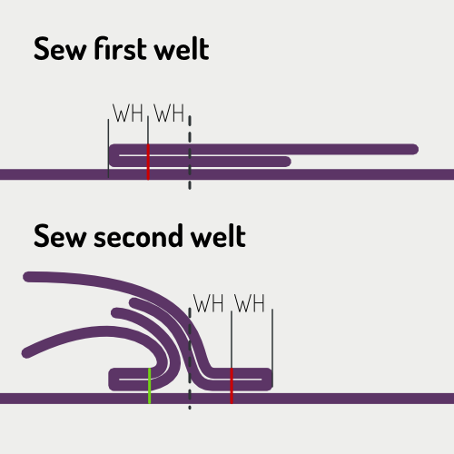
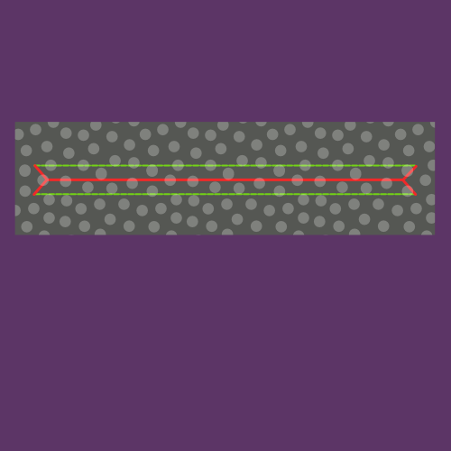
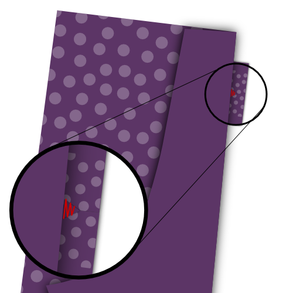
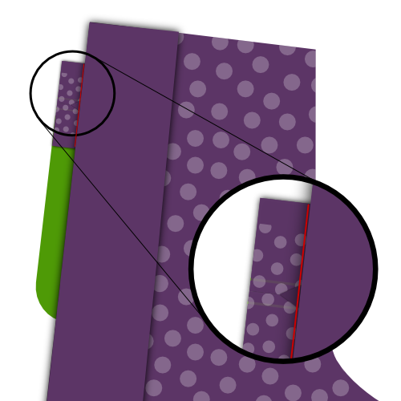
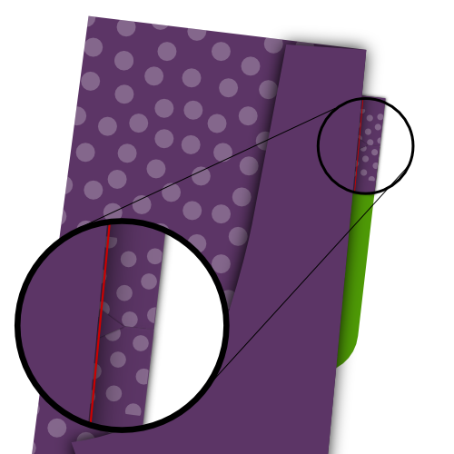
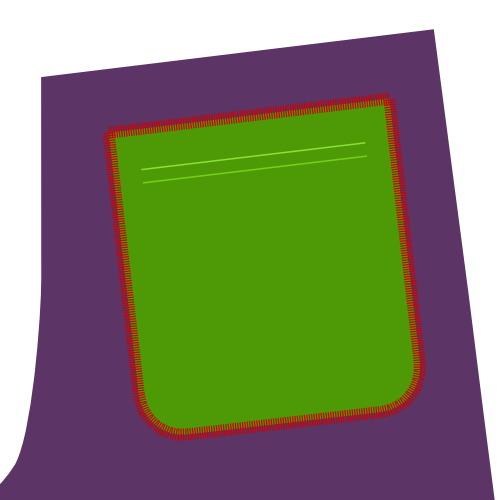

> ##### Leer paspelzakken met David Page Coffin
> 
> In de editie van [Seamwork Magazine](https://www.seamwork.com/) van november 2015 staat een artikel genaamd [Conquering the Welt](https://www.seamwork.com/issues/2015/11/conquering-the-welt), waarin David Page Coffin de constructie van een paspelzak uitlegt.
> 
> David heeft verschillende boeken geschreven over het maken van broeken en hemden, geeft online naailessen en workshops in de VS en het buitenland.
> 
> David is een vriend van deze site, en vooral veel beter geschikt om dit uit te leggen dan ik.

## Video

> Text a bit dry for you? I try to make videos available as part of the pattern documentation.

De playlist hieronder bevat de twee delen van de reeks [How to: Double welt pockets](https://www.youtube.com/watch?v=u1iNrVtPbco&list=PL1gv5yv3DoZOFSXz7yydeV1H8m6pfwstn).

@[youtube](https://www.youtube.com/embed/videoseries?list=PL1gv5yv3DoZOFSXz7yydeV1H8m6pfwstn)

## Before you start

### Wat je nodig hebt

Om een dubbele paspelzak te maken heb je dit nodig:

- Basis naaimateriaal
- De stof of het patroondeel waar je de zak in wil maken
- Twee stroken stof voor de paspels
- Een strookje tussenvoering
- Voering of een andere geschikte stof voor de binnenzak (Zie stof- en kleuropties)
- Een beleg voor de binnenzak, afhankelijk van je stof- en kleuropties

### Parameters

Twee waarden bepalen de afmeting van je dubbele paspelzak. They are:

- Breedte van de zak: dit is de breedte van de opening van de afgewerkte dubbele paspelzak
- Hoogte van de paspel: dit is de hoogte van één paspel, en dus de helft van de hoogte van een dubbele paspelzak

> In dit voorbeeld gebruik ik een zakbreedte van 13 cm en een paspelhoogte van 0.5 cm

## Knippen

### Paspels

De paspels zijn twee rechthoekige stroken stof met de volgende afmetingen:

- Lengte: zakbreedte + 4 cm
- Breedte: Hoogte van de paspel x 2 + 5 cm

Voor ons voorbeeld:

- Lengte: 13 + 4 = 17 cm
- Hoogte: (O.5 x 2) + 5 = 6 cm

Deze vormen de twee smalle stroken stof die je paspelzak maken.

> Let op dat je de draadrichting respecteert bij het uitknippen

### Tussenvoering zak

De tussenvoering voor de zak is een enkele rechthoekige strook kleefbare tussenvoering met de volgende afmetingen:

- Lengte: zakbreedte + 4 cm
- Breedte: Hoogte van de paspel x 2 + 5 cm

Voor ons voorbeeld:

- Lengte: 13 + 4 = 17 cm
- Hoogte: (O.5 x 2) + 5 = 6 cm

> Je hebt misschien opgemerkt dat de tussenvoering dezelfde afmeting heeft als een paspel

De tussenvoering wordt gebruikt om de zak te stabiliseren, en wordt aan de verkeerde kant van je stof gestreken.

### Optioneel: zakbeleg

Het (optionele) zakbeleg is een enkele rechthoekige strook stof met de volgende afmetingen:

- Lengte: zakbreedte + 4 cm
- Breedte: Hoogte van de paspel x 2 + 5 cm

Voor ons voorbeeld:

- Lengte: 13 + 4 = 17 cm
- Hoogte: (O.5 x 2) + 5 = 6 cm

> Je hebt misschien opgemerkt dat het beleg dezelfde afmeting heeft als een paspel

Het beleg is wat je zal zien als je door de zakopening kijkt.

Het beleg is optioneel, maar als je het niet gebruikt zie je het materiaal waar je binnenzak van gemaakt is.

### Binnenzak

De vorm van het zakdeel hangt af van het patroon. Voor de eenvoud gebruik ik een rechthoekig zakdeel met afgeronde hoeken zoals je zou vinden aan de achterzak van een broek.

> Er is gewoonlijk een langere en kortere versie van het zakdeel. Dit is omdat één kant vasthangt aan de bovenste paspel, terwijl de andere aan de onderste bevestigd wordt.

## Construction

### Stap 1: kleef de tussenvoering op z'n plek

Strijk de strook tussenvoering op de verkeerde kant van de stof, zodat het de plek waar de paspelzak komt bedekt.

> Patronen hebben gewoonlijk merktekens die je helpen de plaats van je paspelzak te bepalen

### Stap 2: Markeer de paspelzak op de juiste kant van de stof

Markeer de paspelzak op deze manier:

- Markeer de zakbreedte met verticale lijnen. Laat deze lijnen iets verder doorlopen, dit helpt later om de paspels op de juiste plek te leggen
- Markeer het midden van de zakopening met een horizontale lijn. Laat ook deze lijn iets verder doorlopen om het je later makkelijker te maken
- Markeer twee horizontale lijnen, parallel aan de middenlijn, op dezelfde afstand als de paspelhoogte (in ons voorbeeld is dit 0.5 cm)

Het deel van de twee horizontale lijnen parallel met de middenlijn dat tussen de twee verticale lijnen valt is waar we de paspels vast zullen stikken. Dit is aangeduid met de rode lijnen.

### Stap 3: Vouw en strijk de paspels

Vouw de paspels parallel met de lange zijde, met de goede kant naar buiten.

Vouw ze niet in de helft. In plaats daarvan maak je één zijde 1 cm langer dan de andere.

Strijk deze vouw zodat ze een scherpe plooi wordt.

> Door de randen van de paspel ongelijk te maken verminder je bulk en zichtbaarheid van de paspels aan de buitenkant van het kledingstuk.

### Stap 4: Stik de paspels op hun plaats

> In de beelden hierboven geeft de zwarte stippellijn het midden van de paspel aan. De rode lijn toont waar gestikt moet worden, en de groene lijn is een naad die al gestikt is.

Plaats de paspel op de goede kant van je stof met de korter geplooide kant naar beneden, en centreer alles horizontaal.

Leg de geplooide kant op het midden van de zakopening, en schuif het twee keer de Paspelhoogte (PH) naar buiten.

In ons voorbeeld met een Paspelhoogte van 0.5 cm ligt de vouw van je paspel 1 cm van het midden van de zakopening.

Stik de paspel vast op 0.5 cm (PH) van de vouw, of met andere woorden, exact op de lijn die je op je patroondeel gemarkeerd hebt.

Let op dat je exact begint en stopt aan de verticale lijnen die de zakbreedte aangeven.

Wanneer je dit gedaan hebt stik je de tweede paspel op dezelfde manier vast. Merk op dat dit een beetje lastiger is omdat je de eerste paspel opzij moet plooien, en een stuk van de tweede paspel over de eerste heen leggen.

### Stap 5: Knip je zak open

> Op de afbeelding geeft de rode lijn aan hoe en waar de zak opengeknipt wordt, en toont de groene lijn de naden.

Knip je paspelzak open door langs de middelste horizontale lijn te knippen. Stop een stukje voor de verticale lijnen die de zijkanten van de zakopening aangeven en knip in een hoek van 45 graden naar het uiteinde van het stiksel dat de paspels bevestigt.

> Let op dat je niet door je stiksel knipt, of er voorbij. Ga voor precisiewerk.

### Stap 6: draai de paspels naar de andere kant en strijk

Je hebt je paspels aan de goede kant van de stof vastgestikt. Now, we are going to flip them to the back side, through the opening we just cut in the fabric.

Flip the welts to the back, and press them flat. Take your time to work the fabric into a neat rectangle before you press it down.

> Make sure to press the triangular pieces of fabric (at the short edge of your opening) to the side
> 
> You're pressing several layers of fabric. Consider pressing down (or open) the layers individually before pressing them together. This will give a sharper crease, and a neater welt pocket.

### Step 7: Sew the pocket opening sides to the welts

 

Put your garment down with the good side up, and fold it back on the side of your welt pocket, making sure to keep your welts lying flat.

Sew the triangular piece of fabric from the pocket opening to the welts.

> Make sure that you do not sew into the pocket opening, as this will show the stitches on the front

### Step 8: Sew the bottom pocket bag to the bottom welt

Fold your garment out of the way so you can sew the pocket bag to the lower welt.

Also finish the edge of the welt with a zig-zag stitch so the welt stays flat inside the pocket.

> The pocket bag is show in lining fabric here (green) far clarity. You can also make your pocket bags from other fabric.

### Step 9: Optional: Sew facing to top pocket bag

> This step is optional. Attach facing to the top pocket bag if that is want you want to show through the pocket opening.

### Step 10: Sew the top pocket bag to the top welt

Fold your garment out the way so you can sew the pocket bag to the top welt.

> If you applied facing to your pocket bag, make sure to place it with the facing towards the welts.

### Step 11: Attach the welts to the pocket bag

  

Place your garment with the good side up, and fold it back at the side of the welt pocket.

Sew the triangular piece of fabric from the pocket opening to the pocket bags, much like you've sewn it to the welts earlier.

Fold back your garment at the top of the welt pocket.

Now, sew the top of the pocket opening to the pocket bag.

### Step 12: Finish the pocket bag

Now finish the pocket back by closing all the edges (the top edge is optional).

To do so, you can apply bias tape, use a serger, or sew some other finishing stitch.

After that, you're done!