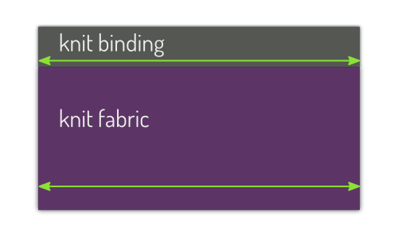

## Qu'est-ce que le biais de jersey de toute façon ?

Le biais de jersey est un terme général pour un type de finition (typiquement) que l'on trouve sur le cou ou le bras d'ouverture des tee-shirts et d'autres vêtements à maille.

Il y a deux variétés de cette finition, la bande de jersey, et le biais de jersey.

## Bande de jersey

La bande de jersey est ce que vous trouvez habituellement à l'encolure de votre T-shirt. C'est une bande de jersey pliée en deux et cousue au bord du vêtement.

Cela laisse un bord inachevé à l'intérieur qui est souvent cousu par des coutures rabattues au pourtour de la bande de jersey.

### Biais de jersey

Le véritable biais de jersey se pose plus comme un biais classique, dans la mesure où il est enveloppé autour du tissu, plutôt que d'être apposé à celui-ci.

La bordure brute du vêtement est insérée entre le biais de jersey plié qui est cousu. Cela se fait souvent avec une recouvreuse, finissant ainsi parfaitement l'intérieur.

> Photos de [Support Tattoos and Piercings at Work](https://www.flickr.com/photos/supporttattoosandpiercingsatwork/21870942614/) et [Derek A.](https://www.flickr.com/photos/sfj/696122404/)

### Style vs fonction
Une bande de jersey est plus commune, et c'est ce que vous voyez typiquement sur la plupart des encolures de T-shirts. C'est l'option la plus décorative.

Le biais de jersey est moins commun, mais souvent utilisé sur les maillots de corps (en guise de sous-vêtement). C'est l'option la plus fonctionnelle.

> ##### Toujours confus ?
> 
> Une autre façon de les distinguer est de penser à ce qui se passe lorsque vous décidez d'élargir la bande/biais de jersey.
> 
> Sur un T-shirt, une bande plus large au cou réduira l'ouverture de l'encolure. Si vous voulez une bande plus large, vous devrez couper un trou plus grand dans votre t-shirt.
> 
> Sur un maillot de corps, si vous voulez que le biais à l'encolure soit plus large, cela ne réduira pas l'encolure. Au lieu de cela, le biais se posera plus loin sur le tissu principal du maillot de corps.

## Pourquoi le biais sur une maille doit être extensible

Que vous utilisiez une bande de jersey ou une finition au biais, vous devrez étirer votre tissu (celui de la bande ou du biais) pour de bons résultats. Autrement dit, cela suppose que vous ne cousiez pas du coutures droites. Voici pourquoi :

### Ligne droite : la vie en mode facile

Sur une couture droite, vous pouvez simplement fixer votre biais/bande. Votre tissu et votre biais ont la même longueur, donc tout va bien.

Le scénario le plus probable où vous le rencontrerez est sur les manches (courtes) d'un T-shirt. Bien que la bande de jersey entoure votre bras, du point de vue du patron (dans le sens où le tissu est encore plat), c'est une couture droite.

### Courbure uniforme : étirement uniforme

Sur une couture courbée, comme une encolure, les choses deviennent un peu plus compliquées. Cela est dû au fait que le bord extérieur et le bord intérieur de votre biais auront une longueur différente.

**Pas d'élasticité, et le résultat ne sera pas plat (ça va bailler)**

Si vous cousez simplement le biais sur le tissu, le résultat sera bon sur l'extérieur de votre biais. Mais le bord intérieur est plus court et votre biais sera comprimé. La tension que cela crée le fera remonter, et votre biais ne sera pas à plat contre votre peau.

**Étirez-le juste ce qu'il faut, et il sera nickel**

Pour résoudre ce problème, vous devez étirer votre biais (et non le tissu) lors de la fixation de votre biais. Si vous le faites correctement, le bord extérieur sera étiré un peu, tandis que le bord intérieur remplira bien votre courbe et tout sera plat.

**Si vous étirez trop, le résultat va froncer**

Étirez trop votre biais et il resserrera trop, causant des fronces sur le tissu principal.

### Vrai vie : étirement variable

Les coutures droites existent, et même si je n'en ai jamais rencontré, les coutures de courbes uniformes existent aussi. Mais le plus souvent, la courbure de votre couture variera.

Sur une encolure de T-shirt, la courbe à l'arrière de votre encolure est différente de l'avant, et il y a probablement une courbure un peu plus serrée derrière votre couture d'épaule.

Sur une légère courbe, la différence entre le bord intérieur et le bord extérieur n'est pas si grande, et seul un peu d'étirement est nécessaire. Mais sur une courbe plus serrée, la différence entre le bord intérieur et le bord extérieur de votre biais sera plus importante. Et vous aurez besoin de plus d'élasticité pour compenser cela.

Pendant que vous suivez votre couture, et qu'il se courbe autour de l'encolure, ou des épaules, ou des caractéristiques de conception, vous devrez adapter la quantité d'étirement à la situation.

## Vous ne pouvez pas calculer la longueur de votre biais de jersey
Je ne dis pas que c'est théoriquement impossible. Mais je dis que c'est en pratique impossible.

La longueur de votre biais dépend de la quantité nécessaire d'étirement. Cela dépend des courbes à suivre, et de la largeur du biais, sans parler de son taux d'élasticité. Il y a juste trop de paramètres à prendre en compte pour calculer correctement votre longueur de biais.

### A ne pas faire
There are a bunch of tutorials out on the internet that show you how to sew on knit binding. Many of those suggest something like _make the neck binding 90% of the length of the seam you are attaching it to_ (the percentage varies).

This idea is that you cut your binding, join its edges, and then sew it in the opening. That is (in my opionion) no good.

An alternative approach to sidestep the length issue is to attach the binding before you close the opening your binding goes in. For example, on a Tshirt you close one shoulder seam, attach binding, then close the second shoulder seam.

Obviously, that means your shoulder seam will cut through your binding which is a big no no in my book.

### Instead, do this

 - Cut your binding as long as the seam it needs to be sewn into. Not 90%, but 100%. This way, you know it's going to be too long, and that's what we want.
 - Mark the place you want your binding to be joined (say center back of the neckline) and place your binding 1cm beyond this point.
 - Start sewing your binding about 3cm or so from this point, and go all the way around. While you do so, make sure to adjust the stretch to whatever the curve requires. There's no tricks for this, you'll have to practice until it comes natural to you.
 - When you make your way around and get close in to the point your marked, stop about 3cm before that.
 - Now you're entire binding is attached, apart from a 6cm or so stretch at the back. Pin both edges of your binding good sides together making is exactly as long as needed and sew them together.
 - Sew the remaining 6cm of your binding.

This way, there is no guessing how long your binding should be, and the binding seam sits where you want it to sit.

> For detailed instructions, check [the Aaron documentation](/en/docs/patterns/aaron/)
